# GSLY 면접스터디

**1주차 질문 목록**

- [GSLY 면접스터디](#gsly-면접스터디)
  - [1번 질의](#1번-질의)
  - [2번 질의](#2번-질의)
  - [6번 질의](#6번-질의)
  - [7번 질의](#7번-질의)
  - [8번 질의](#8번-질의)
  - [13번 질의](#13번-질의)
  - [참고 자료](#참고-자료)

## 1번 질의

1-1. Key (기본키, 후보키, 슈퍼키 등등...) 에 대해 설명해 주세요. (출처 : vsfe)

- 키(key)는 데이터베이스에서 조건을 만족하는 튜플을 찾거나, 순서대로 정렬할 때 <ins>**다른 튜플들과 구별할 수 있는 유일한 식별자이다.**</ins>

- key는 하나의 key 값으로 튜플을 유일하게 식별할 수 있는 성질인 <ins>**유일성**</ins>과 키를 구성하는 속성들 중 가장 최소로 필요한 속성들로만 키를 구성하는 성질인 <ins>**최소성**</ins>이라는 속성을 가진다. 

- 슈퍼키, 후보키, 기본키, 대체키, 유일키, 외래키가 있다.

 

- **슈퍼키 (Super Key)**

    - 릴레이션(테이블)에서 튜플(행)을 유일하게 식별할 수 있는 하나 이상 속성들의 집합

    - 유일성 O, 최소성 X

    - 

ex) <code>PLAYER(id, name, team_id, back_number, birth_date)</code> 릴레이션에서 슈퍼키를 찾으시오.
<ul><li><code>{id, name, team_id, back_number, birth_date}</code><ul><li>릴레이션의 정의 자체가 튜플들로 이루어진 집합이니까 중복자체를 허용하지 않아서 전체 attributes set 자체로 superkey가 될 수 있음</li></ul></li><li><code>{id, name}</code> <strong>,</strong> <code>{name, team_id, back_number}</code> ****.. 기타 등등</li></ul>

- **후보키 (Candidate Key)**

    - 기본키가 될 수 있는 후보로 선정된 키

    - 어느 하나의 속성이라도 제거하면 유일하게 튜플(행)을 식별할 수 없는 슈퍼키, minimal superkey 라고도 함

    - 유일성 O, 최소성 O

    - 

ex) <code>PLAYER(id, name, team_id, back_number, birth_date)</code> 릴레이션 에서 후보키를 찾으시오.
<ul><li><code>{id}</code><ul><li>id는 이미 attribute가 1개니까 제거할 수 없음, 후보키</li></ul></li><li><code>{team_id, back_numer}</code><ul><li>이 둘 중 하나라도 없애면 각각 하나하나는 유니크하게 튜플들을 식별할 수 없음, 후보키</li></ul></li></ul>

- **기본키 (Primary Key)**

    - 릴레이션(테이블)에서 튜플(행)을 유일하게 식별하기 위해 선택된 후보키
    
    - 릴레이션에서 기본키는 단 1개

    - 

ex) <code>PLAYER(id, name, team_id, back_number, birth_date)</code> 릴레이션 에서 개인키를 찾으시오.
<ul><li><code>{id}</code> 혹은 <code>{team_id, back_number}</code> 둘 중 하나를 <strong>개인키</strong>로 선택</li><li>보통 attributes 수가 적은 경우를 pk로 선택 많이함. 여기서는 <strong><code>{id}</code></strong> 선택</li><li>pk는 보통 밑줄 그어서 표시</li></ul>

- **유일키 (Unique Key)**

    - 후보키 중 선택받지 못한 키로, 대체키(alternate key) 라고도 부름

    - 

ex) <code>PLAYER(id, name, team_id, back_number, birth_date)</code> 릴레이션 에서 유일키를 찾으시오.
<ul><li>id가 pk로 선택된 경우에 <strong>유일키(=대체키)</strong> 는 <code>{team_id, back_number}</code></li></ul>

- **외래키 (Foreign Key)**

    - 다른 릴레이션의 기본키를 참조하는 속성들의 집합

    - 

ex) <code>PLAYER(id, name, team_id, back_number, birth_date)</code> , <code>TEAM(id, name, manger)</code> 두 릴레이션 중에서 외래키를 찾으시오.
<ul><li>여기서 <strong>외래키</strong>(foreign key)는 PLAYER의 <strong><code>{team_id}</code></strong></li></ul>

- **복합키 (Composite Key)**

    - 각 튜플(행)을 식별할 수 있는 두 개 이상의 속성들로 구성된 후보키

    - 

슈퍼키와 복합키의 차이

슈퍼키와 복합키의 차이는 “구성하고 있는 키가 어떤 키인지”

<ul><li>슈퍼키 : 구성되는 키가 후보키에 들어가지 않는다. 예를 들어, <code>(학번 + 이름)</code> 의 경우 학번은 기본키로 후보키의 범주이지만, 후보키는 중복 가능</li><li>복합키 : 구성되는 키가 모두 후보키에 속한다. 예를 들어, <code>(학번 + 강의코드)</code> 의 경우 학번으로 학생 구별 가능하고 강의 코드로 강의 구별 가능하다. 중복된 값을 허용하기 위해 2개의 후보키를 복합키로 하여 기본키를 생성한 형태이다.</li></ul>

 

1-2. 데이터베이스에서 키가 필요한 이유가 무엇인가요?  (창작 문제)

- 데이터베이스에서 레코드의 순서에는 의미가 없는데, 이때, 이를 구분해주기 위하여 필요한 것이 바로 키(key)이다.

- RDB에서 특정 레코드를 구별하거나 탐색하기 위한 유일한 방법이 key이다. 따라서, 데이터를 사용하려면 키는 무조건 필요하다.

- 키(key)는 데이터 정합성 유지, 검색, 수정, 삭제 등의 작업을 수행할 때 중요한 역할

    - 데이터 정합성이란, 데이터가 올바르고 일관성 있게 유지되는 것

 

1-3. 기본키는 수정이 가능한가요? (출처 : vsfe)

- 기본키 역시 update를 통하여 수정 가능하다. 단, unique 한 값이어야 한다.

- 또, 기본키의 경우 다른 테이블에서 참조할 수도 있기 때문에 조심해야 한다.

    - cascade 설정 X 연관관계에 있는 → 기본키 or 외래키 수정 불가

    - cascade 설정 O 연관관계에 있는 → 기본키 수정 O, 기본키가 다른 테이블의 외래키로 설정되어 있으면 그 외래키까지 함께 수정됨

    - cascade 설정 O 연관관계에 있는 외래키는 수정 불가

 

1-4. 기본키를 수정할 수 있다면, 고려해야하는 사항은 무엇인가요? (창작 문제)

- PK는 레코드의 물리적인 저장 위치를 결정하기에, 단순히 UPDATE로 값만 변경하면  레코드가 본래 있어야 하는 페이지가 달라질 수 있다.

- 따라서, 레코드를 DELETE 한 이후 INSERT 해줘야 한다.

    - 2번의 디스크 I/O 작업이 필요하고, 인덱스 쪽에도 추가 작업을 유발할 수 있어서 비용이 상당히 크므로 PK는 변하지 않는 값으로 설정하는 것이 중요하다.

 

1-5. 사실 MySQL의 경우, 기본키를 설정하지 않아도 테이블이 만들어집니다. 어떻게 이게 가능한 걸까요? (출처 : vsfe)

- MySQL은 기본적으로 PK가 클러스터 인덱스이며, PK가 없으면 내부적으로 PK를 만들어내기에 가능하다.

    - PK가 없으면 NOT NULL 옵션의 유니크 인덱스(레코드마다 값이 고유한) 중에서 첫번째 인덱스를 클러스터링 키로 선택함

    - 만약, 이도 없다면 InnoDB가 자체적으로 자동 증가 유니크 컬럼을 추가한 후 클러스터링 키로 선택

        - 이렇게 자동 생성되는 내부 PK는 사용자에게 노출되지 않으며, 쿼리에서 사용할 수도 없음. 클러스터 인덱스는 테이블 당 단 하나만 가질 수 있으므로 반드시 생성해주는 것이 좋다.

 

1-6. 인덱스, 클러스터 인덱스, 논클러스터 인덱스가 무엇인가요? (창작 문제)

- <ins><strong>인덱스 (Index)</strong></ins> : 추가적인 쓰기 작업과 저장 공간을 활용해 데이터베이스 테이블의 검색 속도를 향상시키기 위한 자료구조이다.

    - 데이터베이스 테이블의 검색 속도를 향상시키기 위해 사용하는 것으로, 시스템 부하를 줄여 시스템 전체 성능향상에 기여하는 것

    - 인덱스를 위해 DB 10% 내외의 추가 공간이 필요하다. 따라서, 데이터가 많으면 인덱스 생성에 많은 시간이 소요될 수 있음

    - 인덱스를 사용하지 않은 컬럼을 조회하려면 전체를 비교하며 탐색(Full Scan)해야 해서 처리 속도가 떨어짐

    - 조희 성능은 좋으나, 오히려 삽입/수정/삭제 등의 경우 오히려 성능이 저하됨

        - 인덱스에 관련된 추가 연산을 해야하기 때문
        - INSERT : 새로운 데이터에 대한 인덱스 추가
        - DELETE : 삭제하는 데이터의 인덱스를 사용하지 않는다는 작업 수행
        - UPDATE : 기존의 인덱스를 사용하지 않음 처리, 갱신된 데이터에 대한 인덱스 추가

- <ins><strong>클러스터 인덱스 (Clustered Index)</strong></ins> : 실제 데이터와 같은 무리의 인덱스, 해당 키 값을 기반으로 데이터 행을 정렬하고 저장하는 것으로, 클러스터 키가 정렬되어 있고, 정렬된 순서에 따라 데이터의 주소가 결정됨

    - ex) 실제 데이터가 정렬된 백과사전

    - 데이터는 오직 하나의 순서로 정렬될 수 있어서 클러스터 인덱스는 테이블당 최대 1개만 존재

    - 리프 페이지가 데이터 페이지

- <ins><strong>논-클러스터 인덱스 (Non-Clustered Index)</strong></ins> : 실제 데이터와 다른 무리의 별도의 인덱스, 논클러스터 인덱스 키 값을 가지고, 그 키 값의 레코드는 실제 키 값의 레코드를 향한 포인터를 가짐

    - ex) 실제 데이터 탐색에 도움을 주는 별도의 찾아보기 페이지 (책 맨 뒤에 그거)

    - 실제 데이터 페이지는 그대로 있음

    - 별도의 인덱스 페이지 생성 → 추가 공간 필요

    - 테이블 당 여러 개 존재 가능

    - 리프 페이지에 실제 데이터 페이지 주소를 담고 있음

    - unique 제약조건 적용 시 자동 생성

    - 직접 index 생성시 논-클러스터링 인덱스 생성

 

1-7. 리프 페이지라고 하셨는데, 페이지(Page)가 어떤 것인가요? (창작 문제)

- 페이지란, 디스크와 버퍼풀(메모리)에 데이터를 읽고 쓰는 최소 작업 단위

- 일반적인 인덱스를 포함해, PK(클러스터 인덱스)와 테이블 등은 모두 페이지 단위로 관리됨. 루트 페이지는 리프 페이지의 주소로 구성하고, 리프 페이지는 실제 데이터 페이지로 구성

- 아래는 클러스터링 테이블의 저장 방식이다. PK는 인덱스처럼 별도의 자료구조에서 관리가 된다. 리프 페이지에 실제 레코드의 모든 컬럼 값이 저장되어 있다는 것을 제외하면 일반적인 인덱스와 동일

 

 

1-8. MySQL에서 PK를 신중하게 결정해야하는 이유는 무엇일까요? (창작 문제)

- <ins>**PK가 레코드의 물리적인 저장 위치를 결정**</ins>하기 때문이다.

- MySQL은 PK를 기준으로 유사한 값들이 함께 조회되는 경우가 많다는 점에서 착안하여, <ins>**PK가 유사한 레코드들끼리 묶어서 저장**</ins>한다.

- 유사한 것들을 묶는 것을 클러스터링이라고 하는데, 일반적으로 <ins>**PK는 클러스터 인덱스 (Clustered Index)**</ins> 라고 불린다. (그 외의 일반적인 인덱스는 논클러스터 인덱스)

- 클러스터링 특성 때문에 레코드의 저장이나 PK의 변경은 처리 속도가 느림
    - 레코드를 추가하기 위해 <ins>**PK 기반으로 레코드의 저장 위치를 탐색해야하기 때문**</ins>
    - 또, PK를 변경하는 것은 <ins>**레코드가 저장된 물리적인 위치를 변경하는 작업이 수반됨**</ins>

 

1-9. 클러스터링 특성 때문에 단점이 많아 보이는데, 그럼에도 MySQL에서 채택한 이유는 무엇이라고 생각하세요? (창작 문제)

- 쓰기(Write) 작업을 희생해서라도 빠르게 읽기(Read) 작업을 처리하기 위함

- 일반적인 온라인 환경에서 읽기와 쓰기의 비율이 8:2, 9:1 정도라서 읽기 작업을 더욱 우선시 한 것

 

1-10. 외래키 값은 NULL이 들어올 수 있나요? (출처 : vsfe)

- 외래키 값은 NULL이거나 참조하는 릴레이션의 기본키 값과 동일해야 하는 <ins>**참조 무결성 제약조건**</ins>에 의해 들어갈 수 있다.

- ex) 사원이 하나의 부서를 가지는 경우인데, 신입사원은 아직 부서가 미정

 

1-11. 어떤 칼럼의 정의에 UNIQUE 키워드가 붙는다고 가정해 봅시다. 이 칼럼을 활용한 쿼리의 성능은 그렇지 않은 것과 비교해서 어떻게 다를까요? (출처 : vsfe)

- 정의에 unique 키워드를 적용시키면, 칼럼에 자동으로 논클러스터 인덱스가 적용되는 것이다.

- 적용시키지 않은 경우, 기본이라고 가정한다면 전체 테이블 스캔(Full Table Scan)을 할 것이고 논클러스터 인덱스의 경우 인덱스 스캔(Index Scan)을 할 것이다.

- 데이터가 별로 없는 규모가 작은 테이블, `INSERT/UPDATE/DELETE`가 자주 발생하는 칼럼, `WHERE, JOIN, ORDER BY`와 같은 조건절이 자주 사용 안되는 칼럼, 카디널리티(중복도)가 높은 칼럼 → <ins>**전체 테이블 스캔이 더 빠름**</ins>

- 데이터가 많아서 규모가 큰 테이블, `INSERT/UPDATE/DELETE`가 자주 발생하지 않는 칼럼, `WHERE, JOIN, ORDER BY` 와 같은 조건절이 자주 사용되는 컬럼, 카디널리티(중복도)가 낮은 칼럼 → <ins>**인덱스 스캔이 더 빠름**</ins>

  

## 2번 질의

2-1. RDB와 NoSQL의 차이에 대해 설명해 주세요. (출처 : vsfe)

- <ins><strong>RDB(Relational DataBase)</strong></ins> : Database를 이루는 객체들의 릴레이션을 통해 데이터를 저장하는 데이터베이스 

    - 명확하고 엄격한 스키마 정의, 데이터 중복없이 한번만 저장

- <ins><strong>NoSQL(Not only SQL)</strong></ins> : 전통적인 관계형 모델에서 벗어나여 다양한 데이터 모델을 사용하며 데이터의 관리와 접근을 지원하는 데이터베이스

    - 유연한 스키마를 가지고 있어서 모델링이 유연, join 회피를 위한 중복 허용, 수평적 확장에 뛰어남, 대용량 데이터 처리 시 성능 상의 이점 있음
    - NoSQL은 저장 방식에 따라 분류된다. key-value model / document model / column model

 

2-2. RDB의 강점과, 약점이 무엇인가요? (창작 문제)

 

**장점**

- 스키마가 명확하게 정의되어 있음
- 정규화를 통해 테이블을 쪼개서 <ins>**데이터의 중복이 발생하지 않도록 한 번만 저장**</ins>
    - 무결성이 보장됨

**단점**

- <ins><strong>경직된 스키마</strong></ins> (ex. 컬럼 추가하려면 반드시 스키마 변경해야함)
    - 5천만 건의 레코드가 있다고 가정할 때, 새로운 컬럼을 추가하고 만약 write 작업까지 한다면 굉장히 위험부담이 클 것
    - 유연한 확장성의 부족

- 중복 제거를 위해 진행한 정규화 때문에 <ins>**과도한 조인과 성능 하락**</ins>
    - 조인 많이하면 과도한 CPU 사용, 응답시간 늘어남

- <ins><strong>수평적 확장 (scale-out) 힘듦</strong></ins>

    - 레플리케이션을 이용할 수도 있지만, 보통 레플리케이션으로 확장된 서버는 read-only이니까, write 작업이 많아진 경우라면 결국 부하가 부담될 것
    - multi-master, 샤딩과 같은 방법도 있지만, 일반적으로 RDB는 scale-out에 유연한 DB는 아니다

- RDB는 ACID를 지키려고 노력하는데, 오히려 <ins>**ACID가 성능에 영향을 끼침**</ins>
    - 예를 들어, Isolation 지키려고 전체적인 처리량인 throughput 감소

 

2-3. NoSQL의 등장 배경에 대하여 알고 계신가요? (창작 문제)

 

- 2000년대 초중반에 SNS의 등장으로 사용자가 폭발적으로 증가
    - RDBMS로 커버하기 힘든 트래픽 발생
    - high-throughput 요구됨
    - low-latency 요구됨
    - 비정형 데이터의 증가
        - 사용자가 워낙 많고 다양하니까 스키마에 맞게 데이터를 관리하기가 힘듦

 

2-4. 그렇다면, NoSQL은 분산환경에서 원했던 동작에 대해 모든걸 만족하나요? (창작 문제)

 

NoSQL이 분산환경에서 모든걸 만족하는건 아니다. 분산 환경에서 모두를 만족하는 시스템은 없다는 이론인 <a href='https://suhyunsim.github.io/2023-02-21/DB-%EB%A9%B4%EC%A0%91%EC%A7%88%EB%AC%B8' target='_blank'><ins>CAP 이론</ins></a>이라고 있다.

- <ins><strong>Consistency (일관성)</strong></ins> : 모든 노드들이 동일 시간에 동일 데이터를 사용자에게 보여줘야 하는 것이다. (DB가 3개로 분산되었다고 가정할 때, 하나의 특정 DB의 데이터가 수정되면, 나머지 2개의 DB에서도 수정된 데이터를 응답받아야 한다.)
    - RDB의 ACID Consistency와는 조금 다르다. 그건 데이터는 항상 일관성 있는 상태를 유지, 데이터 조작 후에도 헤치지 말아야 한다는 속성이다.

- <ins><strong>Availability (가용성)</strong></ins> : 모든 요청은 정상 응답을 받는다. (특정 노드에서 장애가 발생해도 서비스가 가능해야 한다.)

- <ins><strong>Partitions Tolerance (분리 내구성)</strong></ins> : 시스템 일부가 네트워크에서 연결이 끊기더라도 동작해야 하는 것을 의미한다.

- 분산 시스템에서 CAP 중 2가지만 만족할 수 있는데, 어떻게 클러스터링 하느냐에 따라 달라질 수 있다.
    - RDBMS는 일반적으로 CA를 만족. 분산화보다 데이터의 일관성과 가용성에 중점을 둠
    - NoSQL은 일반적으로 CP(MongoDB, Redis), AP(DynamoDB, cassandra) 형태를 선호한다. 분산에 중점을 둬서 그럼.

 

2-5. NoSQL의 강점과, 약점이 무엇인가요? (출처 : vsfe)

 

**장점**

- <ins><strong>유연한 스키마</strong></ins> (flexible schema)
    - 요구사항 변경에 유연한 대처 가능

- <ins><strong>중복 허용</strong></ins> (join 회피)
    - join 없이 빠른 조회 가능

- <ins><strong>수평적 확장</strong></ins> (scale-out)에 최적화 되어있음
    - 서버 여러 대로 하나의 클러스터를 구성하는 방식을 자주 사용

- 중복을 허용한다는 컨셉 덕분에 여러 컬렉션에 갈 필요 없이 그냥 한 컬렉션에 가서 데이터 읽어오면 됨 → 클러스터에서 각각의 데이터를 나눠서 저장해도 좋은 성능 가능 → scale-out도 유연해짐 → 대용량 데이터 처리 시 성능 상의 이점 !

- ACID의 일부를 포기하고 <ins><strong>high-throughput, low-latency 추구</strong></ins>

 

**단점**

- <ins><strong>애플리케이션 레벨</strong></ins>에서 어떤 데이터가 들어가는지 잘 챙기면서 <ins><strong>스키마 관리가 필요</strong></ins>

- 데이터의 중복이 발생할 수 있음

    - <ins><strong>애플리케이션 레벨</strong></ins>에서 <ins><strong>중복된 데이터들이 모두 최신 데이터를 유지할 수 있도록 관리</strong></ins>해야 함

- 데이터 무결성, 정합성 등이 보장되지 않아서, 금융 시스템, 결제 시스템, 예약 시스템과 같이 consistency(데이터 일관성)가 중요한 환경에서는 사용하기 조심스러움

 

2-6. RDB의 어떠한 특징 때문에 NoSQL에 비해 부하가 많이 걸릴 "수" 있을까요? (주의: 무조건 NoSQL이 RDB 보다 빠르다라고 생각하면 큰일 납니다!) (출처 : vsfe)

 

- 정규화를 통해 테이블을 쪼개서 데이터의 중복이 발생하지 않도록 한 번만 저장하고 테이블 간 관계를 맺는 RDB의 특징 때문에 JOIN 연산이 많아지면서 NoSQL에 비해 부하가 많이 걸릴 수 있는 것

 

2-7. NoSQL을 활용한 경험이 있나요? 있다면, 왜 RDB를 선택하지 않고 해당 DB를 선택했는지 설명해 주세요. (출처 : vsfe)

- In-memory key-value database인 redis를 프로젝트에서 활용 해본 적 있습니다. 선착순 이벤트 기능을 구현할 때, 유저가 쿠폰 조회를 위해 날리는 쿼리가 RDB로 매번 날라가는게 대용량 트래픽이 발생 상황에서는 부담스럽다고 생각했습니다. 이때, redis에서 캐싱해두고 최초 1회만 rdb로 쿼리가 날라가고 이후에는 캐싱해둔 것을 이용하도록 하여 rdb의 부하를 줄이기 위해 redis를 선택했습니다.

- 혹은 로그인 기능을 이용하는 과정에 있어서, refresh token을 redis에 key-value 형태로 저장해놓고 이용했습니다. RDB 처럼 SSD, HDD에 저장하는 것이 아닌, RAM에 데이터를 저장하기에 훨씬 빠르게 접근할 수 있고, refresh token은 rdb에 영구적으로 저장될 필요가 없기에 redis를 이용했습니다.

 

2-8. RDBMS, NoSQL 어떤 상황에 사용하면 좋을지 본인의 의견을 말해주세요. (창작 문제)

- RDBMS
    - 데이터베이스의 ACID 성질을 준수해야하는 소프트웨어 개발하는 경우
    - 관계를 맺고 있는 데이터가 자주 변경되는 애플리케이션의 경우
    - 변경될 여지가 없고 명확한 스키마가 사용자와 데이터에게 중요한 경우

- NoSQL
    - 정확한 데이터의 구조를 알 수 없거나 변경, 확장될 가능성 있는 경우
    - 읽기 작업을 자주하고 쓰기 작업은 자주 없는 경우
    - 막대한 양의 데이터를 다뤄야 해서 데이터베이스를 수평으로 확장해야하는 경우

  

## 6번 질의

6-1. 파티셔닝, 샤딩에 관하여 설명해 주세요. (창작 문제)

 

<ins><strong>파티셔닝 (partitioning) : 큰 테이블을 여러 작은 테이블들로 물리적으로 분할</strong></ins>하는 것이다. 약간 튜닝의 기법으로 데이터가 너무 커졌을 때, 조회하는 시간이 길어졌을 때 행하는 것이 일반적 → 논리적인 데이터 element 들을 다수의 entity로 쪼개는 행위 !

 

- 

<ins><strong>수직적 파티셔닝 (vertical partitioning)</strong></ins> : column을 기준으로 table 나누는 방식
<ul><li>

ex) 게시글 id, 제목, 작성자를 조회하는 쿼리가 있는 상황
<ol><li>보통, where 절이 실제 동작하는 방식은 row 전체를 일단 SSD나 HDD에서 읽어오고 메모리에 올린다음에 원하는 속성만 필터링 함</li><li>그러면 게시글 내용(content) 같이 사이즈가 큰 것도 SSD나 HDD에서 읽어오고 메모리에 올려야 하니까 사용하지도 않는 속성때문에 I/O에 대한 부담이 생기는 것</li><li>where 절에 index가 잘 걸려있으면 체감하지 못할 수 있는데, full scan 하는 경우에는 실제로 체감할 수 있을 정도로 performance에 영향 줌</li><li>이럴 때 vertical partitioning으로 content만 따로 ARTICLE_CONTENT 테이블 만들어서 분리 !</li></ol>
</li><li>위의 예시처럼 이미 정규화가 되어있는 테이블이라도 퍼포먼스를 위해 수직적 파티셔닝을 할 수도 있음 !</li><li>혹은 민감한 정보에는 제한을 걸어서 함부로 접근하지 못하게 하려고 수직적 파티셔닝을 할 수도 있음 !</li><li>정규화도 일종의 수직적 파티셔닝</li></ul> 
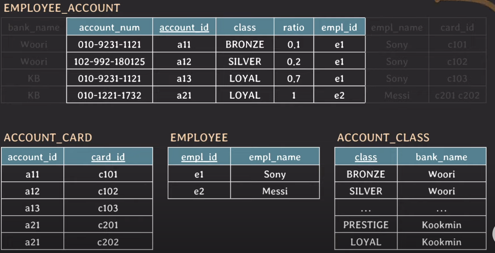

- 

<ins><strong>수평적 파티셔닝 (horizontal partitioning)</strong></ins> : row를 기준으로 table 나누는 방식
<ul><li>테이블의 스키마는 그대로 유지가 됨</li><li>

ex) 유튜브 구독자 정보에 대하여 저장하는 테이블
<ol><li>이 테이블이 가질 수 있는 데이터의 최대치를 생각해보면, <code>사용자 N명</code>, <code>채널수 M개</code>, 최대 row 수는 <code>모든 사용자가 모든 채널을 구독하는 경우 N * M개</code>이다.</li><li>만약, 사용자 수가 100만명(1M)이고 채널 수가 1000개(1K)라면 row 수는 10억(1G) 개가 된다.</li><li>테이블의 크기가 커질수록, 인덱스의 크기도 커지게 됨 → 테이블에 read/write 할 때마다 인덱스에서 처리되는 시간도 조금씩 증가할 것</li><li>이때, 해쉬 기반 수평적 파티셔닝 이용 (hash-based horizontal partitioning)</li><li>hash function을 하나 만들고 예를 들어, user_id를 input으로 넣어서 output이 0과 1이 나오면 0은 0 테이블로 1은 1 테이블로 ! 
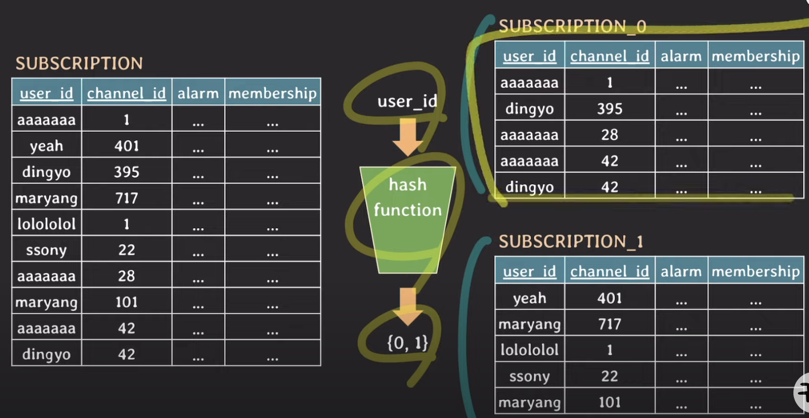
</li><li>이 기준이 되는 user_id를 partition key 라고 함.</li><li>가장 많이 사용될 패턴에 따라 partition key를 정하는 것이 중요 + 데이터가 균등하게 분배될 수 있도록 hash function을 잘 정의하는 것이 중요</li><li>hash-based horizontal partitioning은 한번 partition이 나눠져서 사용되면 이후에 partition을 추가하기 까다로움</li></ol>
</li></ul>

<ins><strong>샤딩 (sharding) : 큰 테이블을 동일한 스키마를 가진 여러 DB 서버에 shard 단위로 분산 저장하는 방법</strong></ins>이다. → 수평적 파티셔닝으로 나누어진 테이블들을 각각의 DB 서버에 저장하는 방식

- horizontal partitioning 처럼 동작하는데, 샤딩은 각 partition이 독립된 DB 서버에 저장됨

- 파티셔닝은 하드웨어 자원이 한정되어있는 상태니까, 결국 DB 서버에 부하 자체는 그대로 받는거고 샤딩은 서로 다른 DB 서버니까 <ins>**부하(load)가 분산**</ins>이 됨

- 

샤딩 적용 시 문제점 및 고려 사항
<ol><li>데이터 재분배 : 샤딩된 DB의 물리적 한계나 성능 한계 도달 시, 결국 scale-up 해야하는데 이때 서비스 정지 없이 scale-up 할 수 있도록 설계 방향 잡아야 함</li><li>데이터 조인 : 샤딩 DB 간 조인이 불가능하므로 데이터 중복에 대한 트레이드-오프</li><li>Global Unique Key : <ins>라우팅을 위해 구분할 수 있는 유일한 키 값이 있어야 한다.</ins></li><li>DBMS에서 제공하는 auto-increment를 사용하면 key가 중복될 수 있으니, 애플리케이션 레벨에서 key 생성을 담당해야 한다.</li><li>프로그래밍 복잡도가 증가하고, 데이터가 한쪽 샤드로 몰리면 샤딩이 무의미해진다.</li><li>한 번 샤딩하면 샤딩 이전 구조로 돌아가기 힘들다.</li></ol>

 

6-2. 클러스터링, 레플리케이션에 관하여 설명해 주세요. (창작 문제)

 

- 

<ins>레플리케이션 (replication) : 여러 개의 데이터베이스 서버를 권한에 따라 <strong>수직적인 구조</strong>(master-slave)로 구축하는 방식</ins>
<ul><li>

단순 백업 : 저장된 데이터가 손실되었을 때의 문제를 해결하기 위해 나온 아키텍트이다. 실제 저장소와 sync를 맞춰서 다른 저장소에 복제하는 형식
 
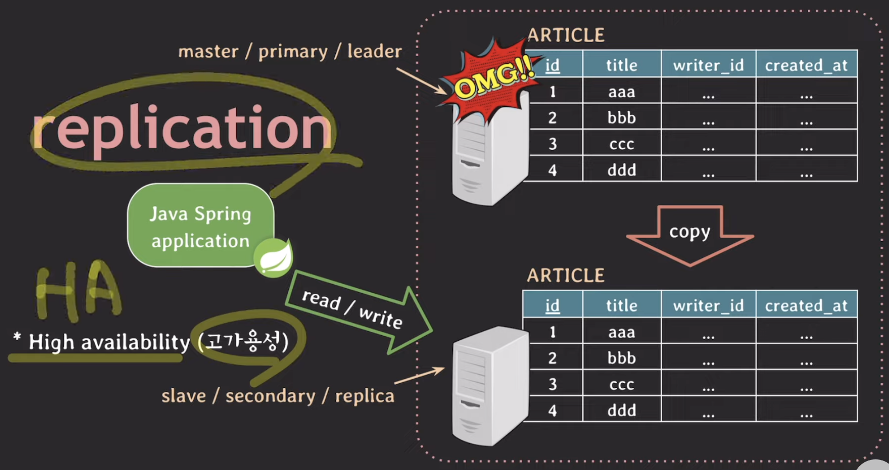

</li><li>

부하 분산 : 구성된 master-slave 구조를 이용하면 read 작업은 slave로 보내는 형식을 채택하여 부하를 분산시킬 수도 있음
 
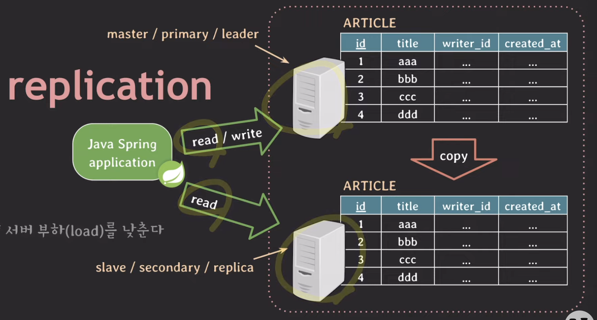

</li><li>

동작 방식
<ol><li>master 노드에 쓰기 트랜잭션 수행</li><li>master 노드는 데이터를 저장하고 트랜잭션에 대한 로그를 Binary Log에 기록</li><li>slave 노드의 I/O 스레드는 master 노드의 Binary Log를 Relay Log에 복사</li><li>slave 노드의 SQL 스레드는 Relay Log를 한 줄씩 읽어 데이터를 저장<ul><li>Binary Log : DB 변경 내용을 기록하는데 이용하는 로그</li><li>Relay Log : slave DB에만 위치, master DB의 Binary Log를 복사해 저장하는데 이용하는 로그</li></ul></li></ol>
</li><li>

장단점
 장점 <ul><li>읽기/쓰기 비율이 8:2, 9:1이 많아서, 레플리케이션만으로도 성능 높일 수 있음</li><li>데이터베이스 서버와 스토리지 모두 확장</li><li>비동기 방식으로 노드 데이터 동기화하여 지연시간 거의 없음</li></ul> 단점 <ul><li>노드들 간 데이터 동기화 보장 X → 데이터 일관성 보장하지 못할 수 있음</li><li>master 노드가 다운되면 fail-over가 까다로움</li></ul>
</li></ul>

- 

<ins>클러스터링 (clustering) : 여러 개의 데이터베이스 서버를 <strong>수평적인 구조</strong>>로 구축하는 방식</ins>
<ul><li>

Active - Active 이중화 : 실제로 동작하는 서버를 여러 대 두는 것
<ul><li>cpu, memory 등 더 많이 사용 → 실제 서버 2대니까 비용적으로 비쌈</li><li>database storage (데이터가 실제로 저장되는 저장소)는 하나를 공유하기에 병목 발생할 수 있음</li></ul>
</li><li>

Active - Standby 이중화 : 하나는 운영 + 하나는 대기 상태인 서버 운영
<ul><li>운영중인 서버 다운 시 대기 상태인 서버가 실행</li><li>비용적으로 줄어들지만, 운영서버 다운 시 active-active 와는 다르게 약간의 다운타임 있을 수 있음</li></ul>
</li><li>

동작 방식
 
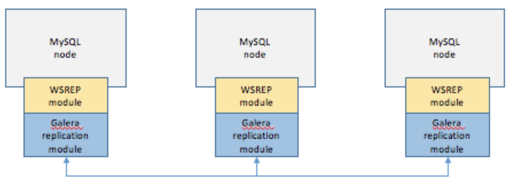
<ol><li>1개의 노드에 쓰기 트랜잭션이 수행되고, 커밋을 실행</li><li>실제 디스크에 내용을 쓰기 전에 다른 노드로 데이터의 복제를 요청</li><li>다른 노드에서 복제 요청을 수락했다는 신호를 보내고, 디스크에 쓰기 시작</li><li>다른 노드로부터 신호를 받으면 실제 디스크에 데이터를 저장</li></ol>
</li><li>

장단점
 장점 <ul><li>노드들 간 데이터를 동기화하여 항상 일관성있는 데이터를 얻을 수 있음</li><li>노드가 죽어도 다른 노드가 살아있어 시스템에 장애가 발생하지 않음</li></ul> 단점 <ul><li>여러 노드 간 데이터를 동기화하는 시간이 필요해서 레플리케이션보다 쓰기 성능이 떨어짐</li><li>장애가 전파되면 처리가 까다롭고, 데이터 동기화에 의해 스케일링에 한계가 존재</li></ul>
</li></ul>

 

6-3. RDBMS, NoSQL에서의 클러스터링/레플리케이션 방식에 대해 설명해 주세요. (출처 : vsfe)

 

- 

RDBMS / NoSQL 레플리케이션 방식 (둘다 동일)
<ul><li>master-slave 구조로 구성해서 master는 write만 처리하고 slave는 read만 수행</li><li>사용자 증대 등으로 인해 부하가 증가하면 slave를 증설</li><li>slave를 증설하면 부하 분산으로 인한 로드밸런서도 같이 구축</li></ul>

- 

RDBMS 클러스터링 방식
<ul><li><a href='https://dataonair.or.kr/db-tech-reference/d-lounge/technical-data/?mod=document&uid=237345' target='_blank'><ins>MySQL 클러스터</ins></a>같은거 이용해서 관리 노드(management node), 데이터 노드(data node), SQL node 3가지로 구성</li><li>관리 노드를 시작하고 데이터 노드와 SQL 노드 연결하는 방식</li><li>전통적인 RDBMS 클러스터에서는 I/O 병목이나 락 경쟁 같은 성능저하 발생함<ul><li>MySQL 클러스터 이용 시, 공유디스크나 락 경쟁에 대한 성능 저하는 발생하지 않음 → 기본적으로 메모리 기반 데이터베이스이고, 데이터는 여러 데이터 노드에 분산되어 있으며 각 노드는 자체 메모리에 데이터를 저장하고 액세스해서 그럼</li><li>MySQL 클러스터 또한 완전 분산 시스템은 아니라서 노드 간 통신은 네트워크를 통해 이루어지니까 네트워크 지연이 성능에 영향을 끼칠 수 있음</li><li>트랜잭션 처리 시 노드 간 동기화를 위해 락이 사용 되므로 이에 대한 성능 저하가 발생할 수 있음</li></ul></li><li>Data node를 초기에 구축하면 데이터 증가로 인한 노드 추가시 시스템 전체 정지 후 재구축해야 하는 단점이 존재</li><ul><li>MySQL 클러스터는 전체 시스템을 정지시키지 않고 노드를 확장할 수 있는 기능인 온라인 스케일 아웃을 제공</li></ul></ul>

- 

NoSQL 클러스터링 방식
<ul><li>NoSQL은 RDBMS 제품군에 비하여 클러스터링 기능이 자체적으로 탑재되어 있고 간단한 설정만으로 클러스터링이 가능하여 비교적 쉽다.</li><li>몽고디비 예시<ol><li>mongos 인스턴스를 여러 대의 서버에 설치하고 네트워크 주소, 레플리카셋 이름, 샤딩 설정등을 포함하는 설정파일을 준비</li><li>레플리카셋으로 구성하고 각 레플리카셋을 샤딩 클러스터에 추가</li><li>샤딩을 위한 키를 결정하고 샤딩 설정 수행</li></ol></li></ul>

 

6-4. MySQL의 레플리케이션 방식에 대하여 아는대로 설명해주세요. (창작 문제)

 
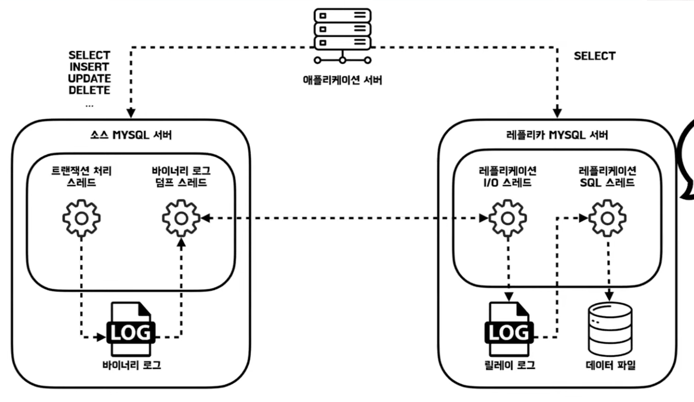

- <ins><strong>작동 원리</strong></ins>
    1. master 노드에 쓰기 트랜잭션 수행
    2. master 노드는 데이터를 저장하고 트랜잭션에 대한 로그를 Binary Log에 기록
    3. 바이너리 로그 덤프 스레드가 slave로 던짐
    4. slave 노드의 I/O 스레드는 master 노드의 Binary Log를 Relay Log에 복사
    5. slave 노드의 SQL 스레드는 Relay Log를 한 줄씩 읽어 데이터를 저장
        - Binary Log : DB 변경 내용을 기록하는데 이용하는 로그
        - Relay Log : slave DB에만 위치, master DB의 Binary Log를 복사해 저장하는데 이용하는 로그

- <ins><strong>복제 방식</strong></ins>
    - 복제 타입 → 바이너리 로그에 기록된 변경내역을 식별하는 방식에 따라 구분
        - <ins><strong>바이너리 로그 파일 위치 기반 복제</strong></ins> (물리적 방식, 파일명과 위치)
        - <ins><strong>글로벌 트랜잭션 아이디(GTID) 기반 복제</strong></ins> (논리적 방식, 식별자)
            - GTID = master_id + transaction_id
            - 동일한 이벤트(트랜잭션)가 모든 서버에서 고유한 식별자 GTID 가짐

- <ins><strong>복제 동기화 방식</strong></ins>
    - <ins><strong>비동기 복제</strong></ins> : master에서 slave에 변경되었는지 확인안하고 스토리지 엔진에 커밋하고 사용자에게 응답 줌 → 바이너리 로그가 잘 전달되었는지, 실제로 적용되었는지 알지도 못하고 보장도 하지 않음 
    
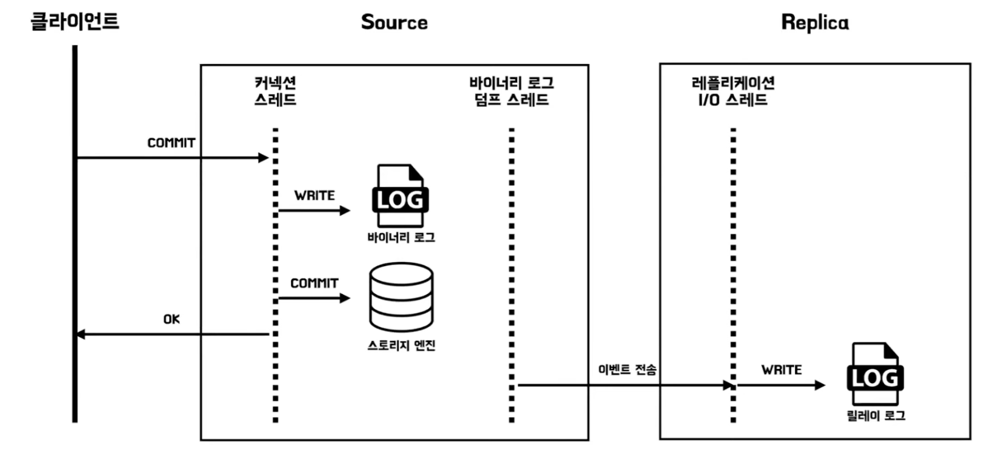

    - <ins><strong>반동기 복제</strong></ins> : master에서 slave로 어느정도 동기화가 되었음을 보장하는 방식 (그런데 진짜 실제 데이터파일이 쓰여져 있음을 보장하는게 아니라 “릴레이 로그”에 기록되었다는 것을 보장하는 것, 그래서 반동기 복제)
    
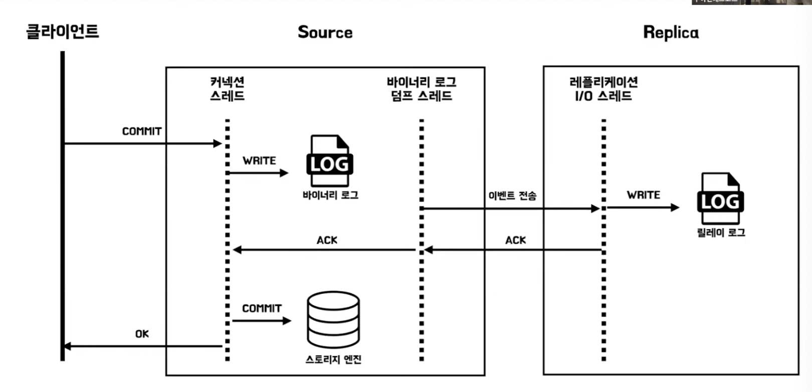

 

6-5. 이러한 분산 환경에선, 트랜잭션을 어떻게 관리할 수 있을까요? (출처 : vsfe)

- 대표적으로 2PC 알고리즘과 SAGA 패턴이 있다.

- 

<ins><strong>2Phase Commit (2PC) 알고리즘</strong></ins>
 
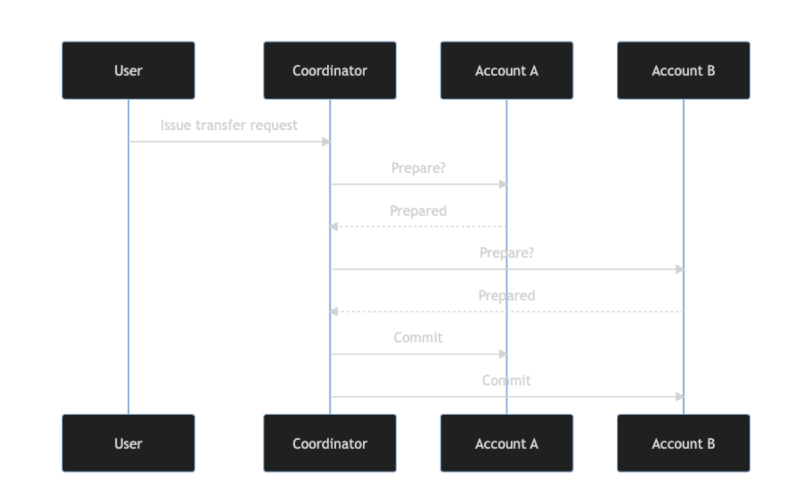
<ul><li><ins><strong>여러 노드들 상에서의 원자적 트랜잭션 커밋을 이루기 위한 알고리즘</strong></ins>이다. 즉, 트랜잭션을 커밋할지 아니면 롤백할지에 대해 분산 원자적 트랜잭션에 관여하는 분산 알고리즘의 하나이다.</li><li>Prepare Phase (준비 단계/투표 단계) : 트랜잭션 매니저 (TM)는 모든 리소스 매니저 (RM)에게 트랜잭션 커밋 준비를 알린다. RM들은 이 요청을 받고 필요한 모든 작업을 준비하며 준비가 완료되면 응답</li><li>Commit/Rollback Phase (커밋/ 롤백 단계) : 모든 RM이 준비되면 TM은 트랜잭션을 커밋하고, 만약 어떤 RM이 준비되지 않았다면, TM은 트랜잭션을 롤백</li><li>

2PC를 사용했을 경우의 문제점
<ul><li>트랜잭션의 책임이 트랜잭션을 조율하는 Coordinator Node에 있으며 이 부분이 단일 실패지점(SPOF)가 될 수 있음</li><li>전체 트랜잭션이 완료될 때까지 서비스에서 사용하는 리소스가 잠겨 있어 서비스가 완료될 때까지 대기하여야 한다. 때문에 지연 시간이 늘어나고 리소스가 차단되어 확장이 어려워질 수 있다.</li><li>NoSQL은 2PC-분산 트랜잭션을 지원하지 않음</li></ul>
</li><li>결과적으로, <ins><strong>2PC 알고리즘은 서비스가 증가할수록 시스템의 대기시간이 길어지고, 응답시간의 증가롤 초래한다. 특히 락을 걸어야 하는 row의 범위가 넓거나 트랜잭션 기간이 길면 시스템에 엄청난 대기시간을 발생시키니까 2PC는 일반적으로 수명이 짧은 작업에만 사용하는 것을 권장</strong></ins></li></ul>

- 

<ins><strong>SAGA 패턴</strong></ins>
<ul><li>MSA 환경에서 일관성을 지키기 어렵다는 것을 기반으로, 약간의 일관성을 포기하고 <ins><strong>Eventual Consistency(최종 일관성)을 보장</strong></ins>하여 효율성을 높이기 위한 패턴</li><li>단일 DB에서 장시간 동작하는 트랜잭션을 지원하는 메커니즘으로 계획됐지만, 여러 서비스에 걸친 트랜잭션 관리에도 적합하다. NoSQL 같이 분산 트랜잭션 처리를 지원하지 않는 경우에도 Saga Pattern을 이용해서 데이터 일관성을 보장받을 수 있다.</li><li>2PC에서는 트랜잭션을 하나의 트랜잭션으로 묶어서 처리를 하지만, <ins><strong>SAGA 패턴은 긴 트랜잭션을 여러 개의 짧은 로컬 트랜잭션으로 분리하는 접근 방식</strong></ins>이다. <ins><strong>각 트랜잭션은 다른 트랜잭션의 완료를 기다리지 않고 독립적으로 실행</strong></ins></li><li>각 서비스의 로컬 트랜잭션을 순차적으로 처리해서, 각 로컬 트랜잭션은 데이터베이스를 업데이트한 다음 Saga 내의 다음 로컬 트랜잭션을 트리거하는 메시지/이벤트를 게시 <ins><strong>(이벤트 기반)</strong></ins></li><li><ins><strong>트랜잭션이 실패해서 롤백이 필요한 경우</strong></ins> 이전 로컬 트랜잭션이 작성한 변경 사항을 취소하는 <ins><strong>일련의 보상 트랜잭션을 통해 전체의 일관성을 유지</strong></ins><ul><li>보상 트랜잭션 : 분산된 트랜잭션 중 일부가 실패할 경우, 그 실패 전에 성공적으로 완료된 트랜잭션을 보상 즉, 되돌리는 역할을 하는 트랜잭션</li></ul></li><li>구현 방법에는 Choreography SAGA(코레오크레피 사가), Orchestration SAGA(오케스트레이션 사가) 두 가지가 있다.<ul><li>Choreography SAGA : 각 서비스끼리 이벤트 주고 받는 방식<ul><li>중간에서 Kafka, Rabbit MQ 등 메시지 큐를 통해 비동기 방식 전달</li><li>중앙 집중형 관리 방식이 아니라 SPOF 없음</li><li>서비스 간 연결 잘 확인해야하는데, 큰 시스템이면 구조 파악 어려워짐</li><li>트랜잭션 시뮬레이션을 위해 모든 서비스를 실행해야해서 통합 테스트와 디버깅 어려워짐</li></ul></li><li>Orchestration SAGA : Orchestrator를 중심으로 하는 Invoke/Reply 방식으로, 트랜잭션이 실패하면 Orchestrator가 그동안의 호출에 대한 보상 이벤트를 호출해서 데이터 정합성을 보장<ul><li>트랜잭션 처리를 위한 매니저 인스턴스가 별도로 존재</li><li>많은 서비스가 있는 복잡한 워크플로우에 적합, 구조 파악 쉬워짐</li><li>전체 워크플로우를 Orchestrator가 관리해서 SPOF 될 가능성 있음</li></ul></li></ul></li></ul>

 

6-6. 마스터, 슬레이브 데이터 동기화 전 까지의 데이터 정합성을 지키는 방법은 무엇이 있을까요? (출처 : vsfe)

 
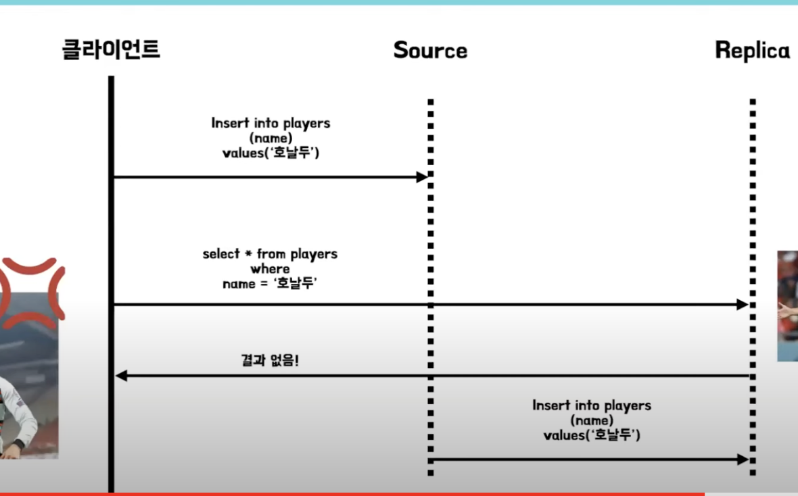

 
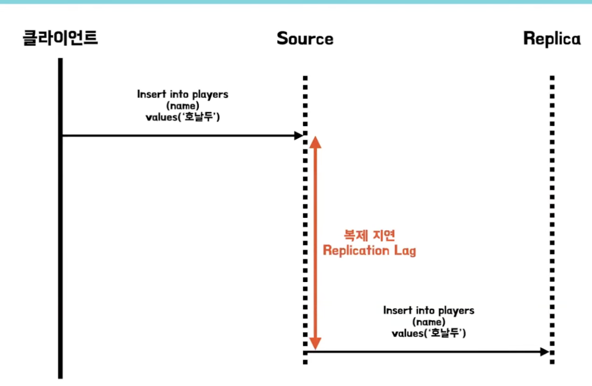

- 다중 스레드로 동시다발적으로 write 작업을 수행하는 master 와 단일 스레드로 write 작업을 수행하는 slave 간의 속도차에 의해 병목이 발생 → `복제 지연 현상`

- <ins><strong>반동기 복제</strong></ins> : master에서 slave로 어느정도 동기화가 되었음을 보장하는 방식 (그런데 진짜 실제 데이터파일이 쓰여져 있음을 보장하는게 아니라 “릴레이 로그”에 기록되었다는 것을 보장하는 것, 그래서 반동기 복제)

- <ins><strong>MHA (Master High Availability)</strong></ins> : master의 고가용성을 위해 개발된 오픈소스인데, master의 health check를 주기적으로 수행하던 slave에서 자동으로 가신 최신 상태의 slave db를 master로 승격시켜 fail-over 해준다.

- (답변1) 반동기 복제 + MHA 조합을 이용하면, 마지막에 커밋된 릴레이 로그는 항상 slave 어딘가에 존재하게 되고, 마스터에 장애가 발생하더라도 릴레이 로그 복구 과정을 통해 동기화하기에 데이터 정합성을 어느정도 지킬 수 있다.

- (답변2) 자신이 쓴 내용 읽기, 쓰기 일관성, 단조 읽기, 등등 .. <a href='https://johngrib.github.io/wiki/study/ddia/05-replication/#%EB%B3%B5%EC%A0%9C-%EC%A7%80%EC%97%B0-%EB%AC%B8%EC%A0%9C' target='_blank'>링크</a> 이 내용이 맞는지 모르겠네요

 

6-7. 다중 트랜잭션 상황에서의 Deadlock 상황과, 이를 해결하기 위한 방법에 대해 설명해 주세요. (출처 : vsfe)

 

6-8. 샤딩 방식은 무엇인가요? 만약 본인이 DB를 분산해서 관리해야 한다면, 레플리케이션 방식과 샤딩 방식 중 어떤 것을 사용할 것 같나요? (출처 : vsfe)

 

- 

<ins><strong>샤딩 (sharding) : 큰 테이블을 동일한 스키마를 가진 여러 DB 서버에 shard 단위로 분산 저장하는 방법</strong></ins>이다. → 수평적 파티셔닝으로 나누어진 테이블들을 각각의 DB 서버에 저장하는 방식
<ul><li>horizontal partitioning 처럼 동작하는데, 샤딩은 각 partition이 독립된 DB 서버에 저장됨</li><li>파티셔닝은 하드웨어 자원이 한정되어있는 상태니까, 결국 DB 서버에 부하 자체는 그대로 받는거고 샤딩은 서로 다른 DB 서버니까 <ins><strong>부하(load)가 분산</strong></ins>이 됨</li><li>

샤딩 적용 시 문제점 및 고려 사항
<ol><li>데이터 재분배 : 샤딩된 DB의 물리적 한계나 성능 한계 도달 시, 결국 scale-up 해야하는데 이때 서비스 정지 없이 scale-up 할 수 있도록 설계 방향 잡아야 함</li><li>데이터 조인 : 샤딩 DB 간 조인이 불가능하므로 데이터 중복에 대한 트레이드-오프</li><li>Global Unique Key : <ins>라우팅을 위해 구분할 수 있는 유일한 키 값이 있어야 한다.</ins></li><li>DBMS에서 제공하는 auto-increment를 사용하면 key가 중복될 수 있으니, 애플리케이션 레벨에서 key 생성을 담당해야 한다.</li><li>프로그래밍 복잡도가 증가하고, 데이터가 한쪽 샤드로 몰리면 샤딩이 무의미해진다.</li><li>한 번 샤딩하면 샤딩 이전 구조로 돌아가기 힘들다.</li></ol>
</li></ul>

- 상황에 따라 다를 것 같다. 샤딩의 경우 데이터가 많을 때 효율적으로 데이터를 나누어서 부하를 줄일 수 있을 것 같지만, Global Unique Key, 애플리케이션 레벨에서 key 생성 등 운영 복잡도가 높아지기에 최대한 피하고 싶고 레플리케이션 방식을 이용하여 부하를 분산하고 싶다. 단 비용적인 측면에 있어서는 문제가 될 것 같아서, 둘 다 비교해보고 적당한 타협점을 찾아야 할 것 같다.

  

## 7번 질의

7-1. 정규화가 무엇인가요? (출처 : vsfe)

- 데이터의 중복 방지, 무결성 충족 등을 위하여 데이터베이스를 설계하는 것

- 이상현상이 있는 릴레이션을 분해하여 이상현상을 없애는 과정이기도 함

- 정규형이 높아질수록 이상현상이 줄어듦

 

7-2. 정규화가 왜 필요한가요? (출처 : vsfe)

 

- 데이터베이스에서 갱신 이상을 없애고, 데이터의 중복을 최소화하기 위하여

 

7-3. 정규화를 하지 않을 경우, 발생할 수 있는 이상현상에 대해 설명해 주세요. (출처 : vsfe)

- <ins><strong>삽입 이상 (Insertion Anomaly)</strong></ins> : 튜플 삽입 시 특정 속성에 해당하는 값이 없어서 NULL을 입력해야 하는 현상

- <ins><strong>삭제 이상 (Deletion Anomaly)</strong></ins> : 튜플 삭제 시 같이 저장된 다른 정보까지 연쇄적으로 삭제되는 현상

- <ins><strong>갱신 이상 (Update Anomaly)</strong></ins> : 튜플 갱신 시 중복된 데이터의 일부만 갱신되어 일어나는 데이터 불일치 현상

 

7-4. 각 정규화에 대해, 그 정규화가 진행되기 전/후의 테이블의 변화에 대해 설명해 주세요. (출처 : vsfe)

 

- 1도 2부 3이 보결
- 제 1정규형 (1NF) - 도메인이 원자
- 제 2정규형 (2NF) - 부분 함수적 종속 제거
- 제 3정규형 (3NF) - 이행적 함수 종속 제거
- BCNF (Boyce-Codd Normal Form) - 결정자
- [링크 참조](https://github.com/Shin-Jae-Yoon/TILbefore/blob/main/Computer%20Science/Database/pukyong/2022.05.24.md)

 

7-5. 정규화가 무조건 좋은가요? 그렇지 않다면, 어떤 상황에서 역정규화를 하는게 좋은지 설명해 주세요. (출처 : vsfe)

 

- 정규화가 무조건 좋지많은 않다. 과도한 정규화를 통해 수행 속도가 느려진다거나 join 연산이 많아지는 경우에 역정규화를 통해 성능 향상을 꾀할 수 있다.

  

## 8번 질의

8-1. View가 무엇이고, 언제 사용할 수 있나요? (출처 : vsfe)

- 뷰(View)는 기본 테이블로부터 유도된 가상/임시 테이블로, 저장장치 내에 물리적으로 존재하지 않는 것이다.

- Virtual Relation을 이용하여 테이블이 아닌데 테이블처럼 보이게 하여서 view 를 사용하면 JOIN문을 최소화하여 사용상의 편의성을 향상시킬 수 있다.

 

8-2. 그렇다면, View의 값을 수정해도 실제 테이블에는 반영되지 않나요? (출처 : vsfe)

 

- 뷰는 테이블에서 유도된 임시 테이블이라서 실제 테이블에는 반영되지 않는다.

  

## 13번 질의

13-1. Schema가 무엇인가요? (출처 : vsfe)

- 스키마는 데이터 모델을 바탕으로 데이터베이스의 구조를 기술한 것이다.

- 데이터베이스의 구조와 제약 조건에 관한 전반적인 명세를 기술하는 메타데이터의 집합

 

13-2. Schema의 3계층에 대해 설명해 주세요. (출처 : vsfe)

 

- three-schema 아키텍처는 데이터베이스 시스템을 구축하는 아키텍처 중의 하나인데, 외부 스키마, 개념 스키마, 내부 스키마가 있다.

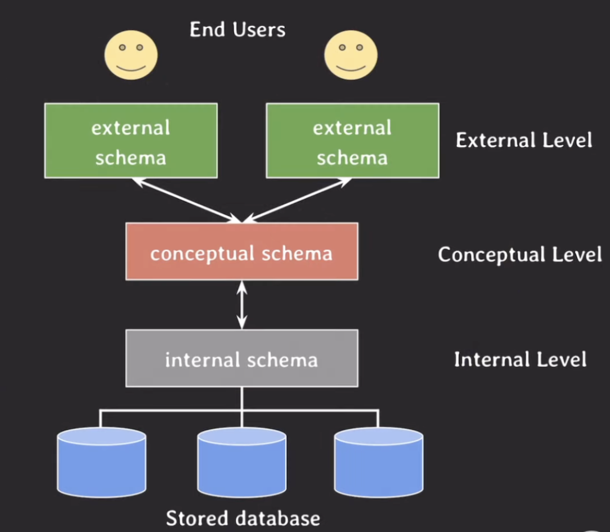

    
- 내부 스키마 : 물리적인 저장 장치에 가장 가깝게 위치하면서, 물리적으로 데이터가 어떻게 저장되는지 physical data model을 통해 표현한다. data storage, data structure, access path (index) 등등 실체가 있는 내용 기술

- 외부 스키마 : 실제 사용자가 바라보는 곳으로, 특정 유저들이 필요로 하는 데이터만 표현하는 계층이다.

- 개념 스키마 : 내부 스키마를 한 번 추상화해서 표현한 것으로, logical data model을 표현한다.

 

## 참고 자료

- vsfe 님의 **[VSFE / Tech-Interview Github](https://github.com/VSFe/Tech-Interview/tree/main)**
- 망나니개발자 님의 [**[MySQL] 프라이머리 키(PK, Primary Key)에 대해 쉽고 완벽하게 이해하기**](https://mangkyu.tistory.com/285)
- becooq81 님의 [**벨로그 CS 공부 저장소 - DB편**](https://velog.io/@becooq81/%EB%8D%B0%EC%9D%B4%ED%84%B0%EB%B2%A0%EC%9D%B4%EC%8A%A4)
- 우아한테크 라라, 제로님의 **[[10분 테코톡] 라라, 제로의 데이터베이스 인덱스](https://www.youtube.com/watch?v=edpYzFgHbqs)**
- 유튜버 쉬운코드 님의 **[[DB] 파티셔닝? 샤딩? 레플리케이션?](https://www.youtube.com/watch?v=P7LqaEO-nGU&list=PLcXyemr8ZeoREWGhhZi5FZs6cvymjIBVe&index=29)**
- pino 님의 티스토리 **[SQL vs NoSQL 비교 리플리케이션, 클러스터링, 샤딩](https://pinopino.tistory.com/entry/5-SQL-vs-NoSQL-%EB%B9%84%EA%B5%90-%EB%A6%AC%ED%94%8C%EB%A6%AC%EC%BC%80%EC%9D%B4%EC%85%98-%ED%81%B4%EB%9F%AC%EC%8A%A4%ED%84%B0%EB%A7%81-%EC%83%A4%EB%94%A9)**
- 망나니개발자님의 **[리플리케이션 vs 클러스터링](https://mangkyu.tistory.com/97)**
- 지마켓 블로그 **[MySQL Cluster 도입 배경](https://dev.gmarket.com/61)**
- dev_hwan 님의 **[MSA 환경에서의 분산 트랜잭션 관리](https://velog.io/@ch200203/MSA-%ED%99%98%EA%B2%BD%EC%97%90%EC%84%9C%EC%9D%98-%EB%B6%84%EC%82%B0-%ED%8A%B8%EB%9E%9C%EC%9E%AD%EC%85%98-%EA%B4%80%EB%A6%AC2PC-SAGA-%ED%8C%A8%ED%84%B4)**
- 개발자국 DEV_PRINTS 님의 **[레플리케이션의 문제와 해결방법 복제지연](https://iiaii.tistory.com/entry/%EB%A6%AC%ED%94%8C%EB%A6%AC%EC%BC%80%EC%9D%B4%EC%85%98%EC%9D%98-%EB%AC%B8%EC%A0%9C%EC%99%80-%ED%95%B4%EA%B2%B0%EB%B0%A9%EB%B2%95-%EB%B3%B5%EC%A0%9C%EC%A7%80%EC%97%B0-semi-sync)**
- 우아한테크 하마드님의 **[[10분 테코톡] 하마드의 복제와 복제지연](https://www.youtube.com/watch?v=CXGzd07c_xo)**