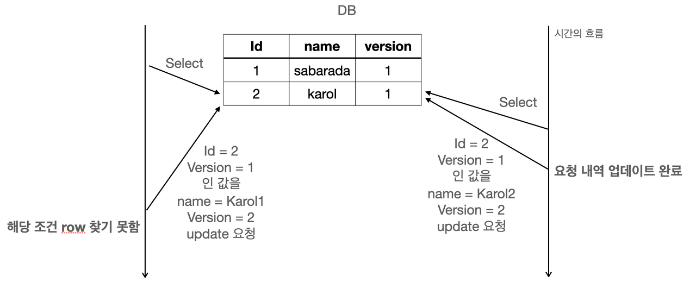
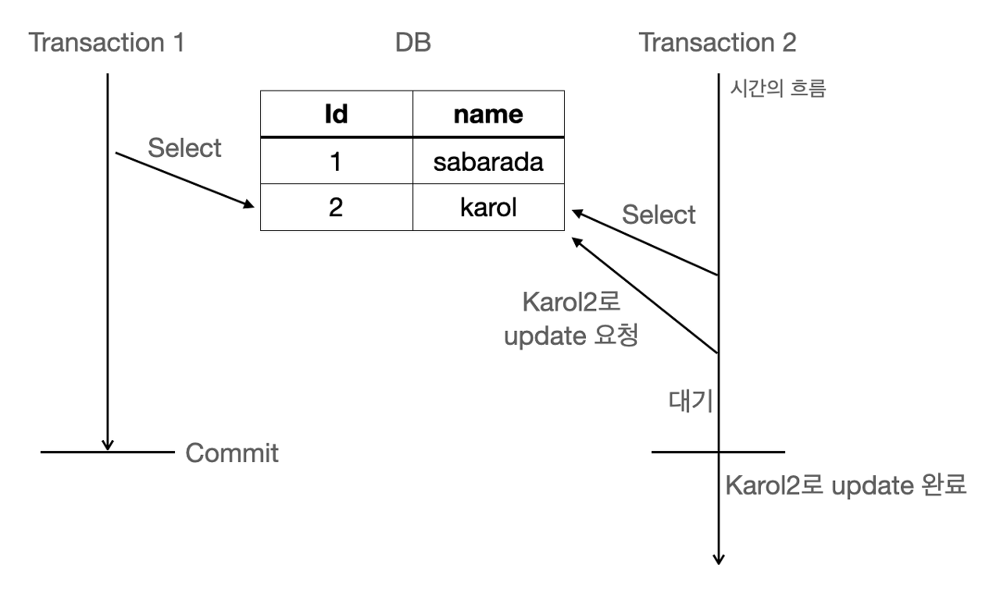

# 3/20 데이터베이스

- **트랜잭션이 무엇이고, ACID 원칙에 대해 설명해 주세요.**
    
    트랜잭션이란 질의(query)를 하나의 묶음 처리해서 만약 중간에 실행이 중단됐을 경우,
    
    처음부터 다시 실행하는 **Rollback**을 수행하고, 오류없이 실행을 마치면 **commit**을 하는 실행 단위를 의미합니다.
    
    즉, 한 번 질의가 실행되면 질의가 모두 수행되거나 모두 수행되지 않는 **작업수행의 논리적 단위**입니다.
    
    예를 들어, 친구에게 인터넷 뱅킹으로 10,000원을 송금하는 상황을 가정해보겠습니다.
    
    제가 친구에게 송금을 한다면, 저의 계좌에서 10,000원을 차감하고 친구의 계좌에 10,000원을 증가시켜야 하는데,
    
    알 수 없는 오류로 인해 저의 계좌에서는 10,000원이 줄었지만 친구 계좌에는 10,000원이 증가되지 않는다면 어떻게 될까요?
    
    저의 10,000원은 그냥 공중으로 증발해버리는 문제가 발생합니다.
    
    이러한 경우가 생기지 않도록 중간에 오류가 발생하면 다시 처음부터 송금을 하도록 하는 것이 rollback입니다.
    
    오류 없이 정상적으로 송금이 됐다면 정상적으로 실행이 끝났으므로 commit을 합니다.
    
    즉, 송금 과정을 하나의 트랜잭션이라 볼 수 있습니다.
    
    ### **트랜잭션 사용 이유**
    
    트랜잭션은 DB 서버에 여러 개의 클라이언트가 동시에 액세스 하거나 응용프로그램이 갱신을 처리하는 과정에서 중단될 수 있는 경우 등 **데이터 부정합을 방지**하고자 할 때 사용합니다.
    
    부정합이 발생하지 않으려면 프로세스를 병렬로 처리하지 않도록 하여 한 번에 하나의 프로세스만 처리하도록 하면 되는데, 이는 효율이 너무 떨어집니다.
    
    즉, 병렬로 처리할 수 밖에 없는 현실적인 상황으로 인해 부정합을 방지하고자 트랜잭션을 사용하는 것입니다.
    
    트랜잭션에서 중요한 것은 스케줄 관리입니다. 스케줄을 잘못 짜게 되면, 데드락에 빠지게 됩니다.
    
    ### Atomicity (원자성)
    
    원자성: 트랜잭션이 데이터베이스에 모두 반영되거나, 전혀 반영되지 않아야 한다.
    
    트랜잭션 도중에 서버가 다운되는 등에 사건이 발생하면 트랜잭션은 전혀 반영되지 않은 상태여야 한다.
    
    DBMS는 이전에 커밋된 상태를 임시 영역에 따로 저장하고, 현재 수행하고 있는 트랜잭션에 의해 변경된 내역을 유지한다. 현재 수행하고 있는 트랜잭션에서 오류가 발생하면 현재 변경 내역을 날리고, 임시 영역에 저장했던 상태로 롤백한다.
    
    > Rollback segment: 이전 데이터를 임시로 저장하는 영역
    > 
    > 
    > **데이터베이스 테이블**: 현재 수행하고 있는 트랜잭션에 의해 새롭게 변경되는 내역
    > 
    
    트랜잭션의 원자성은 롤백 세그먼트에 의해 보장된다.
    
    > 트랜잭션의 길이가 길 때는 오류가 발생해서 처음부터 작업을 수행하는 것을 방지하기 위해 확실한 부분에 대해서는 롤백이 되지 않도록 중간 저장 지점인 save point를 지정할 수 있다.
    > 
    
    이러한 과정을 **UNDO** 연산이라 부른다. UNDO 연산은 트랜잭션이 정상적으로 종료될 수 없게 되면 트랜잭션이 변경한 페이지들을 원상 복구시킨다.
    
    DBMS는 두 개의 버퍼 관리 정책 중 골라 UNDO를 수행할 수 있는데, **STEAL** 정책으로 수정된 페이즈를 언제든지 디스크에 쓸 수도 있고, **¬STEAL**를 통해 수정된 페이즈들을 최소한 트랜잭션 종료 시점까지는 버퍼에 유지할 수도 있다. 거의 모든 DBMS는 STEAL 정책을 채택해 사용하고, 이는 필연적으로 UNDO 로깅과 복구 작업을 수반한다. ¬Steal 정책은 매우 큰 크기의 메모리 버퍼를 필요로 한다는 단점이 있다.
    
    ### Consistency (일관성)
    
    일관성: 트랜잭션이 진행되는 동안에 데이터베이스가 변경되더라도 처음에 참조한 데이터베이스로 트랜잭션을 수행한다. 업데이트된 데이터베이스는 사용하지 않는다. 그래서 사용자는 일관성있는 데이터를 볼 수 있다.
    
    DBMS는 트랜잭션 전 후에 데이터 모델의 모든 제약 조건을 만족 시켜 일관성을 보장한다.
    
    ### Isolation (고립성)
    
    둘 이상의 트랜잭션이 동시에 실행되고 있는 경우, 각각 다른 트랜잭션의 연산에 끼어들 수 없다. 이 트랜잭션이 완료될 때까지 다른 트랜잭션은 이 트랜잭션의 결과를 참조할 수 없다.
    
    병행 처리(concurrent processing)의 경우에 공통된 데이터의 조작 때문에 데이터가 혼란스러워질 수 있어서 독립성 보장이 필수적이다. Lock과 Unlock을 통해 데이터의 고립성을 보장한다.
    
    - 트랜잭션에서 데이터를 읽을 때에는 여러 트랜잭션이 읽을 수는 있지만 쓸 수는 없는 `shared_lock`을 사용한다.
    - 트랜잭션에서 데이터를 쓸 때는 다른 트랜잭션이 읽을 수도 쓸 수도 없게 하는 `exclusive_lock`을 사용한다.
    - 트랜잭션의 읽기/쓰기 작업이 끝나면 `unlock`을 통해 다른 트랜잭션이 `lock`을 할 수 있도록 데이터에 대한 잠금을 푼다
    
    Lock을 사용하면 데드락이 발생할 수도 있어서 **2PL 프로토콜(2 Phase Locking Protocol)**을 통해 여러 트랜잭션이 공유하고 있는 데이터에 동시 접근할 수 없도록 한다.
    
    2PL 프로토콜은 두 개의 상태 (growing phase와 shrinking phase)가 가능하다. Growing phase에서는 `read_lock`, `write_lock`이 일어나고, shrinking phase에서는 `unlock`이 일어난다. 이 때 2PL 프로토콜은 growing phase와 shrinking phase가 섞이면 안된다고 정의한다. Lock이 다 일어난 후에 unlock이 모두 수행되어야 한다.
    
    ### Durability (지속성)
    
    지속성: 트랜잭션이 성공적으로 완료됐을 경우, 결과는 영구적으로 반영되어야 한다
    
    트랜잭션이 성공적으로 수행되었다면, 런타임 오류나 시스템 오류가 발생하더라도 해당 기록은 영구적이여야 한다.
    
    - **ACID 원칙 중, Durability를 DBMS는 어떻게 보장하나요?**
        
        해당 **트랜잭션에 대한 로그를 남겨놓는 방식**으로 Durability를 보장할 수 있습니다.
        
        **`Write-Ahead Logging (WAL)`:** 대부분의 관계형 데이터베이스 관리 시스템(RDBMS)에서는 Write-Ahead Logging을 사용하여 내구성을 보장합니다. 이 방법에서는 **트랜잭션이 커밋되기 전에 해당 변경 사항을 로그 파일에 먼저 기록한 후, 데이터 파일에 변경 사항을 적용**합니다. 따라서 트랜잭션을 커밋하기 전에 로그에 기록되어 있는 **모든 변경 사항은 시스템 장애 시에도 복구**될 수 있습니다.
        
        트랜잭션 수행을 완료하면 **부분완료** 또는 **실패** 상태 중 하나가 됩니다. DBMS는 부분완료 상태에서는 작업한 내용을 데이터베이스에 반영하고, 실패 상태에서는 작업한 내용을 취소합니다.
        
        - `부분완료`: 트랜잭션 수행은 완료됐지만 변경 내용이 데이터 베이스에 기록됐는지 확실하지 않은 상태입니다. 이 상태에서는 DBMS가 최종적으로 변경 내용을 데이터베이스에 기록해야 완료 상태(지속성)가 됩니다.
        - `실패`: 트랜잭션을 중간에 중단하였거나 부분완료 상태에서 변경 내용을 데이터베이스에 저장하지 못한 상태를 말합니다. 실패 상태에서 DBMS는 트랜잭션이 수행한 작업을 모두 원상복구시킵니다.
        
    - **트랜잭션을 사용해 본 경험이 있나요? 어떤 경우에 사용할 수 있나요?**
        
        하나의 엔티티에 여러 작업이 동시 수행될 가능성이 존재하면 사용하는 것이 좋다.
        
        스프링에서는 다음과 같이 트랜잭션을 보장할 수 있다: `@Transactional` 어노테이션에 격리 수준은 옵셔널하게 정의할 수 있음
        
        ```java
        @Transactional(isolation = Isolation.READ_COMMITTED)
        ```
        
        ### 특정 테이블의 잘못된 값을 수정하는 경우
        
        1. **잘못된 값 확인**: 먼저 잘못된 값을 확인
        2. **트랜잭션 시작**: 트랜잭션을 시작(START TRANSACTION). 변경 작업을 묶어서 처리
        3. **값 수정**: 잘못된 값을 올바른 값으로 수정
        4. **커밋**: 변경 작업이 완료되었을 경우, 트랜잭션을 커밋하여 변경 사항을 영구적으로 반영
        5. **롤백(옵션)**: 만약 변경 작업 중에 문제가 발생하여 트랜잭션을 취소해야 할 경우, 롤백을 수행하여 원래의 상태로 되돌림.
        
        ### DB에 새로운 데이터를 추가하는 경우
        
        - 웹 서버에서 POST로 받은 요청이 유저의 장바구니에 상품을 담는다고 가정하였을 때 해당 유저의 장바구니 테이블에 상품의 PK 값을 추가하는 경우
        1. 특정 상품을 상품 테이블에서 조회 후 PK 값 확인
        2. 특정 유저를 유저 테이블에서 조회 후 PK 값 확인
        3. **트랜잭션 시작**: 트랜잭션을 시작(START TRANSACTION). 변경 작업을 묶어서 처리
        4. 유저와 상품의 관계를 정의하는 장바구니 테이블에 각각의 PK 값을 Foreign Key로 사용하여 레코드 추가
        5. **커밋**: 추가 작업이 완료되었을 경우, 트랜잭션을 커밋하여 변경 사항을 영구적으로 반영
        6. **롤백(옵션)**: 만약 추가 작업 중에 문제가 발생하여 트랜잭션을 취소해야 할 경우, 롤백을 수행하여 원래의 상태로 되돌림.
        
        이외에도, 작업을 수행하기 위해 여러 쿼리를 실행해야 할 때, 각 쿼리의 성공 유무가 다른 쿼리의 결과에 critical한 영향을 미치는 경우(예를 들어, 계좌 입/출금 등의 경우)에 트랜잭션을 활용할 수 있습니다.
        
    - **읽기에는 트랜잭션을 걸지 않아도 될까요?**
        
        읽기 연산만 일어나면 데이터의 변경이 일어나지 않기 때문에 동시에 읽어도 문제가 생기지 않는다.
        
        ### 트랜잭션을 걸지 않을 때
        
        1. Dirty Read
        - 수정 중이고 커밋되지 않은 데이터를 다른 트랜잭션에서 읽게 되어 일관성에 어긋난낟.
        1. Non-Repeatable Read
        - 한 트랜잭션 내에서 같은 쿼리를 두번 수행할 때 그 사이에서 다른 트랜잭션이 수정 또는 삭제해서 둘의 결과가 다르게 나타나는 현상이 발생할 수 있음
        1. Phantom Read
        - 한 트랜잭션 안에서 일정 범위의 레코드를 두 번 이상 읽을 때 첫 번째 쿼리에서 없던 유령 레코드가 두 번째 쿼리에서 나타나는 현상
        
- **트랜잭션 격리 레벨에 대해 설명해 주세요.**
    - SQL 표준에서 정의한 3가지 이상 현상(dirty read, non-repeatable read, phantom read)에 대한 허용 수준입니다.
        - `dirty read`는 여러 트랜잭션이 실행되는 과정에서 아직 커밋되지 않은 데이터를 읽었을 때의 이상 현상을 의미합니다.
        - `non-repeatable read`는 두 번의 읽기 연산을 수행하는 트랜잭션을 실행할 때 다른 트랜잭션에 의해 각 연산의 결과가 달라지는 이상 현상을 의미합니다.
        - `phantom read`는 두 번의 읽기 연산을 수행하는 트랜잭션을 실행할 때 다른 트랜잭션에 의해 첫 번째 읽기 연산에서 보이지 않았던 데이터가 두 번째 읽기 연산에서 보이는 이상 현상을 의미합니다.
    - 허용 수준에 따라 트랜잭션 격리 레벨(isolation level)을 다음과 같이 정의할 수 있습니다.
        
        
        |  | Dirty read | Non-repeatable read | Phantom read |
        | --- | --- | --- | --- |
        | Read uncommitted | O | O | O |
        | Read committed | X | O | O |
        | Repeatable read | X | X | O |
        | Serializable | X | X | X |
    
    - 모든 DBMS가 4개의 레벨을 모두 구현하고 있나요? 그렇지 않다면 그 이유는 무엇일까요?
        - MySQL, Oracle, Postgresql 등 각 DBMS의 Isolation 레벨 구현은 모두 다르고, 같은 수준이더라도 그 구현은 다를 수 있습니다.
        - Isolation 레벨이 높을 수록 트랜잭션 처리 과정에서 제약이 발생해 처리량이 감소하기 때문입니다. 따라서 작업을 수행하고자 하는 Task에 따라 처리량과 데이터의 일관성을 타협하여 레벨을 설정해야 합니다.
        - InnoDB를 지원하는 MySQL의 경우 위에서 언급한 4개의 레벨을 모두 구현하고 있습니다.
    
    - 만약 MySQL을 사용하고 있다면, (InnoDB 기준) Undo 영역과 Redo 영역에 대해 설명해 주세요.
        - `Undo 영역`은 UPDATE나 DELETE로 데이터를 변경했을 때 변경되기 이전의 데이터를 보관하는 영역입니다.
        - `Redo 영역`은 DB상의 변경된 내용을 순차적으로 디스크에 기록하는 로그 파일이 저장되는 영역입니다.
        
    - 그런데, 스토리지 엔진이 정확히 무엇을 하는 건가요?
        - 스토리지 엔진은 DBMS가 데이터를 삽입, 추출, 업데이트, 삭제(CRUD)하는 데 사용하는 기본 소프트웨어 컴포넌트 입니다.
        - 즉, DB에서 데이터를 어떻게 저장하고 접근할 것인지에 대한 기능을 제공합니다.
        
- **DB Locking에 대해 설명해 주세요.**
    
    Lock이란 트랜잭션 처리의 순차성을 보장하기 위한 방법입니다. 
    
    트랜잭션이란 DB의 나누어지지 않는 최소한의 처리 단위입니다.
    
    Lock의 종류로는 공유(Shared) Lock과 베타(Exclusive) Lock이 있습니다.
    
    공유락은 다른 말고 Read Lock이라고 불리며 베타락은 Write Lock이라고도 불립니다.
    
    ### 공유(Shared) Lock
    
    **공유 Lock은 데이터를 읽을 때 사용되어지는 Lock**입니다. 이런 **공유 Lock은 공유 Lock 끼리는 동시에 접근이 가능**합니다. 즉, 하나의 데이터를 읽는 것은 여러 사용자가 동시에 할 수 있다라는 것입니다. 하지만 공유 Lock이 설정된 데이터에 베타 Lock을 사용할 수는 없습니다.
    
    ### 베타(Exclusive) Lock
    
    **베타 Lock은 데이터를 변경하고자 할 때 사용**되며, 트랜잭션이 완료될 때까지 유지됩니다. **베타락은 Lock이 해제될 때까지 다른 트랜잭션(읽기 포함)은 해당 리소스에 접근할 수 없습니다.** 또한 해당 Lock은 다른 트랜잭션이 수행되고 있는 데이터에 대해서는 접근하여 함께 Lock을 설정할 수 없습니다.
    
    ## Lock의 설정 범위(Level)
    
    Lock의 설정 범위(Level)에 대해서 알아보도록 하겠습니다.
    
    - **데이터베이스**
        - 데이터베이스 범위의 lock은 전체 데이터베이스를 기준으로 lock 하는 것입니다. 즉, 1개의 세션만이 DB의 데이터에 접근이 가능합니다. 해당 기능은 일반적으로는 사용하지 않습니다. **사용하는 때가 있다면 DB의 소프트웨어 버전을 올린다던지 주요한 DB의 업데이트에 사용합니다.**
    - 파일
        - 데이터베이스 파일을 기준으로 lock을 설정합니다. 파일 이란 테이블, row 등과 같은 실제 데이터가 쓰여지는 물리적인 저장소 입니다. 해당 범위의 Lock은 잘 사용되지는 않습니다.
    - **테이블**
        - 테이블 수준의 Lock은 테이블을 기준으로 Lock을 설정합니다. 이는 테이블의 모든 행을 업데이트 하는 등의 전체 테이블에 영향을 주는 변경을 수행할 때 유용합니다. 즉, **DDL(create, alter, drop 등) 구문과 함께 사용되며 DDL Lock이라고도 합니다.**
    - 페이지와 블럭
        - **파일의 일부인 페이지와 블록을 기준으로 Lock을 설정**합니다. 잘 사용되지는 않습니다.
    - 컬럼
        - 컬럼 기준의 Lock은 컬럼을 기준으로 Lock을 설정할 수 있습니다. 하지만 이 형식은 Lock 설정 및 해제의 리소스가 많이 들기 때문에 일반적으로 사용되지는 않습니다. 지원하는 DBMS도 많지 않습니다.
    - **행(Row)**
        - **행 수준의 Lock은 1개의 행(Row)를 기준으로 Lock 설정을 합니다. DML에 대한 Lock으로 가장 일반적으로 사용하는 Lock입니다.**
    
    ## 블로킹(Blocking)
    
    **블로킹은 Lock간(베타 - 베타, 베타 - 공유)의 경합이 발생하여 특정 Transaction이 작업을 진행하지 못하고 멈춰선 상태**를 말합니다. 위에 설명했듯이 공유락 끼리는 블로킹이 발생하지 않지만 베타락은 블로킹을 발생시킵니다. 블로킹을 해소하기 위해서는 이전의 트랜잭션이 완료(커밋 OR 롤백)되어야 합니다. 뒤에 들어온 트랜잭션은 이전 트랜잭션이 마무리되어야 이후 진행이 가능합니다. 이런 경합은 성능에 좋지 않은 영향을 미칩니다. 따라서 경합을 최소화 할 필요가 있습니다.
    
    DB를 사용하는 프로그래밍을 진행하면서 몇가지 주의사항을 알아보도록 하겠습니다.
    
    1. 한 트랜잭션의 길이를 너무 길게하는 것은 경합의 확률을 올립니다.
    2. 처음부터 설계할 때 같은 데이터를 갱신하는 트랜잭션이 동시에 수행되지 않도록 해야합니다.
    3. 트랜잭션 격리성 수준을 불필요하게 상향 조정하지 않습니다.
    4. 쿼리를 오랜시간 잡아두지 않도록 적절한 튜닝을 진행합니다.
    
    이외에 DBMS에 따라서 lock 대기 시간 등을 설정할 수 있습니다.
    
    ## 교착상태(DeadLock)
    
    **교착상태는 두 트랜잭션이 각각 Lock을 설정하고 다음 서로의 Lock에 접근하여 값을 얻어오려고 할 때 이미 각각의 트랜잭션에 의해 Lock이 설정되어 있기 때문에 양쪽 트랜잭션 모두 영원히 처리가 되지않게 되는 상태**를 말합니다. 예를 들어 보면, game_master, game_detail 테이블이 있습니다. 
    
    트랜잭션 A가 game_master 테이블에 5번 Row를 수정했고 이제 game_detail 테이블에 5번 Row를 이어서 수정하려고 합니다. 동시에 트랜잭션 B는 game_detail 테이블의 5번 Row를 수정하고 이어서 game_master 테이블의 5번 Row를 수정하려고 합니다. 
    
    이 경우 트랜잭션 A는 game_master 테이블의 5번 Row에 배타 락을 설정했고 트랜잭션 B는 game_detail 테이블의 5번 Row에 배타 락을 설정하였습니다. 그리고 교차로 트랜잭션 A는 game_detail의 5번 row의 Lock 설정을 하려고 하고 트랜잭션 B는 game_master의 5번 row에 Lock 설정을 하려고 합니다. 
    
    하지만 이미 각 row들은 서로다른 트랜잭션에 의해서 배타락 설정이 되어있습니다. 따라서 Lock이 해제되기를 서로 기다립니다. 하지만 이 Lock은 풀리지 않을 서로의 트랜잭션 기다리므로 영원히 풀리지 않을것입니다.
    
    **그래서 교착상태가 발생하면 DBMS가 둘 중 한 트랜잭션에 에러를 발생시킴으로써 문제를 해결합니다. 교착상태가 발생할 가능성을 줄이기 위해서는 접근 순서를 동일하게 하는것이 중요**합니다. 즉, 위의 예제라면 프로그래밍을 할 때 game_master를 업데이트 한 후 game_detail을 업데이트 한다와 같은 규칙을 정해 테이블 접근의 교차가 일어나지 않도록 하는것이 중요할 것입니다.
    
    - Optimistic Lock/Pessimistic Lock에 대해 설명해 주세요.
        
        database에 접근해서 데이터를 수정할 때 동시에 수정이 일어나 충돌이 일어날 수 있습니다. 우리는 이런 상황을 해결할 수 있도록 코딩을 진행해야합니다. 어떻게 해결할 수 있을까요 ?
        
        **첫번째, 테이블의 row에 접근시 Lock을 걸고 다른 Lock이 걸려 있지 않을 경우에만 수정을 가능하게 할 수 있습니다.**
        
        **두번째, 수정할 때 내가 먼저 이 값을 수정했다고 명시하여 다른 사람이 동일한 조건으로 값을 수정할 수 없게 하는 것입니다.**
        
        ## 비관적 락(pessimistic lock)
        
        비관적 락은 Reeatable Read 또는 Serializable 정도의 격리성 수준을 제공합니다. **비관적 락이란 트랜잭션이 시작될 때 Shared Lock 또는 Exclusive Lock을 걸고 시작하는 방법**입니다. 즉, Shared Lock을 걸게 되면 write를 하기위해서는 Exclucive Lock을 얻어야하는데 Shared Lock이 다른 트랜잭션에 의해서 걸려 있으면 해당 Lock을 얻지 못해서 업데이트를 할 수 없습니다. 수정을 하기 위해서는 해당 트랜잭션을 제외한 모든 트랜잭션이 종료(commit) 되어야합니다.
        
        
        
        1. Transaction_1 에서 table의 Id 2번을 읽음 ( name = Karol )
        2. Transaction_2 에서 table의 Id 2번을 읽음 ( name = Karol )
        3. Transaction_2 에서 table의 Id 2번의 name을 Karol2로 변경 요청 ( name = Karol )
            - **하지만 Transaction 1에서 이미 shared Lock을 잡고 있기 때문에 Blocking**
        4. Transaction_1 에서 트랜잭션 해제 (commit)
        5. Blocking 되어있었던 Transaction_2의 update 요청 정상 처리
        
        이렇듯 **Transaction을 이용하여 충돌을 예방하는 것이 바로 비관적 락(Pessimistic Lock)**입니다.
        
        ## 낙관적 락(optimistic lock)
        
        **낙관적 락**은 DB 충돌 상황을 개선할 수 있는 방법 중 2번째인 수정할 때 내가 먼저 이 값을 수정했다고 명시하여 다른 사람이 동일한 조건으로 값을 수정할 수 없게 하는 것입니다. 그런데 잘 보면 이 특징은 **DB에서 제공해주는 특징을 이용하는 것이 아닌 Application Level에서 잡아주는 Lock**입니다. 어떤 것인지 도식도로 한번 보도록 하겠습니다.
        
        
        
        도식도를 글로 나타내면 아래와 같습니다.
        
        1. A가 table의 Id 2번을 읽음 ( name = Karol, version = 1 )
        2. B가 table의 Id 2번을 읽음 ( name = Karol, version = 1 )
        3. B가 table의 Id 2번, version 1인 row의 값 갱신 ( name = Karol2, version = 2 ) 성공
        4. A가 table의 Id 2번, version 1인 row의 값 갱신 ( name = Karol1, version = 2 ) 실패
            - **Id 2번은 이미 version이 2로 업데이트 되었기 때문에 A는 해당 row를 갱신하지 못함**
        
        위 flow를 통해서 **같은 row에 대해서 각기 다른 2개의 수정 요청이 있었지만 1개가 업데이트 됨에 따라 version이 변경되었기 때문에 뒤의 수정 요청은 반영되지 않게 되었습니다.** 이렇게 낙관적락은 version과 같은 별도의 컬럼을 추가하여 충돌적인 업데이트를 막습니다. version 뿐만 아니라 hashcode 또는 timestamp를 이용하기도 합니다. **낙관적 락은 version 등의 구분 컬럼을 이용해서 충돌을 예방**합니다.
        
        ## 롤백(Rolback)
        
        **만약 업데이트를 하는 테이블이 1개가 아니라 2개의 테이블이며 2번째 테이블을 업데이트하다 이와같은 충돌이 발생했다면 하나의 수정 요청에 대해서는 롤백이 필요**하게됩니다. 비관적 락과 낙관적 락이 각각 어떻게 롤백하는지 알아보도록 합시다.
        
        아래는 2개의 테이블을 수정하는 비관적 락의 수도코드입니다. 하나의 트랜잭션으로 묶여있기 때문에 수정이 하나 실패하면 database 단에서 전체 Rollback이 일어나게됩니다. 만약 `theTable`이 실패한다고 생각해봅시다. 그렇다면 Transaction이 실패한 것이기 때문에 트랜잭션 전체에 자동으로 rollback이 일어나게 됩니다.
        
        ```ruby
         - SELECT id, `name`
               FROM theTable
               WHERE id = 2;
         - {새로운 값으로 연산하는 코드}
         - BEGIN TRANSACTION;
         - UPDATE anotherTable
               SET col1 = @newCol1,
                   col2 = @newCol2
               WHERE id = 2;
         - UPDATE theTable
               SET `name` = 'Karol2',
               WHERE id = 2;
         - {if AffectedRows == 1 }
         -     COMMIT TRANSACTION;
         -     {정상 처리}
         - {else}
         -     ROLLBACK TRANSACTION;
         -     {DB 롤백 이후 처리}
         - {endif}
        ```
        
        낙관적 락의 경우는 조금 다를 수 있습니다. 낙관적 락의 수도코드는 아래와 같습니다. 코드를 보시면 아시겠지만 Transaction으 잡지 않습니다. 그렇기 때문에 만약 **충돌이 발생하여 수정을 못한 부분에 대해서는 롤백에 대한 책임을 Application 단에서지며 Application에서 롤백을 수동으로 해줘야합니다.**
        
        ```ruby
         - SELECT id, `name`, `version`
               FROM theTable
               WHERE iD = 2;
         - {새로운 값으로 연산하는 코드}
         - UPDATE theTable
               SET val1 = @newVal1,
                   `version` = `version` + 1
               WHERE iD = 2
                   AND version = @oldversion;
         - {if AffectedRows == 1 }
         -     {정상 처리}
         - {else}
         -     {롤백 처리}
         - {endif}
        ```
        
        ## 언제 어떤 경우에 각각 효과적일까 ?
        
        위에서 낙관적 락과 비관적 락이 각각 어떤 개념이며 어떤 롤백 처리방식을 가지고 있는지 알아보았습니다. 그렇다면 어느경우에는 낙관적 락을 사용하고 또 어떨 경우에 비관적 락을 사용하면 좋을까요?
        
        낙관적 락은 트랜잭션을 필요로하지 않습니다. 따라서 **성능적으로 비관적 락보다 더 좋습니다** 그리고 **낙관적 락은 트랜잭션을 필요로 하지 않습니다.** 이 두가지가 비관적 락에 비해 가지는 낙관적 락의 최대 강점입니다. 트랜잭션을 필요로 하지 않기 때문에 아래와 같은 로직의 흐름을 가질때도 충돌 감지를 할 수 있습니다. 만약 비관적 락이라면 1번에서 3번사이의 트랜잭션을 유지할 수가 없습니다.
        
        1. 클라이언트가 서버에 정보를 요청
        2. 서버에서는 정보를 반환
        3. 클라이언트에서 이 정보를 이용하여 수정 요청
        4. 서버에서는 수정 적용 ( 충돌 감지 가능 )
        
        또한 성능적으로 비관적 락보다 좋습니다. 때문에 충돌이 많이 일어나지 않을 것이라고 보여지는 곳에 사용하면 좋은 성능을 기대할 수 있습니다.
        
        **하지만 낙관적 락의 최대 단점은 롤백**입니다. 만약 **충돌이 났다고 한다면 이를 해결하려면 개발자가 수동으로 롤백처리를 한땀한땀 해줘야합니다.** 비관적 락이라면 트랜잭션을 롤백하면 끝나는 작업이지만 낙관적 락은 그렇지 않습니다. 수동으로 롤백처리는 구현하기도 까다롭지만 성능적으로 보더라도 update를 한번씩 더 해줘야합니다. 따라서 결과적으로 비관적 락 보다 좋지 않을 수 있습니다. 이러한 단점 때문에 **낙관적 락은 충돌이 많이 예상되거나 충돌이 발생했을 때 비용이 많이 들것이라고 판단되는 곳에서는 사용하지 않는 것이 좋을 것으로 보입니다.**
        
    - 물리적인 Lock을 건다면, 만약 이를 수행중인 요청에 문제가 생겨 비정상 종료되면 Lock이 절대 해제되지 않는 문제가 생길 수도 있을 것 같습니다. DB는 이를 위한 해결책이 있나요? 없다면, 우리가 이 문제를 해결할 수 없을까요?
        
        이를 해결하기 위해 DB 시스템은 보통 다음과 같은 기능을 제공합니다:
        
        1. **Timeout 설정**: Lock에 대한 타임아웃을 설정하여 특정 시간이 지나면 자동으로 Lock을 해제하는 기능을 제공할 수 있습니다. 이를 통해 비정상 종료가 발생해도 일정 시간이 지나면 Lock이 자동으로 해제되어 다른 요청이 처리될 수 있습니다.
        2. **데드락 감지와 해결**: 데드락(Deadlock)은 두 개 이상의 트랜잭션이 서로가 소유한 Lock을 기다리며 무한 대기하는 상황을 의미합니다. DB 시스템은 데드락을 감지하고 해결하기 위한 기능을 제공합니다. 대표적으로 데드락 감지 알고리즘과 자동 롤백 기능을 활용하여 데드락이 발생하면 트랜잭션을 롤백시키고 Lock을 해제할 수 있습니다.
        3. **트랜잭션 관리**: 트랜잭션의 상태를 관리하고 트랜잭션이 비정상 종료되었을 때 롤백을 수행하여 Lock을 해제하는 기능을 제공합니다.
        
        물론 이러한 기능들을 통해 일부 문제를 해결할 수 있지만, 완벽한 해결책은 아닐 수 있습니다. 따라서 시스템 설계 단계에서 Lock 사용에 대한 고려와 적절한 예외 처리 및 재시도 로직을 구현하는 것이 중요합니다. 또한 DB의 능동적인 모니터링과 성능 튜닝을 통해 Lock 관리에 대한 최적화를 진행할 필요가 있습니다.