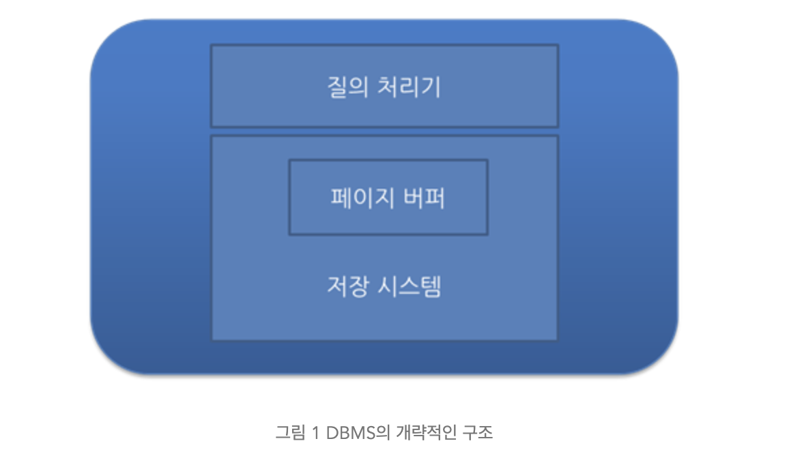
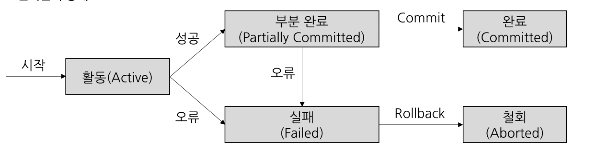
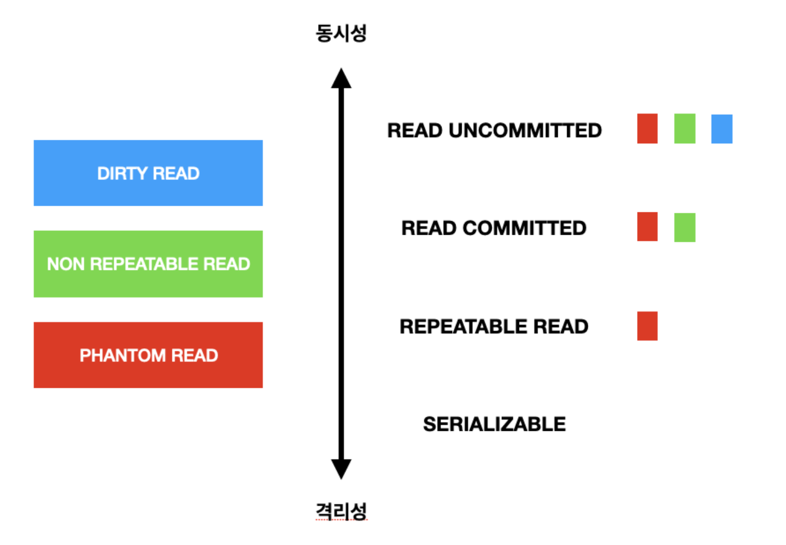
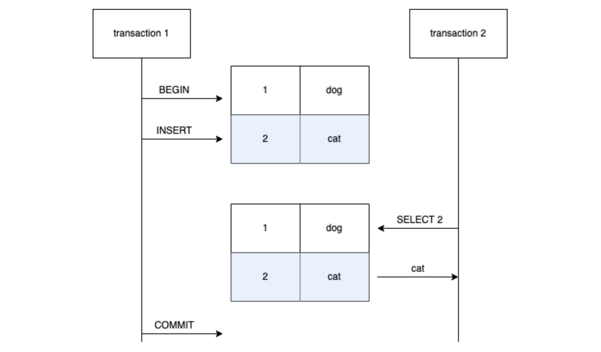
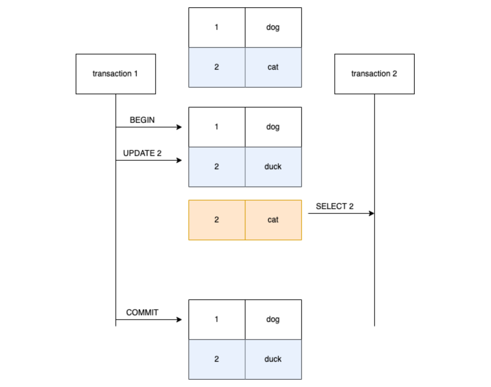
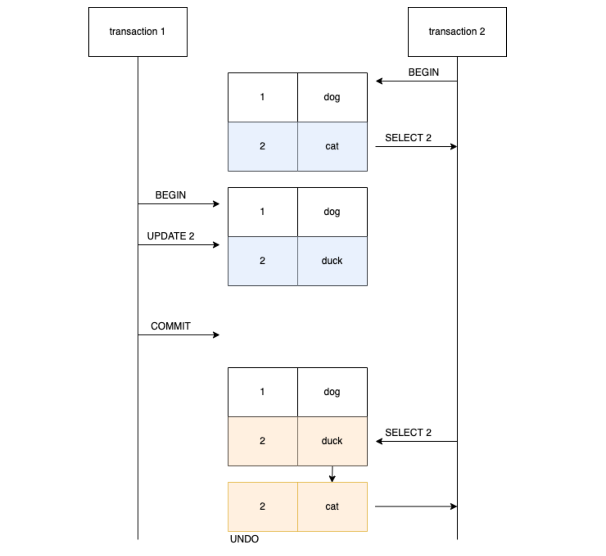
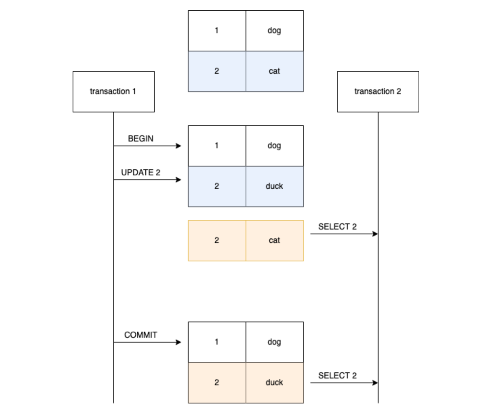
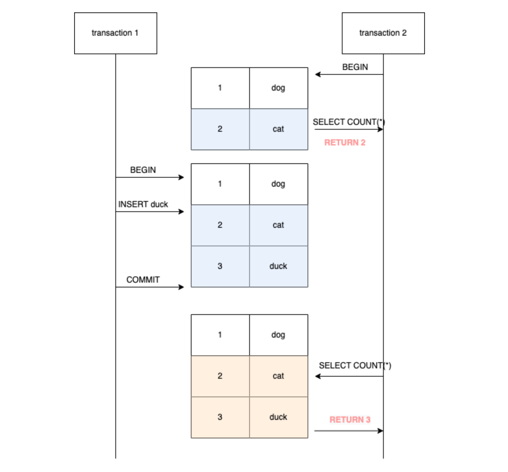

# GSLY 면접스터디

**3주차 질문 목록**

- **GSLY 면접스터디**
  - [3번 질의](#3번-질의)
  - [4번 질의](#4번-질의)
  - [11번 질의](#11번-질의)
  - [참고 자료](#참고-자료)

## 3번 질의

3-1. 트랜잭션이 무엇이고, ACID 원칙에 대해 설명해 주세요. (출처 : vsfe)

 

- <ins>트랜잭션 : 단일한 논리적인 작업 단위 (a single logical unit of work)</ins>
  - 대표적으로 데이터베이스에서 트랜잭션 단위로 작업 처리를 많이 함
  - DB에 특정되는 것이 아님. 메시징 큐 트랜잭션도 있음
  - 특히, 분산 환경(MSA)에서 논리적인 작업 단위인 트랜잭션이 매우 중요!

 

- <ins>ACID : 데이터베이스 트랜잭션이 안전하게 수행 된다는 것을 보장하기 위한 것으로, Atomicity(원자성), Consistency(일관성), Isolation(고립성), Durability(지속성)이 있다.</ins>

 

- <ins>Atomicity (원자성)</ins>
  - 트랜잭션의 모든 연산들이 정상적으로 수행 완료되거나 아니면 전혀 어떠한 연산도 수행되지 않은 상태를 보장하는 것
  - All or Nothing

 

- <ins>Consistency (일관성)</ins>
  - 트랜잭션이 정의된 모든 제약 조건과 규칙을 준수하면서 데이터베이스를 하나의 일관된 상태에서 다른 일관된 상태로 이동하도록 보장하는 것
  - 기본 키, 외래 키 제약과 같은 명시적인 무결성 제약 조건들뿐만 아니라, 자금 이체의 예시에서 두 계좌 잔고의 합은 이체 전후가 같아야 한다는 사항과 같은 비명시적인 일관성 조건도 포함

 

- <ins>Isolation (고립성, 격리성)</ins>
  - 여러 트랜잭션이 동시에 수행되는 경우, 각 트랜잭션은 다른 트랜잭션에 영향받지 않고 독립적으로 실행되도록 보장하는 것
  - Concurrency Control(동시성 제어)의 주된 목표
  - DBMS는 여러 종류의 격리 수준을 제공함

 

- <ins>Durability (지속성)</ins>
  - 트랜잭션이 커밋되고 나면, 하드웨어나 소프트웨어 장애에도 해당 트랜잭션에 의한 모든 변경은 보존하도록 보장하는 것

 

3-2. 데이터베이스 트랜잭션을 관리하기 위해, DBMS는 어떤 식으로 관리하나요? (창작 문제)

 

- DBMS는 버퍼 관리자(=페이지 버퍼)의 버퍼 관리 정책으로 트랜잭션을 관리한다.
  - 버퍼 관리 정책에 따라 UNDO 복구나 REDO 복구가 필요하거나 필요하지 않게 된다.
  - UNDO 복구나 REDO 복구를 위해 다양한 기법이 있지만, 보편적으로 로그 기법을 사용한다.

 

- 

상세한 내용 살펴보기
 <ul><li>DBMS의 개략적인 구조<ul> 

<li>DBMS는 보통 비휘발성 저장 장치인 디스크(ex.SSD)에 데이터를 저장하며 전체 데이터베이스의 일부분을 메인 메모리(RAM)에 유지</li><li>DBMS는 데이터를 고정 길이의 페이지(page)로 저장하며, 디스크에서 읽거나 쓸 때에 페이지 단위로 입출력</li><li>메인 메모리(RAM)에 유지하는 페이지들을 관리하는 모듈을 보통 페이지 버퍼(page buffer) 관리자 또는 버퍼 관리자라고 함</li><li>DBMS는 각 제품마다 구조가 다르기는 하지만, 크게 질의 처리기(Query Processor)와 저장 시스템(Storage System)으로 나눠볼 수 있음<ul><li>MySQL의 경우에는 InnoDB, MyISAM 등과 같이 여러 하부 저장 시스템을 선택할 수 있음. 모듈만 바꿔끼우면 되니까 편함 </li></ul></li></ul></li></ul> <ul><li>UNDO는 왜 필요한가?</li><ul><li>오퍼레이션 수행 중에 수정된 페이지들이 버퍼 관리자의 버퍼 교체 알고리즘에 따라서 디스크에 출력될 수 있다.</li><li>즉, 아직 끝나지 않은 트랜잭션이 수정한 페이지들도 디스크에 출력될 수 있다는 의미</li><li>근데, 해당 트랜잭션이 어떤 이유든 정상적으로 종료될 수 없게 되면 트랜잭션이 변경한 페이지들은 원상 복구되어야 하는데, 이때의 복구를 <ins>UNDO 복구</ins>라고 부름</li></ul></ul> <ul><li>버퍼 관리 정책 - STEAL 정책</li><ul><li><ins>수정된 페이지를 언제 디스크에 쓸 것인가 기준으로 나눌 수 있는 정책</ins></li><li><code>STEAL</code> : 수정된 페이지를 언제든지 디스크에 쓸 수 있는 정책</li><li><code>~STEAL</code> : 수정된 페이지들을 최소한 트랜잭션 종료 시점(EOT, End of Transaction)까지는 버퍼에 유지하는 정책</li><li>대부분의 상용 DBMS는 STEAL 정책을 채택한다. 이 말은 커밋 이전의 트랜잭션이 디스크에 써질 수 있고 이때문에 UNDO 로깅과 복구가 필요해진다.</li></ul></ul> <ul><li>REDO는 왜 필요한가?</li><ul><li>ACID 중 Durability 때문에 커밋한 트랜잭션의 경우 어떠한 상황에서도 보존되어야 하기 때문이다.</li><li>이미 커밋한 트랜잭션의 수정을 재반영하는 복구 작업을 <ins>REDO 복구</ins>라고 하는데, REDO 복구 역시 UNDO 복구와 마찬가지로 버퍼 관리 정책에 영향을 받음</li></ul></ul> <ul><li>버퍼 관리 정책 - FORCE 정책</li><ul><li><ins>트랜잭션이 종료되는 시점에 해당 트랜잭션이 수정한 페이지들을 디스크에도 쓸 것인가 쓰지 않을 것인가로 나눈 정책</ins></li><li><code>FORCE</code> : 수정했던 모든 페이지를 트랜잭션 커밋 시점에 디스크에 반영하는 정책</li><li><code>~FORCE</code> : 수정했던 페이지를 트랜잭션 커밋 시점에 디스크에 반영하지 않는 정책</li><ul><li><code>~FORCE</code>는 수정했던 페이지(데이터)를 디스크에 반영하지 않는다는 점이지 커밋 시점에 어떠한 것도 쓰지 않는다는 것은 아니다. 커밋 시점에 어떤 일들을 했었다는 REDO 로그는 기록함</li></ul><li>대부분의 상용 DBMS는 ~FORCE 정책을 채택한다. 이 말은 커밋한 트랜잭션의 내용이 디스크 상의 데이터베이스 상에 반영되어 있지 않을 수 있기 때문에 반드시 REDO 복구가 필요해진다.</li></ul></ul> <ul><li>결과적으로, DBMS는 버퍼 관리 정책으로 <code>STEAL 정책</code>과 <code>~FORCE 정책</code>을 채택하므로 UNDO 복구와 REDO 복구 모두 필요하고, 이러한 방법으로 데이터베이스 트랜잭션을 관리한다.</li></ul>

 

3-3. ACID 원칙 중, Durability를 DBMS는 어떻게 보장하나요? (출처 : vsfe)

 

- DBMS는 Durability를 보장하기 위해 로그(log)라는 갱신 작업에 대한 기록을 관리하여 보장함
  - 커밋된 트랜잭션에 의해 갱신된 내용이 디스크에 미처 반영되기 전에 시스템 장애가 발생하면, 시스템 재 구동 시에 로그를 판독하여 변경된 내용을 복구

- <ins>WAL (Write-Ahead Logging) : 트랜잭션으로 인한 모든 변경 사항을 커밋하기 전에 로그 파일에 기록</ins>

- <ins>저널링 : 트랜잭션 중에 발생한 모든 변경 사항을 기본 데이터 파일에 쓰기 전에 기록하고 저장하는 프로세스</ins>
  - 데이터베이스에 문제가 발생할 경우 데이터베이스가 불완전한 트랜잭션을 복구하고 롤백할 수 있음

- checkpoint : 메모리 내 데이터베이스 버퍼의 내용을 디스크에 주기적으로 저장하는 작업

- 데이터베이스 백업 : 시스템 오류나 손상이 발생할 경우 데이터 손실을 방지하기 위해 정기적으로 데이터베이스를 백업

- 

번외. 한국의 DBMS인 알티베이스
<ul><li>우리나라의 알티베이스라는 DBMS의 Durability Level을 참조해봐도 좋을 것 같음</li><li><a href="https://dataonair.or.kr/db-tech-reference/d-guide/dbms-1/?mod=document&uid=101732">링크 1</a></li><li><a href="http://www.gurubee.net/lecture/2168">링크 2</a></li></ul>

 

 

3-4. 트랜잭션을 사용해 본 경험이 있나요? 어떤 경우에 사용할 수 있나요? (출처 : vsfe)

 

- 갱신 작업에 한해서는 스프링을 사용하면서 트랜잭션을 항상 걸었음

- 예를 들어, 모아밤 프로젝트에서 루틴을 인증하는 로직이 있었음. 이 로직은 루틴 인증 버튼을 눌러서 요청을 날렸을 때, 클라이언트에서 이미지를 보내주면 이미지 리사이징 → 이미지 업로드 → 이미지 업로드가 되면 루틴 인증 처리의 로직이 되어있어서, 하나의 논리적인 작업 단위로 묶어야해서 트랜잭션을 사용했음
  - 이미지 업로드 자체를 다른 트랜잭션으로 뺀다고 하더라도 루틴 인증 내부에 반드시 포함되어야 함

 

3-5. 읽기에는 트랜잭션을 걸지 않아도 될까요? (출처 : vsfe)

 

- 일반적으로 읽기 작업만 수행하는 상황에서는 트랜잭션을 걸지 않아도 됨

- 그러나, 여러 사용자나 시스템이 동시에 같은 데이터에 접근할 때, 데이터의 일관성을 유지하기 위해 읽기 작업에 트랜잭션을 걸어야 할 수 있음 (동시성 제어가 필요한 경우)

- 동시성 제어의 상황에서 트랜잭션 격리 수준에 따라 발생할 수 있는 문제
  - Dirty Read : 수정 중이고 커밋되지 않은 데이터를 다른 트랜잭션에서 읽어서 일관성 어긋나는 현상
  - Non-Repeatable Read : 한 트랜잭션 내에서 같은 쿼리를 두번 수행할 때 그 사이에서 다른 트랜잭션이 수정 또는 삭제해서 둘의 결과가 다르게 나타나는 현상
  - Phantom Read : 한 트랜잭션 안에서 일정 범위의 레코드를 두 번 이상 읽을 때 첫 번째 쿼리에서 없던 유령 레코드가 두 번째 쿼리에서 나타나는 현상

 

3-6. 트랜잭션의 상태에 대해서 설명해주세요. (창작 문제)

 

- 활동(Active)
  - 트랜잭션이 실행 중에 있는 상태, 연산들이 정상적으로 실행 중인 상태

- 장애(Failed)
  - 트랜잭션이 실행에 오류가 발생하여 중단된 상태

- 철회(Aborted)
  - 트랜잭션이 비정상적으로 종료되어 Rollback 연산을 수행한 상태

- 부분 완료(Partially Committed)
  - 트랜잭션이 마지막 연산까지 실행했지만, Commit 연산이 실행되기 직전의 상태

- 완료(Committed)
  - 트랜잭션이 성공적으로 종료되어 Commit 연산을 실행한 후의 상태

 

추가적으로 필기하면 좋을 주제들

 

- 스프링에서 트랜잭션은 어떻게 구현되었는가? → AOP
  - [참고 링크](https://giron.tistory.com/125)

- 스프링 트랜잭션의 전파 속성
  - db 레벨에서 전파된다는 느낌이 아니라 애플리케이션 레벨에서 발생하는 일!
  - [참고 링크](https://kth990303.tistory.com/385)

- `@Transactional(readOnly=true)` 사용 이유
  - 읽기 작업이라는걸 다른 개발자들에게도 알릴 수 있어서 가독성 좋음
  - 성능적인 측면
    - 애플리케이션 레벨 : JPA 더티체킹 시 `readOnly=true`로 되어있으면 생략할 수 있어서 성능 좋음
    - 데이터베이스에서 : MySQL의 경우 읽기 전용 트랜잭션에 대해서는 ID가 부여되지 않아 트랜잭션 ID 설정에 대한 오버헤드를 해결한다. 또, 스냅샷을 통해 데이터를 조회하기에 일관성을 보장할 수 있음
    - [참고 링크](https://cupeanimus.tistory.com/90)
  - 주의할 점
    - JPA의 동시성 제어 과정에서, 낙관적 락을 사용한 경우
      - `@Transactional(readOnly=true)`로 설정한 메서드에 엔티티를 수정하는 로직이 있을 경우, 해당 트랜잭션이 엔티티를 수정하는 것이 아니라 읽기 전용으로 설정했기 때문에 버전 번호를 확인하지 못할 수 있다. 이때 충돌을 감지하지 못하고 동시에 발생한 트랜잭션의 변경 사항을 덮어쓰게 되어 데이터 불일치 문제가 발생할 수 있다.
      - [참고 링크](https://velog.io/@jhbae0420/TransactionalreadOnly-true%EB%A5%BC-%EC%82%AC%EC%9A%A9%ED%95%98%EB%8A%94-%EC%9D%B4%EC%9C%A0%EC%99%80-%EC%A3%BC%EC%9D%98%ED%95%A0%EC%A0%90)

 

## 4번 질의

4-1. 트랜잭션 격리 레벨에 대해 설명해 주세요. (출처 : vsfe)

 

- 여러 트랜잭션이 수행될 때, 각 트랜잭션이 얼마나 고립되어 있는지를 나타내는 정도

- 동시성 제어에서 Locking을 통해 다른 트랜잭션이 관여하지 못하도록 막는데, 무조건 Locking을 수행하면 성능이 떨어지기 때문에 이를 고려하여 효율적인 Locking이 필요해진다.

- `Read Uncommitted`
  - 트랜잭션 처리중이거나 Commit 되지 않은 데이터를 다른 트랜잭션이 읽는 것을 허용
  - Select 문장이 수행되는 동안 해당 데이터에 Shared Lock이 걸리지 않음
  - 데이터 정합성에 문제가 있어, 사실상 격리수준으로 인정되지 않음(Dirty Read 발생)
  - 

예시

<ul><li>트랜잭션1에서의 변경 사항이 아직 커밋되지 않았음에도, 트랜잭션1 이후에 시작된 트랜잭션2에서 그 변경 사항을 조회할 수 있다.</li></ul>

- `Read Committed`
  - 트랜잭션이 Commit 되어 확정된 데이터만 읽는 것을 허용
  - Select 문장이 수행되는 동안 해당 데이터에 Shared Lock이 걸림
  - 일반적인 SQL 서버의 Default Isolation Level
  - 

예시

<ul><li>트랜잭션1에서 업데이트 쿼리로 인해 레코드의 값이 바뀌었음에도, 트랜잭션2에서 이 레코드를 조회할 때는 트랜잭션1이 커밋되지 않았기 때문에, 백업되어 있는 업데이트 이전의 레코드 값이 조회된다.</li></ul>

- `Repetable read`
  - 트랜잭션이 시작되기 전에 Commit된 내용에 대해서만 조회가 가능
  - 자신의 트랜잭션 번호보다 낮은(먼저 일어난) 트랜잭션 번호에서 커밋된 사항만 확인 가능
  - 트랜잭션이 범위 내에서 조회한 데이터 내용이 항상 동일함을 보장
  - 다른 사용자는 트랜잭션 영역에 해당되는 데이터에 대한 수정 불가
  - 

예시

<ul><li>해당 트랜잭션이 시작되기 전에 커밋된 내용에 대해서만 조회할 수 있다. UNDO 공간에 백업해두고, 그 값을 읽음 (공간에 대한 비용 소모)</li></ul>

- `Serializable`
  - 한 트랜잭션을 다른 트랜잭션과 완전히 분리하는 격리 수준
  - 트랜잭션이 완료될 때까지 Select 문장이 사용하는 테이블에 Shared Lock을 검

 

- `Dirty Read`
  - 아직 실행이 완료되지 않은 다른 트랜잭션에 의한 변경 사항을 보게 되는 상황
  - 커밋되지 않은 데이터를 다른 트랜잭션에서 읽을 수 있도록 허용할 때 발생

- `Non-Repeatable Read`
  - 한 트랜잭션에서 같은 쿼리를 두 번 수행할 때 그 사이에 다른 트랜잭션 값을 수정하거나 삭제하면서 두 쿼리의 결과가 다르게 나타나는 상황
  - 

예시

<ul><li> 트랜잭션2가 끝나기 전에 트랜잭션1이 커밋되면, 하나의 트랜잭션(2번)에서는 똑같은 레코드의 조회(select)를 수행했음에도, 다른 결과를 조회하게 되는 문제가 생길 수 있다. (일관성 오류)</li></ul>

- `Phantom Read`
  - 하나의 트랜잭션에서 일정 범위의 같은 쿼리를 두 번 실행했을 경우, 첫 번째 쿼리에서 없던 유령 레코드가 두 번째 쿼리에서 나타나는 상황, 첫 번째 쿼리에서 있던 레코드가 두 번째 쿼리에서 사라지는 상황
  - 

예시

<ul><li> 하나의 트랜잭션에서 일정 범위에 대한 같은 쿼리를 두 번 실행했을 때, 첫 쿼리에서는 없던 유령 레코드가 두 번째 쿼리에서는 나타나는 현상이 일어날 수 있다.(결과 집합이 달라짐) 범위 전체에 대해서는 보관하지 못하기 때문에 발생하는 문제</li></ul>

 

4-2. Repeatable Read에서 이전 트랜잭션이 완료되었을 때의 데이터만 조회할 수 있도록 지정한다고 하셨는데, 그렇다면 Phantom Read도 해결되지 않나요? (창작 문제)

 

- 일반적인 상황에서는 해결되겠지만, `SELECT FOR UPDATE`의 경우 여전히 해결되지 않아서 Phantom Read 문제가 발생한다고 한다.
  - [참고 링크](https://github.com/prgrms-web-devcourse/BE-Team-R-CS-Study/issues/15)

- 추가로, MySQL의 경우 갭락을 도입했기에 일반적인 DBMS보다 Phantom Read가 덜 발생하지만, `SELECT → SELECT FOR UPDATE`의 경우에는 팬텀 리드가 발생한다.
  - [참고 링크](https://parkmuhyeun.github.io/woowacourse/2023-11-28-Repeatable-Read/)

- SELECT FOR UPDATE?
  - SELECT FOR UPDATE문을 실행하면 LOCK을 획득하고, 해당 세션이 UPDATE 쿼리 후 COMMIT하기 전까지는 다른 세션들이 해당 ROW를 수정하지 못하도록 하는 기능
  - [참고 링크](https://velog.io/@jisulog/MySQL-%ED%8A%B8%EB%9E%9C%EC%9E%AD%EC%85%98%EA%B3%BC-SELECT-FOR-UPDATE%EB%AC%B8)

 

4-3. 만약, 금융권에서 일하고 있고 격리 수준을 설정한다면 어떻게 설정하고 싶으신가요? (창작 문제)

 

- 대표적으로 이체의 작업에 있어서는 데이터 정합성이 중요하다고 생각한다. SERIALIZABLE로 설정하면 데이터 정합성에 있어서 완벽하겠지만, 성능이 너무 느려서 이를 고려해야할 것 같다. MySQL 기준으로 default가 READ COMMITTED인데, REPETABLE READ로 설정할 것 같다.

- REPETABLE READ에서도 Phantom Read 문제가 발생하지만, MySQL의 경우 갭락을 채택하고 있기 때문에 `SELECT → SELECT FOR UPDATE`의 경우가 아니라면 팬텀리드가 발생하지 않아서 이 부분을 신경쓴다면 성능과 데이터 정합성을 어느정도 같이 생길 수 있을 것 같다.

 

4-4. 모든 DBMS가 4개의 레벨을 모두 구현하고 있나요? 그렇지 않다면 그 이유는 무엇일까요? (출처 : vsfe)

 

- 그렇지 않다. DBMS마다 자체적인 구현은 다를 수 있다. 예를 들어, READ UNCOMMITTED의 경우 데이터 정합성을 너무 챙기지 못해서 격리 수준으로 보기도 애매하다고 생각하여 구현하지 않는 DBMS도 있을 수 있고, MySQL의 경우처럼 4개를 모두 구현했을 수도 있다.

- 대표적으로 Oracle database는 READ UNCOMMITTED를 구현하지 않는다. 또, REPETABLE READ도 명시적으로 구현하고 있지는 않다. 다만, for update 절을 이용해서 구현할 수는 있다.

 

4-5. 만약 MySQL을 사용하고 있다면, (InnoDB 기준) Undo 영역과 Redo 영역에 대해 설명해 주세요. (출처 : vsfe)

 

- Undo 영역
  - 트랜잭션 실행 후 롤백 시 언두 로그를 참조에 이전 데이터로 복구할 수 있도록 로깅한 영역
  - 언두 로그는 로그 버퍼에 기록되는데, 이 영역을 Undo Record 영역이라고 함

- Redo 영역
  - 데이터베이스 장애 발생시 복구에 사용되는 로그로, 버퍼풀에 저장되어 있던 데이터의 유실을 방지하게 위해 사용

- 추가로 정리 필요
  - [참고 링크 1](https://velog.io/@becooq81/%EB%8D%B0%EC%9D%B4%ED%84%B0%EB%B2%A0%EC%9D%B4%EC%8A%A4#%EB%A7%8C%EC%95%BD-mysql%EC%9D%84-%EC%82%AC%EC%9A%A9%ED%95%98%EA%B3%A0-%EC%9E%88%EB%8B%A4%EB%A9%B4-innodb-%EA%B8%B0%EC%A4%80-undo-%EC%98%81%EC%97%AD%EA%B3%BC-redo-%EC%98%81%EC%97%AD%EC%97%90-%EB%8C%80%ED%95%B4-%EC%84%A4%EB%AA%85%ED%95%B4-%EC%A3%BC%EC%84%B8%EC%9A%94)
  - [참고 링크 2](https://studynote.oopy.io/books/1)
  - [참고 링크 3](https://livvjh.com/posts/develop/real-mysql-architecture/)
  - [참고 링크 4](https://hoing.io/archives/3513)

 

4-6. 그런데, 스토리지 엔진이 정확히 무엇을 하는 건가요? (출처 : vsfe)

 

- 스토리지 엔진(=데이터베이스 엔진)은 서버 엔진이 필요한 물리적인 데이터를 가져오는 장치이다.

- DBMS가 데이터베이스에 대해 데이터를 삽입, 추출, 업데이트 및 삭제(CRUD 참조)하는 데 사용하는 기본 소프트웨어 컴포넌트

- 현대의 많은 DBMS가 동일한 DB 내에 다중 저장 엔진을 지원한다. (ex. MySQL은 MyISAM 뿐만 아니라 InnoDB도 지원한다.) 저장 엔진은 동일 DB내의 테이블마다 다르게 지정이 가능하다.

- [참고 링크](https://velog.io/@sweet_sumin/DB-%EC%8A%A4%ED%86%A0%EB%A6%AC%EC%A7%80-%EC%97%94%EC%A7%84-%EB%B3%84-%EC%B0%A8%EC%9D%B4)

 

## 11번 질의

11-1. DB Locking에 대해 설명해 주세요. (출처 : vsfe)

 

- 동시성 제어를 위해 사용되는 대표적인 방법이 Lock 이다. Lock을 통해 트랜잭션이 순차적으로 처리됨을 보장한다.

- <ins><strong>공유락(Shared Lock) : 읽기 잠금</strong></ins>
  - <ins>특정 자료에 공유 Lock을 걸면 다른 트랜잭션이 해당 자료를 갱신할 수 없다. 단, 다른 트랜잭션이 읽는 것은 가능</ins>
  - 공유 락끼리는 동시에 접근 가능
  - 여러 사용자가 동시에 하나의 데이터를 읽을 수 있음
  - 공유 락이 설정된 데이터에 배타 락을 걸 수 없음

- <ins><strong>배타락(Exclusive Lock) : 쓰기 잠금</strong></ins>
  - <ins>특정 자료에 배타 Lock을 걸면 다른 트랜잭션이 자료를 갱신할 수 없고, 읽을 수도 없다.</ins> 배타 Lock이 걸린 자료는 공유 Lock을 갖고 있는 트랜잭션들에 의해 읽혀질 수 없다 (Dirty read 방지)
  - 데이터를 변경하고자 할 때 사용
  - 락이 해제될 때까지 다른 트랜잭션(읽기 포함)은 해당 리소스에 접근할 수 없음
  - 해당 락은 다른 트랜잭션이 수행되고 있는 데이터에 대해서는 접근하여 함께 락을 설정할 수 없음

 

11-2. Lock을 사용하면 아무런 문제가 없나요? 문제가 있다면, 해결 방안으로 어떤 것이 있나요? (창작 문제)

- 결국, 동시성에서 문제가 발생하는 원인은 스케쥴링 때문이다. 순차적 스케쥴링의 경우에는 상관 없지만, 트랜잭션들이 겹쳐서 실행되는 비순차적 스케쥴링의 경우에 operation 들이 충돌되기에 문제가 발생하는 것인데 Lock을 쓴다고 해도 여전이 문제가 있다.

- 이때문에 locking operation의 실행순서를 변경시킨 2PL protocol 방식이 사용된다. two-phase locking protocol은 트랜잭션에서 모든 locking operation이 최초의 unlock operation 보다 먼저 수행되도록 하는 프로토콜이다.
  - expanding phase(growing phase) : lock을 취득하기만 하고 반환하지는 않는 phase를 의미
  - shirinking phase(contracting phase) : lock을 반환만하고 취득하지는 않는 phase를 의미
  - 단, lock이 해제되기를 기다리다가 데드락 현상이 발생할 수 있음
  - [참고 링크](https://velog.io/@alsry922/Lock%EC%9D%84-%ED%99%9C%EC%9A%A9%ED%95%9C-concurrency-control#read-lock%EA%B3%BC-write-lock%EC%9D%98-%EA%B4%80%EA%B3%84)

- 2PL에도 여러 종류가 있다.
  - conservative 2PL : 트랜잭션 시작에 필요한 모든 lock을 취득한 후에 트랜잭션을 실행하기에 데드락에서 자유롭다. 단, 트랜잭션 시작까지 오랜 시간이 걸리고 성능이 좋지 않아서 잘 사용하지는 않는다.
  - strict 2PL(S2PL) : strict schedule을 보장하는 2PL이다. 따라서 recoverability를 보장하며, write-lock을 트랜잭션이 commit 혹은 rollback된 후에 반환한다.
  - strong strict 2PL(SS2PL or rigorous 2PL) : strong strict 2PL은 기본적으로 동일한데 read-lock도 트랜잭션이 commit 혹은 rollback된 후에 반환하는 2PL이다. 초창기 RDBMS가 concurrency control을 구현하기 위해 가장 많이 사용하는 프로토콜이었다.

- 2PL의 한계
  - 2PL은 read-lock, write-lock을 사용해서 concurrnecy control을 구현하기 위한 프로토콜
  - 서로 다른 트랜잭션에서 같은 데이터에 대해 read-lock을 쥐는 것만 허용되고 나머지는 모두 허용되지 않음 → 한쪽 트랜잭션은 무조건 block되기 때문에 DBMS의 전체 처리량이 좋지 않은 문제점이 존재
  - 그렇게 해서 탄생한 것이 <ins>MVCC(multiversion concurrency control)</ins>
  - [참고 링크](https://velog.io/@alsry922/2PL-protocol-%EC%A2%85%EB%A5%98)

- 쉬운코드 영상보고 추가 필기 필요
  - [참고 링크 1](https://www.youtube.com/watch?v=89TZbhmo8zk&list=PLcXyemr8ZeoREWGhhZi5FZs6cvymjIBVe&index=16)
  - [참고 링크 2](https://www.youtube.com/watch?v=0PScmeO3Fig&list=PLcXyemr8ZeoREWGhhZi5FZs6cvymjIBVe&index=18)

 

11-3. 그렇다면, MVCC란 어떤 것 인가요? (창작 문제)

 

- <ins><strong>MVCC (Multi-Version Concurrency Control)</strong></ins> 
  - 동시 접근을 허용하는 데이터베이스에서 동시성을 제어하기 위해 사용하는 방법 중 하나
  - MVCC에서 데이터에 접근하는 사용자는 접근한 시점에 데이터베이스의 Snapshot을 읽는다. 이 snapshot 데이터에 대한 변경이 완료(commit)될 때 까지의 변경사항은 다른 데이터베이스 사용자가 볼 수 없다.
  - 이후에 사용자가 업데이트하면 이전의 데이터를 덮어 씌우는게 아니라 새로운 버전의 데이터를 UNDO 영역에 생성 → 이전 버전의 데이터와 비교해서 변경된 내용을 기록 → 하나의 데이터에 대해 여러 버전의 데이터가 존재하게 되고, 사용자는 마지막 버전의 데이터를 읽게 됨
  - [참고 링크](https://mangkyu.tistory.com/53) 추가 필기 필요

- 쉬운코드 영상보고 추가 필기 필요
  - [참고 링크 1](https://www.youtube.com/watch?v=wiVvVanI3p4&list=PLcXyemr8ZeoREWGhhZi5FZs6cvymjIBVe&index=19)
  - [참고 링크 2](https://www.youtube.com/watch?v=-kJ3fxqFmqA&list=PLcXyemr8ZeoREWGhhZi5FZs6cvymjIBVe&index=20)
  - [블로그도 참조](https://velog.io/@alsry922/MVCCMultiversion-Concurrency-Control)

 

11-4. Optimistic Lock/Pessimistic Lock에 대해 설명해 주세요. (출처 : vsfe)

 

- <ins><strong>Optimistic Lock (낙관적 락)</strong></ins>
  - 사용자들이 같은 데이터를 동시에 수정하지 않을 것이라고 가정
  - 데이터를 읽는 시점에 Lock을 걸지 않는 대신 수정 시점에 값이 변경됐는지를 반드시 검사
  - 말 그대로 트랜잭션 충돌이 발생하지 않는다는 가정을 하는게 낙관적 락, 애플리케이션이 제공하는 락
  - 트랜잭션을 커밋하기 전까지 트랜잭션 충돌을 알 수 없음
  - 주로 낙관적 락은 버전 관리나 변경 추적을 통해 구현된다. 예를 들어, 데이터의 버전 번호를 사용하여 동시성 충돌을 감지할 수 있다. JPA에서는 `@Version`

- <ins><strong>Pessimistic Lock (비관적 락)</strong></ins>
  - 사용자들이 같은 데이터를 동시에 수정할 것이라고 가정
  - 데이터를 읽는 시점에 Lock을 걸고, 트랜잭션이 완료될 때까지 이를 유지
  - SELECT 시점에 Lock을 거는 비관적 동시성 제어는 시스템의 동시성을 심각하게 떨어뜨릴 수 있어서 wait 또는 nowait 옵션과 함께 사용해야 함
  - DB가 제공하는 락 기능을 사용하고, 데이터 수정 시 즉시 트랜잭션 충돌을 알 수 있음
  - 배타락과 공유락이 여기에 해당함

 

11-5. 물리적인 Lock을 건다면, 만약 이를 수행중인 요청에 문제가 생겨 비정상 종료되면 Lock이 절대 해제되지 않는 문제가 생길 수도 있을 것 같습니다. DB는 이를 위한 해결책이 있나요? 없다면, 우리가 이 문제를 해결할 수 없을까요? (출처 : vsfe)

 

- 데드락 탐지 : DBMS는 데드락을 탐지하는 알고리즘을 실행하여, 데드락이 발생하면 자동으로 하나 이상의 트랜잭션을 중단시키고 롤백하여 락을 해제

- Timeout 설정 : Lock을 설정할 때 Timeout을 설정하여 특정 시간이 경과하면 자동으로 Lock이 해제되도록 설정

- 트랜잭션 롤백 : 트랜잭션이 비정상적으로 종료될 때 자동으로 롤백되도록 설정하여 Lock이 해제되도록 하기

- 애플리케이션 코드 단에서 해결 : 비정상 종료시 Lock을 명시적으로 해제하는 코드를 작성하여 이를 해결, 예를 들어, 특정 예외가 발생할 때 Lock을 해제하도록 하는 코드를 작성

 

추가 공부 하면 좋을 내용

 

- 희나님이 언급하신 real mysql 책 관련 내용
  - DB 잠금을 사용하지 않았는데 잠금이 걸리는 경우가 있습니다. 어떤 상황인가요?
  - InnoDB 스토리지 엔진의 잠금은 무엇인가요?
  - MySQL의 자동 증가 락은 무엇인가요?
  - [참고 링크](https://github.com/GSLY-CSstudy/tech-interview-CS/blob/main/database/2024.03.20/2024.03.20_%E1%84%92%E1%85%A1%E1%86%AB%E1%84%92%E1%85%B4%E1%84%82%E1%85%A1.md)

 

## 참고자료

- vsfe 님의 **[VSFE / Tech-Interview Github](https://github.com/VSFe/Tech-Interview/tree/main)**
- becooq81 님의 **[데이터베이스 면접 정리](https://velog.io/@becooq81/%EB%8D%B0%EC%9D%B4%ED%84%B0%EB%B2%A0%EC%9D%B4%EC%8A%A4#db-locking)**
- 유튜버 쉬운코드 님의 **[데이터베이스 트랜잭션을 아십니까?](https://www.youtube.com/watch?v=sLJ8ypeHGlM)**
- 네이버 d2 **[DBMS는 어떻게 트랜잭션을 관리할까?](https://d2.naver.com/helloworld/407507)**
- livvjh 님의 **[쉽게 이해하는 MySQL 아키텍처 한판 정리](https://livvjh.com/posts/develop/real-mysql-architecture/)**
- devjem 님의 **[네이버 d2 트랜잭션 아티클 정리 글](https://devjem.tistory.com/73)**
- AppMaster **[데이터베이스 트랜잭션을 관리하고 ACID 속성을 구현하는 방법](https://appmaster.io/ko/blog/deiteobeiseu-teuraenjaegsyeon-mic-sanseong-sogseong)**
- R팀 스터디 **[트랜잭션](https://github.com/prgrms-web-devcourse/BE-Team-R-CS-Study/blob/main/Database/2022-04-08-%ED%8A%B8%EB%9E%9C%EC%9E%AD%EC%85%98.md)**
- 망나니개발자 님의 **[트랜잭션](https://mangkyu.tistory.com/30)**
- 