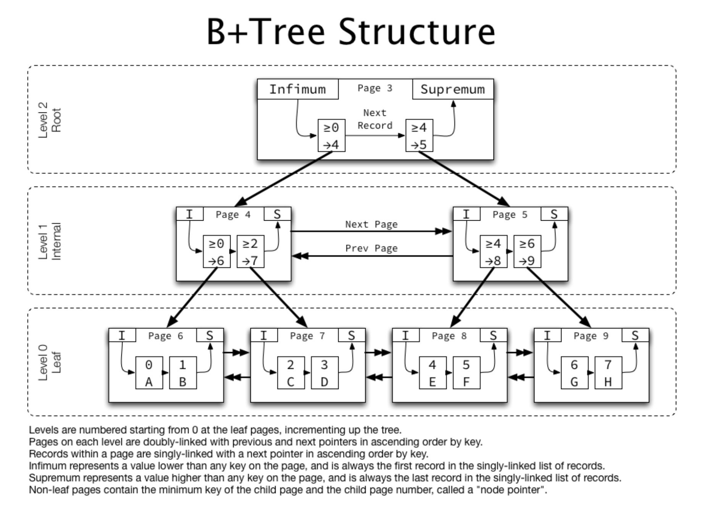
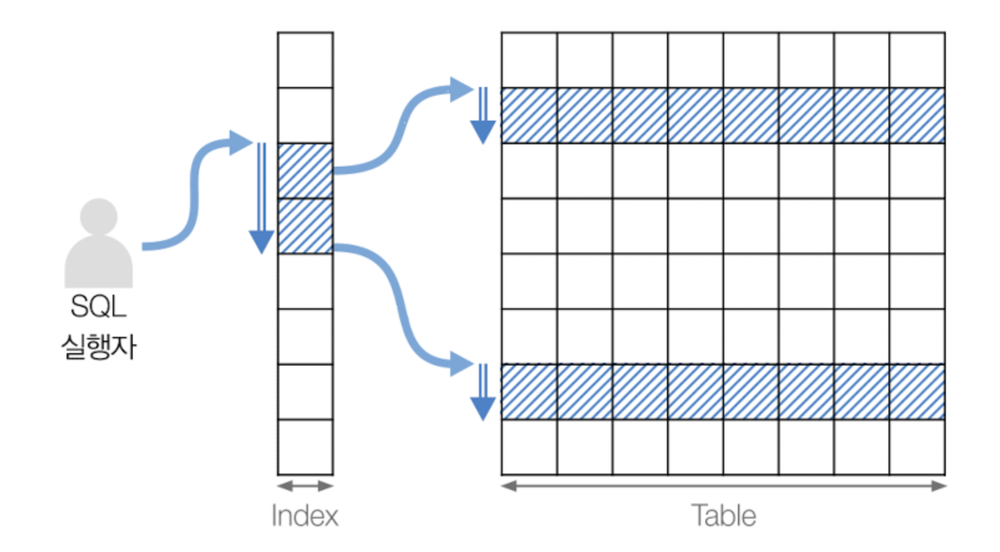

# GSLY 면접스터디

**4주차 질문 목록**

- **GSLY 면접스터디**
  - [5번 질의](#5번-질의)
  - [10번 질의](#10번-질의)
  - [15번 질의](#15번-질의)
  - [참고 자료](#참고-자료)

<hr>

## 5번 질의

<details><summary>5-1. 인덱스가 무엇이고, 언제 사용하는지 설명해 주세요. (출처 : vsfe)</summary>

<br>

- <ins><strong>인덱스 (Index)</strong></ins> : 추가적인 쓰기 작업과 저장 공간을 활용해 데이터베이스 테이블의 검색 속도를 향상시키기 위한 자료구조이다.

    - 특정 컬럼에 인덱스를 생성하면, 해당 컬럼의 데이터들을 정렬하여 별도의 메모리 공간에 데이터의 물리적 주소와 함께 저장

    - 인덱스를 위해 DB 10% 내외의 추가 공간이 필요하다. 따라서, 데이터가 많으면 인덱스 생성에 많은 시간이 소요될 수 있음

    - 인덱스를 사용하지 않은 컬럼을 조회하려면 전체를 비교하며 탐색(Full Scan)해야 해서 처리 속도가 떨어짐

    - 조희 성능은 좋으나, 오히려 삽입/수정/삭제 등의 경우 오히려 성능이 저하됨

    - 대표적으로 (Key,Value)로 저장되는 자료 구조인 Hash Table이나 B-tree를 이용하여 구현됨.
      - B-tree의 변형으로 구현되는 경우도 많은데, MySQL은 B-tree의 변형인 B+tree를 이용하여 복잡하게 구현됨

    - 인덱스가 너무 많으면 좋지않음 + 3~4개가 적당하다고 함
      - 너무 많은 인덱스는 새로운 Row를 등록할때마다 인덱스를 추가해야하고, 수정/삭제 시마다 인덱스 수정이 필요하여 성능상 이슈
      - 위에서 말한것처럼 인덱스는 추가적인 공간을 사용함
      - 인덱스가 많으면 옵티마이저가 잘못된 걸 선택하고 인덱스를 잘못 태울 확률이 커짐

</details>

<br>

<details><summary>5-2. 일반적으로 인덱스는 수정이 잦은 테이블에선 사용하지 않기를 권합니다. 왜 그럴까요? (출처 : vsfe)</summary>

<br>

- 인덱스의 효과를 누리려면 인덱스를 항상 최신의 정렬 상태로 유지해야 해서, INSERT/UPDATE/DELETE문으로 인덱스가 적용된 컬럼이 수정되면 연산을 추가적으로 해야되는 오버헤드가 발생
    - INSERT : 새로운 데이터에 대한 인덱스 추가
    - DELETE : 삭제하는 데이터의 인덱스를 사용하지 않는다는 작업 수행
    - UPDATE : 기존의 인덱스를 사용하지 않음 처리, 갱신된 데이터에 대한 인덱스 추가
      - 실제로 인덱스에는 update가 없고, 그저 delete + insert 이다.

</details>

<br>

<details><summary>5-3. 그렇다면 인덱스에서 사용하지 않겠다고 선택한 값은 위 정책을 그대로 따라가나요? (출처 : vsfe)</summary>

- 사용하지 않음 처리를 했다는 말은 `DELETE`와 `UPDATE` 이후 기존 인덱스를 삭제하지 않고 사용하지 않음 처리 했다는 의미이다.

- 예를 들어, B+tree의 리프노트에 `(이름, 신재윤)`을 `(이름, 삭제된 data)`와 같이 표시해두는 것이다. 해당하는 삭제된 값을 무시하면서 노드를 따라 이동하며 원하는 값을 찾으면 되기에, 결국 정책은 그대로 따라간다는 의미이다.

- 이러한 이유로, `INSERT/UPDATE/DELETE` 작업이 많은 테이블에서는 index가 안좋다는 의미이다. 당장 데이터를 삭제할 때는 실제로 삭제하지 않고 마킹만 해두는 것이 좋겠지만, 이것들이 쌓이면 사용하지도 않는 작업이 공간을 차지하니까 좋지 않다.

</details>

<br>

<details><summary>5-4. ORDER BY/GROUP BY 연산의 동작 과정을 인덱스의 존재여부와 연관지어서 설명해 주세요. (출처 : vsfe)</summary>

<br>

- <ins><strong>ORDER BY - 인덱스를 사용하지 않는 경우</strong></ins>
  - Filesort 방식으로, 레코드를 읽어온 후 MySQL 서버에서 Sort Buffer라는 메모리 공간을 활용해 정렬
  - Sort Buffer는 인덱스를 이용한 정렬이 불가능한 경우, 별도의 정렬 작업을 할 때 사용되는 공간
  - Sort Buffer의 크기는 가변적으로 증가하고 최대 사이즈는 시스템 변수 `sort_buffer_size`로 설정할 수 있음
    - 정렬해야 하는 Data의 크기가 Sort Buffer보다 크다면 여러 조각으로 나누어서 처리하고 임시 저장을 위해 디스크 사용하고 디스크에 저장된 Data를 다시 메모리로 읽어와서 처리
    - `sort buffer size 크기가 너무 크면` → 메모리 부족 현상 발생
    - `sort buffer size 크기가 너무 작으면` → 대부분의 정렬 작업에 디스크 I/O 발생

- <ins><strong>ORDER BY - 인덱스를 사용하는 경우</strong></ins>
  - 이미 정렬되어 있으니, 별도의 정렬을 위한 처리가 필요 없어서 성능상 우수

- <ins><strong>GROUP BY - 인덱스를 사용하지 않는 경우</strong></ins>
  - GROUP BY 역시 Sort Buffer와 연관되어 있음

- <ins><strong>GROUP BY - 인덱스를 사용하는 경우</strong></ins>
  - 이미 정렬되어 있으니, 별도의 정렬을 위한 처리가 필요 없어서 성능상 우수

</details>

<br>

<details><summary>5-5. 그렇다면, ORDER BY/GROUP BY를 인덱스 태우려면 어떻게 하나요? (창작 문제)</summary>

<br>

- <ins><strong>GROUP BY</strong></ins>
  - GROUP BY 절에 명시된 칼럼이 인덱스 칼럼의 순서와 위치가 같아야 함
  - 인덱스를 구성하는 칼럼 중에서 뒷쪽에 있는 칼럼은 GROUP BY 절에 명시되지 않아도 인덱스를 사용할 수 있지만 인덱스의 앞쪽에 있는 칼럼이 GROUP BY 절에 명시되지 않으면 인덱스를 사용할 수 없음
  - GROUP BY 절에 명시된 칼럼이 하나라도 인덱스에 없으면 GROUP BY 절은 전혀 인덱스를 사용하지 못함

- <ins><strong>ORDER BY</strong></ins>
  - GROUP BY를 인덱스 태우는 것과 거의 동일한데, 하나의 조건이 더 추가
  - 정렬되는 각 칼럼의 오름차순(ASC) 및 내림차순(DESC) 옵션이 인덱스와 같거나 또는 정반대인 경우에만 사용할 수 있음

- 자세한 예시는 [공부하는 개발자님의 ORDER BY/GROUP BY 튜닝](https://lannstark.tistory.com/40) 참고

</details>

<br>

<details><summary>5-6. 기본키는 인덱스라고 할 수 있을까요? 그렇지 않다면, 인덱스와 기본키는 어떤 차이가 있나요? (출처 : vsfe)</summary>

<br>

- 정확하게 말하면 primary key 자체는 인덱스가 아니라 제약조건이다.

- 그러나, MySQL 에서는 primary key 제약조건에 클러스터링 인덱스가 자동 적용된다.

- PK는 개념적인 값으로 레코드의 유일성을 보장하지만 물리적으로 저장되지는 않는다. 하지만, 물리적인 저장 위치를 결정 해준다.

- 인덱스는 레코드의 유일성을 보장하지 않고, 단지 탐색을 빠르게 해주는 역할이다. 그리고 별도의 물리적인 디스크 공간에 저장된다.

- 클러스터링 인덱스와 MySQL에서 pk의 중요성은 [2024.03.07_신재윤](../2024.03.07/2024.03.07_신재윤.md)을 참고하자

</details>

<br>

<details><summary>5-7. 외래키는 인덱스라고 할 수 있을까요? 그렇지 않다면, 인덱스와 외래키는 어떤 차이가 있나요? (출처 : vsfe)</summary>

<br>

- 정확하게 말하면 foreign key 자체는 인덱스가 아니라 제약조건이다.

- 외래키는 개념적인 값으로 다른 릴레이션을 참조할 때 사용하고 물리적으로 저장되지는 않는다.

</details>

<br>

<details><summary>5-8. 인덱스가 데이터의 물리적 저장에도 영향을 미치나요? 그렇지 않다면, 데이터는 어떤 순서로 물리적으로 저장되나요? (출처 : vsfe)</summary>

<br>

- 실제 데이터와 같은 무리의 인덱스라는 뜻의 클러스터링 인덱스는 pk에 자동으로 적용된다.

- 이 pk에 따라 유사한 레코드들끼리 묶어서 데이터를 저장한다.

- 따라서, 인덱스는 데이터의 물리적 저장에도 영향을 미친다.

</details>

<br>

<details><summary>5-9. 우리가 아는 RDB가 아닌 NoSQL (ex. Redis, MongoDB 등)는 인덱스를 갖고 있나요? 만약 있다면, RDB의 인덱스와는 어떤 차이가 있을까요? (출처 : vsfe)</summary>

<br>

- NoSQL 시스템에 따라 다르겠지만, 많은 NoSQL에서 인덱스를 지원한다.

- Redis
  - 인메모리 key-value 구조에서 키를 사용하여 값을 가져오는 경우, 해시 테이블을 이용한 `O(1)` 인데, 이때는 따로 인덱스를 사용하지는 않는다.
  - 다만, 값에는 복잡한 값이 들어갈 수 있기에 키 이외에 다른 항목을 검색하려는 경우에는 인덱싱을 사용하기도 한다.
  - > **Sorted sets** as indexes <br>**Lexicographically** encoded indexes<br>**Geospatial** indexes<br>**IP** range indexes<br>**Full text search** indexes<br>**Partitioned** indexes
  - <ins><strong>Redis에서는 데이터를 해시에 저장하고 쿼리하기 전에 데이터에 대한 Redis 검색 인덱스를 생성하지만, 기존 RDB에서는 데이터를 테이블에 저장하고 SQL을 사용하여 쿼리하는 차이가 있다.</strong></ins>
  - redis 공식 사이트의 **[indexing-patterns](https://redis.com/glossary/indexing-patterns/)** 참고하자

- MongoDB
  - document-oriented 방식의 몽고디비는 다양한 방식의 인덱스를 지원한다.
  - MongoDB의 기본 인덱스 구조는 B-Tree 인덱스이다. 클러스터 인덱스가 아니기 때문에 프라이머리 인덱스와 세컨더리 인덱스 간의 내부구조가 동일하며, 최상단의 루트 노드, 중간 위치의 브랜치 노드, 그리고 최하단의 리프 노드로 구성되어 있다.
  - 다양하게 지원하는 인덱스 중, 해시 인덱스는 쿼리의 검색 성능을 높이는데 사용하기 보다는 해시 샤딩을 구현하기 위해 더 많이 사용한다.
  - <ins><strong>rdb의 인덱스와 거의 유사하나, nosql 자체의 특징적인 부분에서 차이가 난다. mongodb는 수평 확장이 쉽기에 인덱스도 쉽게 확장되나 rdb는 그렇지 않다.</strong></ins>

</details>

<br>

<details><summary>5-10. (A, B) 와 같은 방식으로 인덱스를 설정한 테이블에서, A 조건 없이 B 조건만 사용하여 쿼리를 요청했습니다. 해당 쿼리는 인덱스를 탈까요? (출처 : vsfe)</summary>

<br>

- 복합 인덱스의 경우에는 인덱스의 순서가 중요한데, 현재는 A가 먼저 오고 B가 나중에 오고 있다.

- 이러한 상황에서 A 조건 없이 B 조건만 사용하면 해당 쿼리는 인덱스를 타지 않는다.

- 그렇다고 table full scan 하는 것은 아니고, index full scan 함
  - mysql 8.0 부터는 index skip scan !?

</details>

<br><hr>

## 10번 질의

<details><summary>10-1. B-Tree와 B+Tree에 대해 설명해 주세요. (출처 : vsfe)</summary>

<br>

<p align="center"></p>

- <ins><strong>B-Tree (Balanced-Tree)</strong></ins>
  - 이진 트리의 구조에서 자식 노드의 수가 2개가 아닌 <ins>M개의 자식을 가지도록 고안된 것이며, 좌우 자식 간에 항상 균형을 맞춘다는 의미의 자료구조</ins>이다.
  - 루트 노드 + 브랜치 노드 + 리프 노드의 구조로 이루어짐
  - 리프 노드 간에 연결리스트로 연결되어 있지 않음
  - 모든 노드에서 값을 가질 수 있음
  - <ins>각 노드의 자료는 정렬되어 있으며, 중복되지 않음</ins>
  - 시간 복잡도는 최고, 평균, 최악 모두 `O(log N)`으로 동일

- <ins><strong>B+Tree</strong></ins>
  - B-Tree를 개선시킨 자료구조로, 리프 노드에만 데이터가 저장되면서 리프 노드들을 연결리스트(Linked List)로 연결하여 순차 검색에 용이하게 한 구조이다.
  - 루트 노드나 브랜치 노드에는 다음 노드로 가기 위한 주소가 저장되어 있음
    <p align="center"></p>
  - InnoDB에서는 더 복잡한 B+Tree를 사용하는데, 같은 레벨의 노드들 끼리는 단일 연결리스트가 아닌 이중 연결리스트(Double Linked List)로 구현되어 있으며, 자식 노드들은 단일 연결리스트(Single Linked List)로 구현되어 있다.

</details>

<br>

<details><summary>10-2. 그렇다면, B+Tree가 B-Tree에 비해 반드시 좋다고 할 수 있을까요? 그렇지 않다면 어떤 단점이 있을까요? (출처 : vsfe)</summary>

<br>

- 상황에 따라서 다르다.

- <ins><strong>B+Tree를 사용하면 더 좋은 경우</strong></ins>
  - B+Tree는 모든 데이터가 리프 노드에 저장되는데, Full scan시, 연결리스트로 연결된 리프 노드들에 대해서만 읽기를 진행하면 되므로 시간이 단축됨

- <ins><strong>B-Tree를 사용하면 더 좋은 경우</strong></ins>
  - B-Tree는 내부 노드에도 데이터가 저장될 수 있기 때문에 더 낮은 리프 노드까지의 경로를 가질 수 있다. 이 말은 리프 노드까지 안가도 데이터를 찾을 수 있는데, 이 경우에는 B+Tree 보다 빠르다.

</details>

<br>

<details><summary>10-3. DB에서 RBT를 사용하지 않고, B-Tree/B+Tree를 사용하는 이유가 있을까요? (출처 : vsfe)</summary>

<br>

- AVL 트리, RBT, B Tree 모두 시간복잡도는 최선, 평균, 최악 `O(log N)`

- 그럼에도, 레드블랙트리는 결국 이진 균형 탐색 트리이기 때문에, 자식 노드의 수가 2개이다. 이때문에 데이터가 많아지면 레벨이 커져서 트리의 높이가 커진다.

- DB는 secondary storage인 HDD나 SSD에 저장되는데, RAM으로 데이터를 읽어올 때 block 단위로 데이터를 읽고 쓸 것 이고 데이터의 처리 속도가 RAM에 비해 매우 느리다.

- <ins><strong>B tree는 데이터가 아무리 많아져도 RBT보다 트리의 높이가 낮아서 secondary storage에 접근을 적게한다. 즉, 시간이 오래 걸리는 I/O 작업의 횟수를 획기적으로 낮출 수 있다는 의미이다.</strong></ins>

- <ins><strong>또, B tree는 노드에 연관된 데이터가 많이 저장될 수 있어서, block 단위의 저장공간을 RBT에 비해 효율적으로 사용할 수 있다.</strong></ins>

- 이러한 이유로 B tree 계열을 사용함!

<br>

<details><summary>10-4. DB에서 해시 인덱스를 사용하지 않고, B-Tree/B+Tree를 사용하는 이유는? (창작 문제)</summary>

<br>

- hash index는 시간 복잡도가 `O(1)`이라서 매우 빠르지만, 동등 조회만 가능하고 범위 기반 검색 `<, >` 이나 정렬에는 사용할 수 없는 단점이 있어서 그렇다.

</details>

<br>

</details>

<br>

<details><summary>10-5. 오름차순으로 정렬된 인덱스가 있다고 할 때, 내림차순 정렬을 시도할 경우 성능이 어떻게 될까요? B-Tree/B+Tree의 구조를 기반으로 설명해 주세요. (출처 : vsfe)</summary>

<br>

- 오름차순으로 정렬된 인덱스를 내림차순 정렬을 시도한다는건 반대 방향으로 읽는 Backward index scan(인덱스 역순 스캔) 한다는 의미이다.

- Backword index scan은 일반적으로 forward index scan보다 약 28.9% 정도 느리다.

- B+Tree의 구조에서 이중 연결 리스트로 리프노드가 연결되어 있으니까 단지 앞으로 전진하느냐 뒤로 후진하느냐의 차이만 있어 보이는데, 왜 이런 결과가 발생할까? InnoDB 기준으로 설명하겠다.
  - 페이지 잠금이 Forward index scan에 적합한 구조
  - 페이지 내에서 인덱스 레코드는 단방향으로만 연결된 구조 (Forwarded single linked link)
  - 자세한 내용은 **[카카오 테크 블로그 참조](https://tech.kakao.com/2018/06/19/mysql-ascending-index-vs-descending-index/)**

</details>

<br><hr>

## 15번 질의

<details><summary>15-1. Table Full Scan, Index Range Scan에 대해 설명해 주세요. (출처 : vsfe)</summary>

<br>

- <ins><strong>DB의 스캔 종류</strong></ins>
  - Table Scan : 인덱스를 거치지 않고 테이블의 데이터로 직접 접근
  - Index Scan : 인덱스를 통해 테이블의 데이터에 접근

- <ins><strong>디스크 접근 방식</strong></ins>
  - sequential access (순차 접근) : 물리적으로 인접한 페이지를 순차적으로 읽는 방식
    <p align="center"></p>

    - 디스크 헤더의 움직임을 최소화하여 작업시간과 리소스 점유 시간을 줄일 수 있음
    - 테이블 풀 스캔이 동작하는 방식
  - random access : 물리적으로 떨어진 페이지를 임의로 접근하는 방식
    <p align="center"></p>

    - 디스크 헤더에 많은 움직임을 요구하여, 데이터 접근 시간이 오래 걸림
    - 접근 범위를 줄이는 방식으로 튜닝이 필요할 수 있음

<br>

- <ins><strong>Table Full Scan</strong></ins>
    <p align="center"></p>

    - 인덱스를 거치지 않고 테이블 데이터에 직행하여 처음과 끝까지 스캔하는 방식
    - sequential access + Multi block I/O
    - WHERE 조건문을 기준으로 활용할 인덱스가 없는 경우 사용
    - 대량의 데이터에 접근할 때 테이블 풀 스캔을 쓰면, 디스크 I/O의 비용이 많이 발생하여 시스템 성능에 부정적인 영향을 끼칠 수 있음

<br>

- <ins><strong>Index Full Scan</strong></ins>
    <p align="center"></p>

    - 테이블에 접근하지 않고, 인덱스 내의 열만을 참조하여 처음부터 끝까지 스캔하여 데이터에 접근하는 방식
      - <ins>인덱스를 사용하지 않고 전체 인덱스를 읽어서 검색</ins>하는 방법
    - 데이터가 적을 때는 빠르게 처리가 될 수 있으나 데이터가 많을 때는 많은 시간이 걸릴 수 있음
    - 인덱스 풀 스캔이 사용되는 이유는 테이블에는 다른 레코드들도 포함되어 있으니 비효율적이기 때문
      - 해당 방식이 아주 빠르지는 않지만 테이블 풀 스캔보다는 적은 디스크 I/O로 쿼리를 처리할 수 있음
      - 그렇다고 하여 인덱스 풀 스캔을 위해서 인덱스를 생성해서는 안되며, 인덱스 풀 스캔은 일반적으로 “인덱스를 사용한다”고 하지도 않음

<br>

- <ins><strong>Index Range Scan</strong></ins>
    <p align="center"></p>

    - 범위가 결정된 인덱스를 읽는 방식으로, 정해진 범위만 접근하면 되므로 이 방식은 다른 방식들보다 빠름. 일반적으로 인덱스를 탄다고 표현하는 것이 바로 이 index range scan
    - `BETWEEN ~ AND`, `LIKE`, `<` 등을 사용했을 때, 인덱스를 범위 기준으로 스캔한 뒤, 스캔 결과를 토대로 테이블에 접근
    - 해당 테이블의 name 컬럼에 인덱스가 걸려있다고 할 때, 쿼리의 실행 순서를 정리하면 다음과 같다.
      1. (인덱스 탐색) 인덱스의 조건을 만족하는 값이 저장된 위치를 찾는다.
      2. (인덱스 스캔) 시작 위치부터 필요한 만큼 인덱스를 순서대로 읽는다.
      3. (랜덤 I/O) 읽어들인 인덱스와 PK를 이용해 최종 레코드를 읽어온다.
    - WHERE 절 범위 검색, ORDER BY 정렬, JOIN 연산 수행 시에 발생

<br>

- <ins><strong>Index Unique Scan</strong></ins>
    <p align="center"></p>

    - WHERE문에 `=` 을 사용하였을 때, 기본키나 고유 인덱스로 테이블에 접근하는 방식
    - 인덱스에서 중복되지 않는 유일한 값을 검색하는 방법을 의미하는데, 하나의 값만 읽어 들이기 때문에 비용이 가장 적게 듬

<br>

- <ins><strong>Index Loose Scan</strong></ins>
    <p align="center"></p>

    - 인덱스 레인지 스캔과 비슷하게 특정 인덱스 범위만 스캔하는 방식과 비슷하지만 <ins>중간중간 필요 없는 인덱스 키 값을 건너뛰고 다음으로 넘어가서 검색</ins>하는 방식
    - 보통 GROUP BY, MAX(), MIN() 함수 포함 시 동작

<br>

- <ins><strong>Index Merge Scan</strong></ins>
    <p align="center"></p>

    - 두 개 이상의 인덱스를 병합하여 검색하는 방식
    - 각 인덱스를 병합하는데 시간이 걸리기 때문에 전체적인 속도가 느릴 수 있으나 각각의 인덱스를 사용하는 것보다 효율적

<br>

- <ins><strong>Index Skip Scan</strong></ins>
  - MySQL 8.0부터 추가된 기능
  - <ins>인덱스의 뒷 컬럼만으로 검색하는 경우에 옵티마이저가 자동으로 쿼리를 최적화하여 인덱스를 타도록 하는 읽기 방식</ins>
  - 옵티마이저가 인덱스를 타지 못하는 쿼리를 최적화함

    ```mysql
    # 출처 : 망나니개발자(https://mangkyu.tistory.com/286)

    ALTER TABLE 
        employee
    ADD INDEX 
        ix_gender_birthdate (gender, birth_date);


    # 인덱스를 사용하지 못하는 쿼리

    SELECT 
        gender, birth_date
    FROM 
        employee
    WHERE 
        birth_date >= '1994-12-26';


    # 옵티마이저가 아래와 같이 최적화 하여 실행
    SELECT 
        gender, birth_date 
    FROM 
        employee 
    WHERE 
        gender = 'M'
        AND birth_date >= '1994-12-26';

    SELECT 
        gender, birth_date 
    FROM 
        employee 
    WHERE 
        gender = 'F'
        AND birth_date >= '1994-12-26';
    ```

  - Index Skip Scan이 실행되기 위해서는 다음의 조건들을 모두 만족시켜야 함
    - 조회되는 컬럼은 인덱스 만으로 처리 가능해야 함(커버링 인덱스)
    - 인덱스의 선행 컬럼은 WHERE 절에 없어야 함
    - 인덱스 선행 컬럼의 카디날리티가 낮아야 함(유니크한 값이 적어야 함)

</details>

<br>

<details><summary>15-2. 가끔은 인덱스를 타는 쿼리임에도 Table Full Scan 방식으로 동작하는 경우가 있습니다. 왜 그럴까요? (출처 : vsfe)</summary>

<br>

- WHERE 절이나 ON 절에 인덱스를 이용할 수 있는 적절한 조건이 없는 경우

- 테이블의 레코드 건수가 너무 적어서 인덱스를 통해 읽는 것보다 풀 테이블 스캔을 하는 것이 더 빠른 경우(일반적으로 테이블이 1개의 페이지 만으로 구성되는 경우)

- 인덱스 레인지 스캔을 사용할 수 있더라도 일치되는 레코드 건수가 너무 많은 경우

- 코드로 보는 구체적인 예시는 hjjungdev 님의 **[인덱스를 타지 않고 Full Scan 하는 경우](https://hjjungdev.tistory.com/115#google_vignette)** 참고
  - 인덱스 컬럼절을 변형한 경우
  - 내부적으로 데이터 형변환이 일어난 경우
  - 조건절에 NULL 또는 NOT NULL을 사용하는 경우
  - 부정형으로 조건을 사용한 경우
  - LIKE 연산자 사용 시 와일드카드의 위치가 맨 앞에 있는 경우
  - OR 조건을 사용하는 경우
  - 복합 인덱스의 순서를 정확하게 사용하지 않은 경우
  - 과도하게 IN 구문에 조건이 많은 경우

- 추가 : 일반적으로 전체 테이블의 크기는 인덱스보다 훨씬 크기 때문에 table full scan은 상당히 많은 디스크 읽기를 필요로한다. 그래서 MySQL은 특정 테이블의 연속된 페이지가 읽히면 백그라운드 쓰레드를 통해 다음 페이지의 작업을 미리 읽어 메모리(버퍼풀)에 넣어두는 리드 어헤드(Read ahead) 기능을 갖고 있다. 리드 어헤드 작업은 4개 또는 8개의 페이지부터 시작하여 최대 64개의 페이지까지 읽어오도록 증가된다. 참고로 이는 풀 인덱스 스캔에도 동일하게 적용

</details>

<br>

<details><summary>15-3. COUNT (개수를 세는 쿼리) 는 어떻게 동작하나요? COUNT(1), COUNT(*), COUNT(column) 의 동작 과정에는 차이가 있나요? (출처 : vsfe)</summary>

<br>

- `COUNT()` 는 두 가지 방식으로 동작한다.
  - 값을 센다
  - 행을 센다
    - 이때, 값은 NULL이 아닌 것을 의미

- `COUNT(1)`, `COUNT(column)`
  - 괄호 안에 컬럼 이름이나 다른 표현을 넣는다면, COUNT() 는 이 표현이 <ins>몇 번이나 값을 가지는지를 셈</ins>
  - 값은 NULL이 아닌 것을 의미하니 카운팅에서 제외되고 null 체크 함

- `COUNT(*)`
  - 단순히 결과에 있는 행 수를 셈
  - 괄호 안에 있는 표현이 절대 NULL 을 가질 수 없는 경우 이런 식으로 동작하게 되며 일반적인 예시가 COUNT(*)이다.
  - MyISAM의 경우 `COUNT(*)`에 대한 정보를 저장하고 있음
  - InnoDB의 경우 `COUNT(*)`에 대한 정보를 저장하고 있지 않음
    - 그러다보니 InnoDB 기준 `COUNT(1)`과 `COUNT(*)`의 성능 차이 거의 없음

</details>

<br><hr>

## 참고 자료

- vsfe 님의 **[VSFE / Tech-Interview Github](https://github.com/VSFe/Tech-Interview/tree/main)**
- EXEM 님의 **[MySQL 아키텍처](https://blog.ex-em.com/1682)**
- 공부하는 개발자 님의 **[GROUP BY, ORDER BY 인덱스 튜닝](https://lannstark.tistory.com/40)**
- 우아한 프로그래밍 님의 **[인덱스를 타지 않고 Full Scan 하는 경우](https://hjjungdev.tistory.com/115#google_vignette)**
- RastaLion 님의 **[몽고디비 아키텍처](https://rastalion.me/mongodb-index-1-architecture/)**
- stackoverflow **[Does Redis uses indexes to get the data?](https://stackoverflow.com/questions/53495189/does-redis-uses-indexes-to-get-the-data)**
- 카카오 테크 블로그 **[https://tech.kakao.com/2018/06/19/mysql-ascending-index-vs-descending-index/](https://tech.kakao.com/2018/06/19/mysql-ascending-index-vs-descending-index/)**
- **[Real MySQL 8.0 8장 정리](https://neverfadeaway.tistory.com/71)**
- 망나니개발자 님의 **[B-tree](https://mangkyu.tistory.com/286)**
- 기억보단 기록을 님의 **[인덱스 정리 및 팁](https://jojoldu.tistory.com/243)**
- jooh95 님의 **[[DB] 테이블 데이터 스캔 방식 및 디스크 접근 정리](https://velog.io/@jooh95/DB-Scan-%EC%A2%85%EB%A5%98-%EC%A0%95%EB%A6%AC)**
- adjh54 님의 **[[DB/Postgres] 테이블 스캔](https://adjh54.tistory.com/163)**
- hoon93 님의 **[인덱스 스캔과 전체 테이블 스캔](https://hoon93.tistory.com/53)**
- hjjungdev 님의 **[인덱스를 타지 않고 Full Scan 하는 경우](https://hjjungdev.tistory.com/115#google_vignette)**
- daniel-hebn 님의 **[MySQL 성능 최적화](https://daniel-hebn.github.io/2018/04/14/2018-04-14-MySQL-%EC%84%B1%EB%8A%A5%EC%B5%9C%EC%A0%81%ED%99%94-4/)**
- 멍개님의 **[[mysql] count 1편 - count에 대해서 몰랐던 사실](https://m.blog.naver.com/pjt3591oo/221030483713)**