# GSLY 면접스터디

**1주차 질문 목록**

- **GSLY 면접스터디**
  - [6번 질의](#6번-질의)
  - [7번 질의](#7번-질의)
  - [11번 질의](#11번-질의)
  - [12번 질의](#12번-질의)
  - [참고 자료](#참고-자료)

## 6번 질의

6-1. HTTP란 무엇인지 설명해주세요. (창작 문제)

 

- HTTP(HyperText Transfer Protocol)는 문서 간 링크를 통하여 연결할 수 있는 HTML 같은 Hyptertext를 전송하는 프로토콜

- 애플리케이션 레이어에 위치

 

6-2. HTTP/1.0과 HTTP/1.1의 차이를 말해주세요. (창작 문제)

 

- <ins><strong>HTTP/1.0</strong></ins>
  - 하나의 요청-응답 마다 새로운 TCP 연결 → 성능 저하
    - 매번 TCP 연결을 계속 하니 RTT(Round Trip Time, 패킷 왕복시간)가 늘어남
  - HTTP 헤더에 호스트 헤더가 없음
    - 하나의 IP에서 여러 개의 도메인을 운영할 수 없음

- <ins><strong>HTTP/1.1</strong></ins>
  - <ins><strong>지속적 연결(Persistent Connection)</strong></ins>을 default로 설정하여, 지정한 timeout 동안 커넥션을 닫지 않고 유지 → 하나의 TCP 연결을 통해 여러 요청-응답 가능
  - <ins><strong>파이프라이닝(Pipelining)</strong></ins> 도입을 통해 요청이 응답을 기다리지 않고 순차적으로 여러 요청을 연속적으로 보낼 수 있게 됨
  - 호스트 헤더 추가를 통해 가상 호스팅(virtual hosting, 하나의 서버에 여러 개의 도메인 이름을 호스팅하는 방식)이 가능하게 됨
  - 대역폭 최적화시켰음
    - HTTP/1.0은 다운로드 도중 끊기면 다시 다운로드가 불가능하고 새로 받아야했음
    - HTTP/1.1은 Range:bytes 헤더를 추가하여 다운로드 재개 요청 가능
  - 강력한 인증을 위해 프록시 관련 헤더도 추가됨
    - proxy-authentication, proxy-authorization

 

6-3. HTTP/1.1의 문제점들을 개선하기 위한 방법으로 어떤게 있었을까요? (HTTP/2.0 묻는 것 아님) (창작 문제)

 

- 주로 프론트엔드 단의 최적화 내용

1. Image Spriting (이미지 스프라이트) : 다양한 이미지 파일의 요청 횟수를 줄이기 위해, 하나의 큰 이미지로 만든 다음 CSS에서 해당 이미지의 좌표값을 지정하여 표시하는 방법

2. Domain Sharding (도메인 분할) : 브라우저들이 여러 개의 연결을 생성하여 병렬로 요청 보내는 것

3. Minified CSS/JS : 데이터의 용량을 줄이기 위해 CSS, JS 축소

4. Load Faster : head 태그에 JS를 삽입하고 async나 defer 옵션을 이용하여 브라우저 파싱을 block 하지 않고 로드

5. Data URI Scheme : HTML 문서 내 이미지 리소스를 Base64로 인코딩된 이미지 데이터로 직접 기술하는 방법을 통해 서버로의 요청을 줄임

6. 구글의 SPDY 프로토콜 : Throughput이 아닌 Latency 관점에서 고속화한 새로운 프로토콜이다. 스피디 프로토콜은 HTTP/2.0의 기반 프로토콜이 됨

 

6-4. HOL Blocking에 대해 설명해주세요. (출처 : vsfe)

 

- HOL Blocking (Head Of Line Blocking)은 어떤 요청에 병목이 생겨서 전체적으로 latency가 증가하는 것이다.

- 웹에서 HOL Blocking을 말할 때는 `HTTP 에서의 HOL Blocking`과 `TCP 에서의 HOL Blocking`이 있다.

 

- <ins><strong>HTTP 에서의 HOL Blocking</strong></ins>
    - HTTP/1.1에 도입된 파이프라인 때문에 발생한 문제
    - 요청-응답 1쌍은 항상 순서를 유지하면서 동기적으로 수행됨
    - ex) A, B, C 요청이 순서대로 가는 상황에 A 요청이 다른 요청에 비해 오래 걸리는 상황이다. 이때, A가 완료되기 전까지 B와 C는 block 되고 기다려야 한다. → 병목 발생

- <ins><strong>TCP 에서의 HOL Blocking</strong></ins>
    - TCP의 고질적인 문제이다.
    - TCP는 패킷 전송 과정에서 신뢰성 때문에 전달을 보장한다. 이 때문에 패킷이 손실된 경우에는 재전송한다.
    - ex) A, B, C 패킷이 순서대로 가다가 A 패킷이 손실되면 재전송 되기 전까지 B, C 패킷은 기다려야 한다. → 병목 발생

 

6-5. HTTP/1.1과 HTTP/2.0의 차이점을 말해주세요. (출처 : vsfe)

 

- HTTP/2.0은 HTTP/1.1의 문제를 해결하면서 성능을 향상시키기 위해 등장했음

- HTTP/1.1의 대표적인 문제 → HOL Blocking, 중복 헤더(Compression header), 무거운 헤더

- HTTP/2.0에서는 아래와 같이 문제를 해결한다.

  - <ins><strong>바이너리 프레이밍 계층 이용</strong></ins>
    - text로 왔다갔다 하던 데이터를 바이너리 프레임으로 인코딩하여 전송
    - 파싱 속도, 전송 속도 크게 증가
    - `\r`, `\n` 과 같이 개행문자로 헤더와 바디가 구분되던 것이 layer로 구분할 수 있게 되어서 오류 발생 가능성이 줄었음

  - <ins><strong>멀티플렉싱 (Multiplexing)</strong></ins>
    - 연결된 커넥션 내에서 양방향으로 메시지를 주고받는 하나의 큰 흐름인 **Stream**을 이용
    - Stream안에 다수의 Frame으로 이루어진 Message를 담아서 전송
    - 이러한 Stream들이 병렬적으로 처리되어 HTTP 요청과 응답이 비동기적으로 처리됨 → HOL Blocking 문제 해결

  - <ins><strong>헤더 압축</strong></ins>
    - HTTP/1.1에는 많은 헤더가 추가되었었고, 또 그는 매 요청마다 전송되었었음
    - 이러한 중복 헤더 문제 해결을 위해, HTTP/2.0에서는 헤더 내용 중 중복되는 헤더는 정적 테이블에 캐싱해놓고 중복되지 않는 헤더만 보냄
    - 이때, 중복되는 헤더는 허프만 인코딩을 통해 더욱 압축해서 보냄
    - 결과적으로 HTTP/1.1에 비하여 헤더의 크기가 약 85% 줄어듦
    - > 허프만 인코딩 : 문자열을 문자 단위로 쪼개 빈도수를 세어 빈도가 높은 정보는 적은 비트수를 사용해 표현하고, 빈도가 낮은 정보는 비트 수를 많이 사용하여 전체 데이터 표현에 필요한 비트양을 줄이는 알고리즘

- Server Push 기능도 제공한다. (HTML 문서 상에 필요한 리소스를 클라이언트 요청 없이 보낼 수 있음)

 

 

6-6. 그렇다면, HTTP/2.0에서는 네트워크 지연이 크게 향상 되었나요? (창작 문제)

 

- HTTP/1.1에서 HTTP/2.0으로 넘어가면서 기대했던 효과보다는 생각보다 네트워크 지연이 줄지 않았음

- 사실 이는 HTTP가 TCP를 이용하기 때문이었는데, TCP의 고질적인 문제였음

- TCP에서도 HOL Blocking 문제가 발생
  - 패킷 전송 과정에서 신뢰성 때문에 전달을 보장한다. 이 때문에 패킷이 손실된 경우에는 재전송하면서 생기는 병목 현상

- 이 문제를 해결하기 위한 것이 QUIC 프로토콜

 

6-7. QUIC 프로토콜에 대하여 설명해주세요. (창작 문제)

 

- QUIC(Quick Udp Internet Connections) 프로토콜이란, UDP를 사용하여 빠르게 인터넷에 연결하는 프로토콜이다.

- QUIC 프로토콜은 Application과 Transport 계층을 애매하게 걸치고 있음

- UDP 위에서 동작하기에 전송 속도가 굉장히 빠름

- 독립 스트림 방식을 도입하여, 요청마다 다른 스트림을 사용하도록 스트림을 나눴음
    - A가 블록되어도 B나 C는 여전히 가게 되어서 TCP의 고절직 문제인 HOL Blocking 해결

- TCP/IP와 TLS 레이어가 나뉘어져 있어서 발생하던 불필요한 RTT를 줄였음
  - 어차피 SSL 인증을 위해 TLS 연결할 것을 생각하고 QUIC에 TLS 연결까지 같이 탑재해버렸음 → 커넥션 과정을 축소시켜 더욱 빠른 전송 속도

- 네트워크가 변경되어도 연결이 유지됨
  - 한 번 연결되면, connection ID를 클라이언트에게 부여하기에, 클라이언트의 IP가 변경되어도 기존의 연결을 계속 유지 가능

 

6-8. UDP 기반을 이용하면 TCP 보다 신뢰성이 많이 떨어지나요? (창작 문제)

 

- UDP 프로토콜은 신뢰성 보장을 못하는 것이 아니라 "안" 하는 것이다.

- 강제되던 TCP와는 다르게 필요에 따라 UDP의 신뢰성을 커스텀 할 수 있음

 

6-9. HTTP/3.0의 주요 특징에 대해 설명해 주세요. (출처 : vsfe)

 

- QUIC 위에서 돌아가는 HTTP가 HTTP/3.0

 

6-10. HTTP/3.0의 좋은 특징들에도 불구하고, 주변에서 HTTP/3.0을 사용하는 사이트를 많이 본적 없는데, 왜 그렇다고 생각하시나요? (창작 문제)

 

1. 기존 체계 호환 문제

- HTTP/1.1이나 HTTP/2 기반의 최적화를 이미 적용한 기업의 경우 오히려 신기술 도입 시 성능이 반감될 수 있음
  - ex) 브라우저의 병렬 다운로드를 통해 리소스를 빠르게 받아오는 도메인 분할(domain sharding) 기법을 적용한 경우

 

2. 암호화로 인하여 네트워크 제어가 힘듦

- QUIC는 기존에 암호화하지 않던 헤더 필드도 암호화하기에, ISP나 네트워크 중계회사에서 이 헤더 필드를 읽을 수 없어서 네트워크 혼잡을 관리하기 위한 네트워크를 최적화하기 힘들어짐
- ex) 패킷이 ACK인지 재전송인지 알기 어렵고 RTT 추정도 힘듦

 

3. QUIC가 CPU를 많이 사용함

- QUIC는 TCP보다 CPU를 3.5% 더 사용해서, 추가적인 CPU 사용이 아직은 도입하는 것을 주저하게 함

 

## 7번 질의

7-1. TCP와 UDP의 차이에 대해 설명해 주세요. (출처 : vsfe)

 

- <ins><strong>TCP (Transmission Control Protocol)</strong></ins>

    
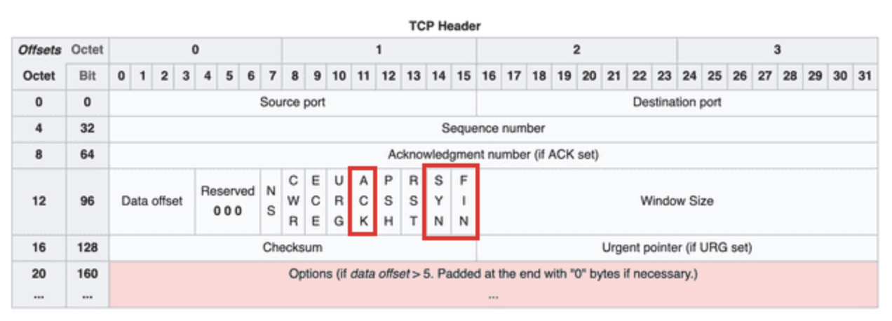

  - 신뢰성 있는 데이터 통신을 가능하게 해주는 연결 지향형 프로토콜
      - 3-way handshaking 과정을 통해 연결하고 통신이 끝나면 4-way handshaking 과정을 통해 연결을 해제

  - 파이프라인 방법을 사용하여, 한 번에 데이터를 쏟아붓는다
    - ACK가 돌아올 때까지 기다리지 않고 다음 데이터를 전송

  - 흐름 제어
      - 송신 측에서 데이터 처리 속도 조절하여 수신 측의 버퍼 오버플로우 방지 (버퍼 크기 차이)
      - 송신 측에서 감당이 안되게 많은 데이터를 빠르게 보내 수신측에서 문제 발생하는 것 방지
      - (7-8번 문제와 관련)

  - 혼잡 제어
    - 네트워크 내의 패킷 수가 과도하게 증가하지 않도록 방지
    - 정보의 소통량이 과다하면 패킷을 조금만 전송하여 혼잡 붕괴 현상이 일어나는 것 막음
    - (7-10번 문제와 관련)

  - UDP 보다 신뢰성이 좋지만, 속도는 느림

  - 모든 TCP 연결은 전이중(Full-Duplex), 점대점(Point to Point) 방식
    - 전이중 : 전송이 양방향으로 동시에 일어날 수 있으며, 바이트 스트림을 사용함
    - 점대점 : 각 연결이 정확히 2개의 종단점을 가짐
    - 멀티캐스팅, 브로드캐스팅 지원 x

 

- <ins><strong>UDP (User Datagram Protocol)</strong></ins>

    
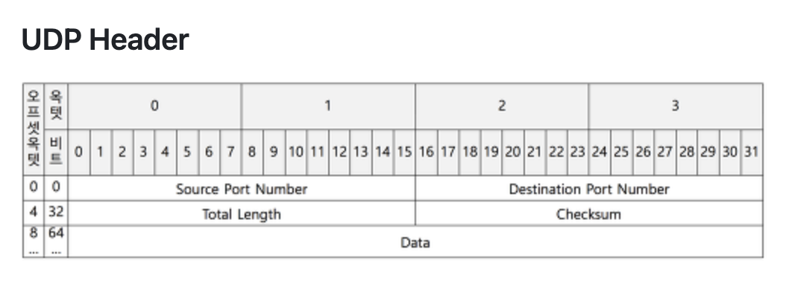

  - 비 연결형으로 데이터그램 단위로 데이터를 처리하는 프로토콜
      - 데이터그램 : 독립적인 관계를 지니는 패킷
      - 데이터의 전송 순서가 바뀔 수 있음
      - 서버와 클라이언트는 `1:1`, `1:N`, `N:M`으로 연결 가능

  - 데이터의 수신 여부를 따로 확인하지 않음 → 패킷 오버헤드 적음 → 네트워크 부하 감소

  - TCP보다 전송속도가 빠르며, 신뢰성이 낮음

 

7-2. 전송 계층의 파이프라인 프로토콜에 대하여 설명해주세요. (오류 제어 기법에 관한 설명으로 봐도 괜찮) (창작 문제)

 

- <ins>파이프라인 프로토콜이란, 패킷 송수신 측면에서 일련의 단계 또는 처리 단계를 통해 데이터를 전송하는 방법</ins>

- 필요한 이유
  - 기존의 상황에서는 RTT(Round Trip Time, 왕복시간) 동안 아무것도 보낼 수 없기에 네트워크 활용률이 낮다.
  - 더 많이 보내는 형식으로 네트워크의 활용률을 높이기 위해 파이프라인 프로토콜은 필요하다

- 장점
  - 더 빠른 전송 속도를 허용하고, 네트워크 정체를 줄여서 네트워크 성능을 향상시킬 수 있음
  - 장거리 데이터 전송에 사용할 수 있어서 광역 네트워크에서 사용하기에 적합

- 단점
  - 구현하기 복잡할 수 있어서, 네트워크 문제 발생 시 문제 해결 어려울 수 있음
  - 네트워크에 대기 시간을 도입하여 전송 속도를 저하시킬 수도 있음

- <ins><strong>Stop-and-Wait</strong></ins>

    

    - ACK 오기 전까지 멈추는거

- <ins><strong>Go-Back-N (GBN, N부터 반복)</strong></ins>

    
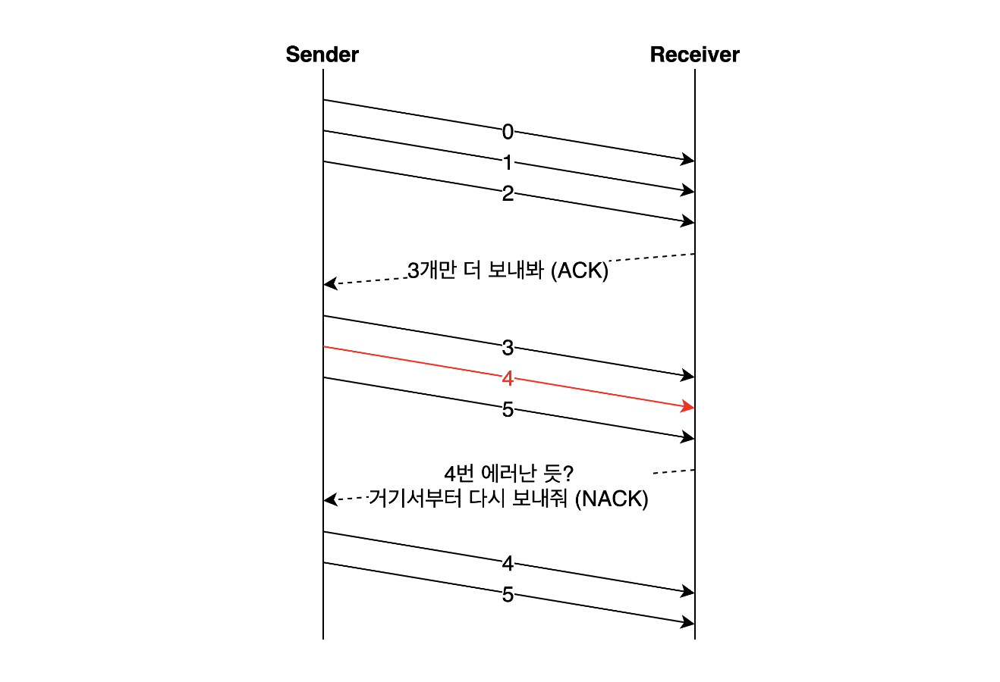

    - 송신 측에서 확인 응답(ACK)을 받지 않고, 여러 패킷을 전송할 수 있음
    - 파이프라인에서 확인 응답이 안 된 패킷의 최대 허용 수 N보다 크면 안됨
    - Sliding Window 프로토콜 이라고도 부름
    - 패킷 하나에서 오류가 발생하는 경우, 윈도우 내의 모든 패킷 재전송 → 불필요한 작업 많이함

- <ins><strong>Selective Repeat ARQ (SR, 선택적 반복)</strong></ins>

    
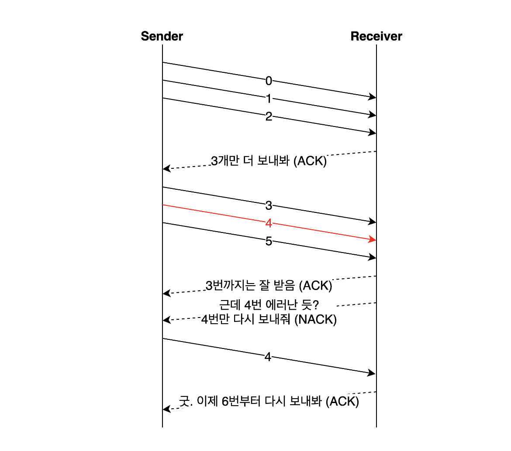

    - 수신측에서 오류가 발생한 패킷만을 다시 재전송하는 방법으로 불필요한 작업을 피하게 만듦 
    - ex) 윈도우 크기가 3, 패킷이 `0, 1, 2, 3` 인 경우, `ACK 0, ACK 1, ACK 2` 모두 유실되어서 패킷 0부터 다시 보낸다고 하자.
      - `ACK 0, ACK 1, ACK 2` 패킷을 유실해서 패킷 0부터 보내는거야?
      - `ACK 0, ACK 1, ACK 2` 패킷은 정상적으로 받았는데, `ACK 3`이 손실된 상태여서 다음 번호인 패킷 0을 보내는거야?
      - 이런 애매모호한 상황이 생김 → 그래서 패킷 번호눈 윈도우 크기보다 두 배가 넘도록 해야함

 

7-3. 패리티 검사, CRC, Checksum이 무엇인가요? (출처 : vsfe, 창작 문제)

 

- <ins><strong>패리티 검사</strong></ins>

  - 오류를 검출하는 방식으로, 1의 개수를 짝수 개로 맞춰서 보낼 지 홀수 개로 맞춰서 보낼 지 송신측과 수신측이 약속하고 여분의 bit (패리티 비트)를 채워서 보내는 방식

  - Single-bit Error 같은 홀수 개의 오류만 검출 가능, 짝수 개의 오류 검출 불가능
      - 이를 해결하기 위한 2차원 패리티 검사가 탄생
      - 수평(LRC), 수직(VRC) 패리티 비트를 추가하고 카운트 하는 방식
      - 하지만 수평과 수직으로 짝수 개씩 똑같이 바뀐다면 역시나 검출 불가능 → <ins>패리티 검사의 근본적인 한계</ins>

 

- <ins><strong>CRC (Cyclic Redundancy Check, 순환 중복 검사)</strong></ins>

  - 패리티 검사의 한계를 채워주기 위해 나온 오류 검출 방식

  - 데이터에 오류가 발생했는지 확인하는 코드를 데이터 뒤에 확장 데이터를 덧붙여 보내는 방식

  - <ins>나눗셈을 이용하여 오류를 검출</ins>하는 방식이다. 정해진 숫자로 나눴을 때, 무조건 나머지가 0이 되어야 한다. 보내는 확장 데이터가 나눌 때 사용하는 숫자이다.

 

- <ins><strong>Checksum</strong></ins>

  - 체크섬은 오류를 검출하는 방식으로 송신된 헤더와 데이터의 무결성을 검사하는 것이다.

  - 송신된 데이터의 체크섬과 수신된 데이터의 체크섬 값을 비교하고 올바르게 왔는지 확인하는 것

  - <ins>합계로 오류를 검출</ins>하는 방식이다.

  - 체크섬 계산 방법

    1. 데이터를 2Byte 단위로 나눠서 더함 (odd byte의 경우 뒤를 0으로 패딩)
    2. 덧셈 결과가 2Byte 초과하면 올림수(carry)를 하위 바이트에 더함
    3. 덧셈 결과에 1의 보수를 취함

 

7-4. 데이터 전송 과정에서 오류가 발생하는 원인은 어떤게 있을까요? (창작 문제)

 

1. 감쇠 (Attenuation) : 전송 신호가 전송 매체를 통과하는 과정에서 거리에 따라 점차 약해지는 현상

2. 지연 왜곡 (Delay Distortion) : 유선 전송 매체에서 주로 발생하는데, 하나의 전송 매체를 통해 여러 신호를 전달했을 경우 주파수에 따라 속도가 달라지면서 생기는 오류

3. 상호 변조 잡음 (Intermodulation Noise) : 서로 다른 주파수들이 하나의 전송 매체를 공유할 때, 주파수 간 합이나 차로 인하여 새로운 주파수가 생성되는 잡음

4. 충격 잡음 (Impulse Noise) : 번개와 같은 외부적인 충격이나 기계적인 통신 시스템의 결함 등 순간적으로 높은 진폭이 발생하는 잡음

 

7-5. TCP와 UDP 중 어느 프로토콜이 Checksum을 수행할까요? (출처 : vsfe)

 

- TCP 헤더와 UDP 헤더 모두에 체크섬이 있다. 둘 다 수행한다.

- TCP는 필수적으로 체크섬 과정을 수행

- UDP의 체크섬은 선택과정이면서, 에러 복구를 위한 필드가 불필요하기 때문에 TCP 헤더에 비해 간단하다.
  - ex) checksum 값이 0이면 수신측은 체크섬 계산을 하지 않아도 됨

 

7-6. 그렇다면, Checksum을 통해 오류를 정정할 수 있나요? (출처 : vsfe)

 

- <ins><strong>Checksum은 오류 검출 방식으로, 직접 오류를 정정할 수는 없고, 재전송을 요청할 수는 있다.</strong></ins>

- 오류 수정 방식에는 크게 후진오류수정(BEC), 전진오류수정(FEC)가 있다.

- 후진오류수정(Backward Error Correction) : 전송된 데이터에 오류가 발생된 경우, <ins>송신 측에 오류 사실을 알려 재전송으로 복원하는 방식</ins>
  - 오류 검출 방식 : 패리티 검사, CRC, 체크섬
  - 자동 반복 요청(ARQ) : Stop and Wait, Go-back-N, Selective-Repeat, Adaptive ARQ

- 전진오류수정(Forward Error Correction) : <ins>수신 측에서 오류를 스스로 검출/복원할 수 있는 방법</ins>으로 송신 시 오류 복구를 위한 잉여 비트를 추가하여 전송하는 방식
  - 해밍코드 : 수신 측에서 오류가 발생한 비트를 찾아 재전송을 요구하지 않고 자신이 직접 오류 수정 (1개 오류 비트 수정)
  - 상승코드 : 한계 값(경계 값) 디코딩, 순차적 디코딩을 이용하여 오류가 발생한 오류 비트를 모두 수정할 수 있는 방식

 

7-7. TCP가 신뢰성을 보장하는 방법에 대해 설명해 주세요. (출처 : vsfe)

 

- 자신이 보낸 데이터에 대하여 상대방이 받았다는 의미인 응답 패킷을 다시 받아야 통신이 이루어 짐

- 만약, 그 과정에서 응답 패킷을 받지 못하면 패킷이 유실되었다고 판단하여 TCP 재전송이 이루어짐

- 이와 같은 과정을 통해 신뢰성을 보장함

 

7-8. TCP의 흐름 제어 처리 방법에 대해 설명해주세요. (창작 문제)

 

- 흐름 제어
  - 송신 측에서 데이터 처리 속도 조절하여 수신 측의 버퍼 오버플로우 방지 (버퍼 크기 차이)
  - 송신 측에서 감당이 안되게 많은 데이터를 빠르게 보내 수신측에서 문제 발생하는 것 방지
  - Stop and Wait, Sliding Window
  - (7-1번 문제와 관련)

 

  > **큐잉 지연**으로 인하여, 송신 측의 전송량이 수신측의 수신량보다 큰 경우 패킷이 손실될 수 있음. 따라서, 송신측의 패킷 전송량을 수신측에 따라 제어해야 함    기본적인 개념으로 수신측에서 송신측에게 자신의 상태인 RWND(Receive Window, Receive Buffer의 남은 공간)를 피드백한다.

 

- <ins><strong>Stop and Wait</strong></ins>

    
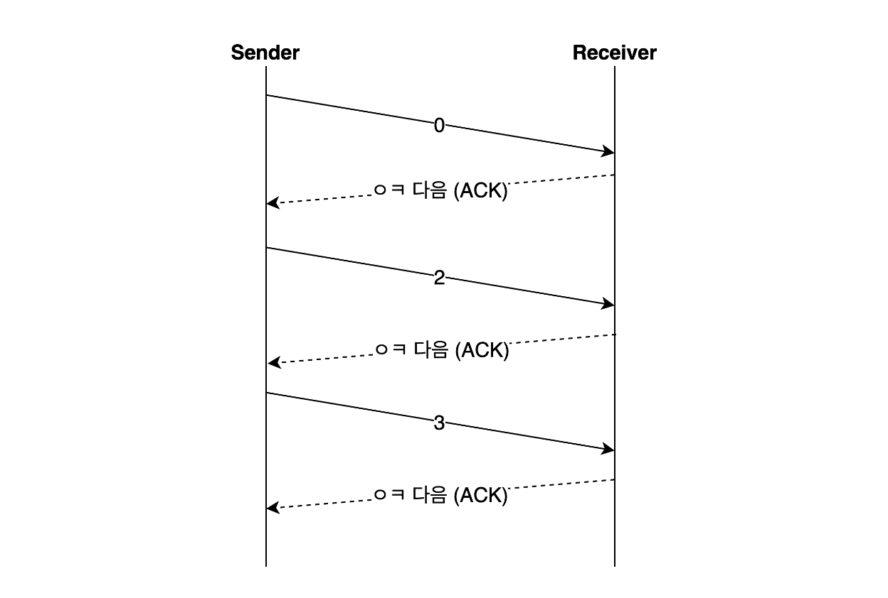

    - 매번 전송한 패킷에 대해 확인 응답(ACK)을 받아야만 그 다음 패킷을 전송하는 방법

    - 패킷을 하나씩 보내기에 비효율적

    - 단순한 구현으로 쓰지 않고, 여러 오류 제어 방식과 함께 도입하여 사용

- <ins><strong>Sliding Window</strong></ins>

    
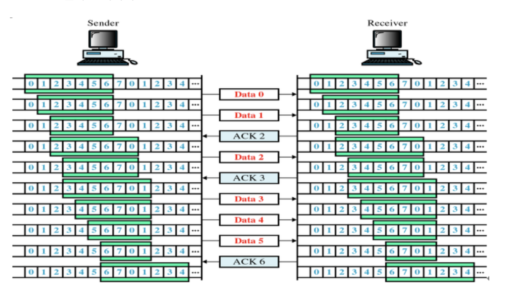

    
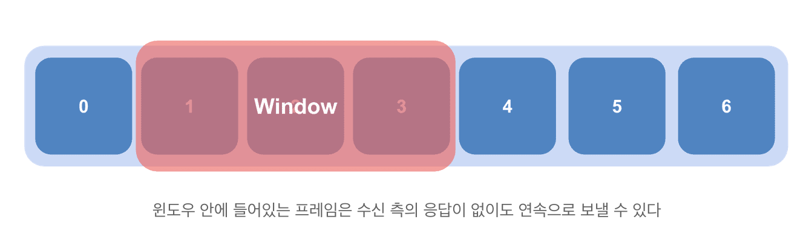

    - 수신 측이 한 번에 처리할 수 있는 데이터를 정해놓고, 그때 그때 수신 측의 데이터 처리 상황을 송신 측에 알려줘서 데이터의 흐름을 제어하는 방식

    - 수신 측에서 설정한 window 크기 만큼 송신 측에서 확인 응답(ACK) 없이 패킷을 전송할 수 있어서, 데이터 흐름을 동적으로 조절할 수 있음
      - <ins><strong>window : 메모리 버퍼의 일정한 영역 → 일종의 마스킹 도구</strong></ins>
      - 최초의 윈도우 크기는 3-way handshaking을 통해 수신측 윈도우 크기로 결정됨

    - 쉽게 말해서, 송신 측이 수신 측에서 처리할 수 있는 데이터 양을 알고 있으니까 ACK 없이 예측해서 보낼 수 있다는 말

 

7-9. 네트워크 혼잡 상황은 왜 발생할까요? (창작 문제)

 

- 송신 측에서 보내는 데이터의 양이 라우터가 처리할 수 있는 양을 초과하면 데이터는 라우터가 처리하지 못한다.

- 송신 측에서는 초과된 데이터를 손실 데이터로 간주하고 계속 재전송하여 네트워크를 혼잡하게 만든다.

 

7-10. TCP의 혼잡 제어 처리 방법에 대해 설명해 주세요. (출처 : vsfe)

 

- 혼잡 제어 (7-1번 문제와 관련)
  - 네트워크 내의 패킷 수가 과도하게 증가하지 않도록 방지
  - 정보의 소통량이 과다하면 패킷을 조금만 전송하여 혼잡 붕괴 현상이 일어나는 것 막음
  - AIMD, 느린 시작, 빠른 재전송, 빠른 회복

 

  > 패킷 손실(lost)이나 긴 지연시간(long delay) 같은 congestion 발생 시, cwnd(congestion window) 양을 줄이고 congestion이 발생하지 않으면 cwnd를 점차 늘리는 방법이 혼잡제어이다.    CWND는 TCP 연결의 송신률을 제어하는 변수이다. `cwnd = 전송했지만 ACK를 받지 못한 패킷량 + 아직 보내지 않은 패킷량`으로 congestion이 발생하지 않으면 점차 늘리지만, congestion 발생 시 크기를 줄인다.

 

- <ins><strong>AIMD (Additive Increase / Multiplicative Decrease)</strong></ins>

    
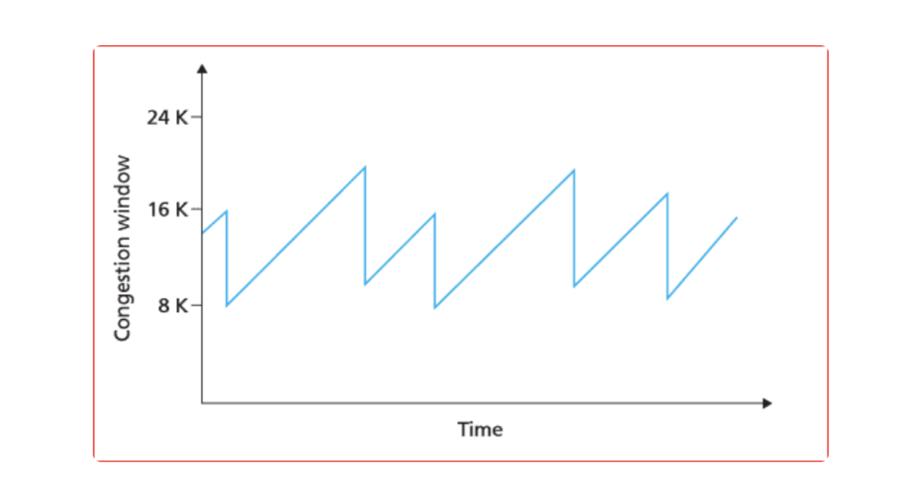

    - 합 증가 / 곱 감소 방식
    - 처음에 패킷 1개 보냄 → 문제 없으면 윈도우의 크기를 1씩 증가시켜가며 전송 → 전송에 실패하거나 일정 시간 넘기면 윈도우의 크기를 절반으로 줄임
    - 여러 호스트가 하나의 네트워크를 공유하는 경우, 나중에 진입한 쪽이 처음에는 불리하지만 시간이 흐를수록 평형상태로 수렴하여 굉장히 공평하다는 특징이 있음
    - 윈도우의 크기를 1씩 늘리기에 네트워크의 모든 대역을 제대로 활용하지 못하기에, 초창기에 오랜 시간이 걸리고, 네트워크 혼잡상황을 미리 감지하지 못한다는 단점 있음

- <ins><strong>Slow Start (느린 시작)</strong></ins>

    
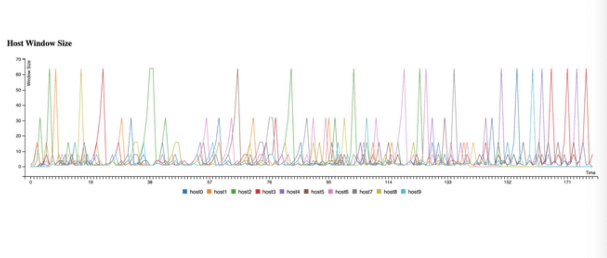

    - 윈도우의 크기를 1, 2, 4, 8 ... 지수적으로 증가시킴 → 혼잡 감지되면 윈도우의 크기를 1로 줄임

- <ins><strong>Fast Retransmit (빠른 재전송)</strong></ins>

    
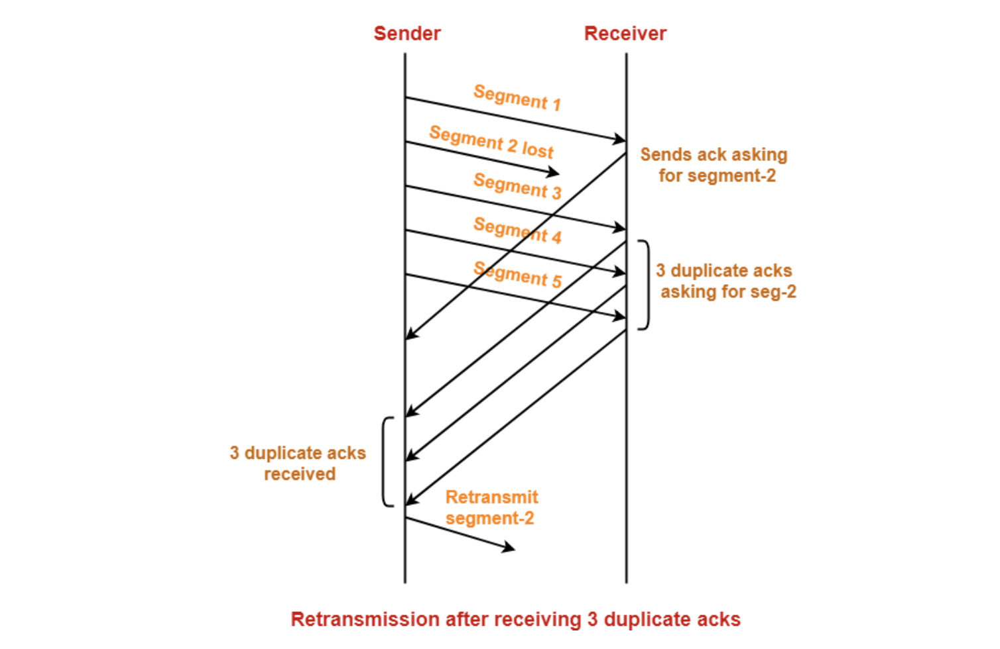

    - 수신 측에서 순서대로 잘 도착한 마지막 패킷의 다음 순번을 ACK에 실어서 보냄
    - 중복 ACK를 3번 받는 순간 재전송이 이루어짐
    - 송신 측에서 설정한 timeout이 안지나도 해당 패킷을 재전송 할 수 있어서, 빠른 재전송률 유지 가능

- <ins><strong>Fast Recovery (빠른 회복)</strong></ins>

    
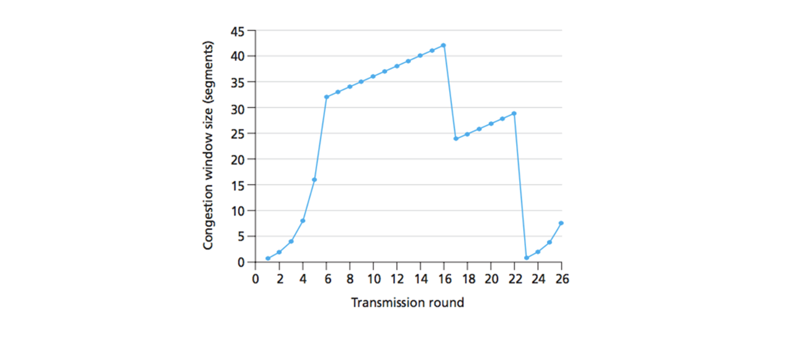

    - 혼잡 상태가 되면, 윈도우 크기를 1로 줄이지 않고, 반으로 줄이고 선형적으로 증가시키는 방법
    - 혼잡 상황을 한 번 겪고 난 이후 → AIMID 방식으로 동작

 

7-11. TCP 혼잡 제어의 정책에는 어떤 것이 있나요? (창작 문제)

 

- <ins><strong>TCP Tahoe</strong></ins>

    
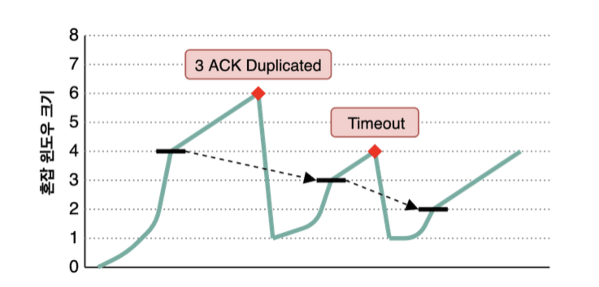

    1. 처음에 slow start 시작하여 윈도우 크기 지수적으로 증가 → 임계점(ssthresh) 도달하면 AIMD 사용하여 윈도우 크기 선형적으로 증가
    2. 혼잡 상황 발생 시 → 임계점을 윈도우 크기 절반, 윈도우 크기는 1로 변경

    - Taheo는 ACK Duplicated 3번 만나는 상황이나 timeout 각각에 대하여 다르게 판단하지 않고 하나의 혼잡상황으로 판단

    - 한 번 혼잡 상황이 발생한 지점을 기억하고, 그 지점이 가까워지지 않도록 조절함
      - 초록선이 송신 측의 혼잡 윈도우 크기, 검정 선이 ssthresh 값

    - Slow Start 구간에 윈도우 크기 늘릴 때 오래걸림 + 혼잡 상황 발생 시 윈도우 크기 1부터 시작하는 단점

- <ins><strong>TCP Reno</strong></ins>

    
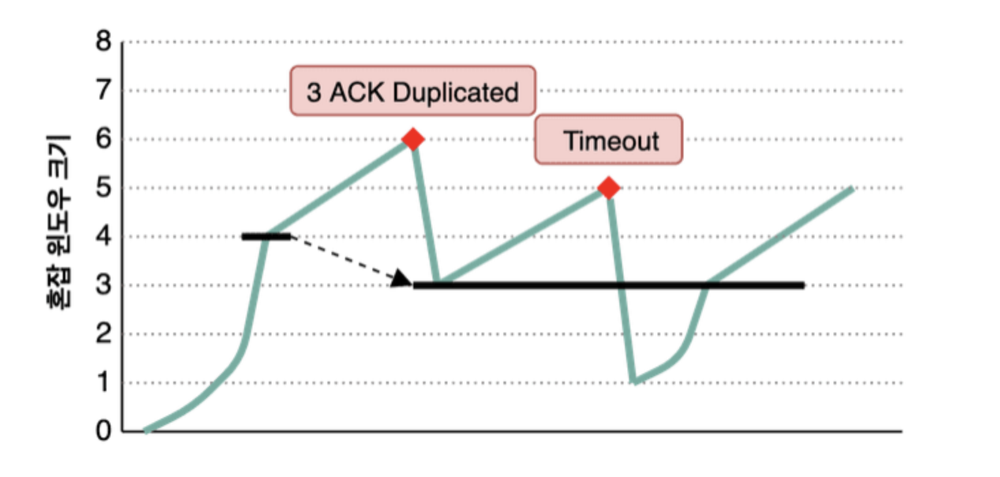

    - Tahoe 처럼 Slow start 시작 → 임계점 넘어서면 AIMD 사용하는 것 동일

    - 그러나, Tahoe와는 다르게 3 ACK Duplicated와 timeout 혼잡 상황을 구분함 → 혼잡 상황에 대해 우선순위를 둔 정책

      - 3 ACK Duplicated 발생 → 빠른 회복(윈도우 크기를 반으로 줄이고), 임계점을 줄어든 윈도우 크기로 정함
      - timeout 발생 → 윈도우 크기를 1로 줄이고 slow start 진행, 임계점 변경 x

 

7-12. 왜 HTTP는 TCP를 사용하나요? (출처 : vsfe)

 

- 데이터 전송의 신뢰성
  - 신뢰성 있는 전송 : HTTP 요청과 응답의 정확성에 대한 보장이 필요하다고 생각함. TCP는 패킷 손실되면 재전송 수행해서 모든 데이터가 전송되도록 보장하니까

- 제어와 관련하여
    - 오류 제어 : TCP는 오류 검출 및 수정을 지원
    - 혼잡 제어 : 네트워크의 혼잡 상태를 관리하고 효율적으로 데이터 전달 가능. UDP가 네트워크의 혼잡 상태를 관리하는 능력은.. 아직은 글쎄

- 결과적으로, TCP를 통해 HTTP는 웹 페이지나 파일을 전송할 때, 전송 중 손실되거나 변조된 데이터 없이 사용자에게 정확한 내용을 전달할 수 있도록 한다. 사용자 입장에서는 이로 인해 웹 서핑 시 높은 수준의 신뢰성과 안정성을 체감할 수 있다.

 

7-13. 그렇다면, 왜 HTTP/3 에서는 UDP를 사용하나요? 위에서 언급한 UDP의 문제가 해결되었나요? (출처 : vsfe)

 

- HOL Blocking (Head Of Line Blocking)을 없애고 latency를 줄여서 성능적으로 큰 향상이 있어서 사용한다고 생각함

- UDP가 신뢰성에서 문제가 있다고는 하지만, 사실, UDP는 신뢰성이 "없는 것"이 아니라 "안한 것"이라고 생각함. 애플리케이션 단에서 커스텀하여 신뢰성 확보 해줄 수 있음.

- 네트워크가 변경되어도 연결이 유지됨
  - 한 번 연결되면, connection ID를 클라이언트에게 부여하기에, 클라이언트의 IP가 변경되어도 기존의 연결을 계속 유지 가능

 

7-14. 그런데, 브라우저는 어떤 서버가 TCP를 쓰는지 UDP를 쓰는지 어떻게 알 수 있나요? (출처 : vsfe)

- TCP를 사용한다면 `HTTP/1.1`, `HTTP/2.0`을 말하는 것일거고 UDP라면 `HTTP/3.0`을 의미하는 것일 거다. HTTP 버전에 따라서, 브라우저는 서버와의 통신 방법을 결정한다.

- <ins><strong>HTTP/1.x</strong></ins>

  - `HTTP/1.0`, `HTTP/1.1`은 요청 형식이 서로 호환된다. 첫 요청 이후, 서버의 응답은 서버가 지원하는 버전과 함께 "Connection: keep-alive"와 같은 헤더를 포함하여 사용 가능한 기능을 나타낸다.

- <ins><strong>HTTP/2.0</strong></ins>

  - 브라우저는 `HTTP/2.0`를 TLS 연결 위에서만 지원한다. 이는 새로운 TLS 기능인 <ins>ALPN</ins>을 사용할 수 있게 한다. 크롬은 TLS 연결을 설정할 때 지원되는 프로토콜 목록을 서버에 보내고, 서버는 사용할 프로토콜을 선택하여 응답한다. 만약 서버가 ALPN extension을 반환하지 않는다면, 브라우저는 `HTTP/1.x`만 지원하는 것으로 가정한다.
    - TLS 연결을 설정할 때 지원되는 프로토콜 목록은 `http/1.1` 혹은 `h2`가 있다. `h2`는 이제부터 `HTTP/2.0`을 사용할 것으로 예상한다는 것을 표시한 것
    - ALPN (Application-Layer Protocol Negotiation, 프로토콜 협상) : TLS 연결을 설정할 때, 클라이언트와 서버 간에 사용할 프로토콜을 협상하는 메커니즘

- <ins><strong>HTTP/3.0</strong></ins>

  - `HTTP/3.0`은 QUIC이라는 다른 전송 프로토콜을 사용하기 때문에 인라인 업그레이드가 불가능하다. 따라서 브라우저는 초기 TCP 연결을 설정하고, TLS ALPN을 통해 `HTTP/1.1` 또는 `HTTP/2.0`을 협상한다. `HTTP/3.0`로 업그레이드하는 것은 실제로 서버가 시작하며, 서버는 HTTP 응답에 <ins>Alt-Svc 헤더</ins>를 보내어 `HTTP/3.0`을 지원하는 것을 나타낸다. 브라우저는 이 제안을 따르고 QUIC 연결을 시도하며, 성공하면 TCP 연결을 종료한다.
    - 인라인 프로토콜 : 웹 프로토콜에서 기존의 연결을 사용하여 새로운 프로토콜로 업그레이드하는 프로세스

 

7-15. 본인이 새로운 통신 프로토콜을 TCP나 UDP를 사용해서 구현한다고 하면, 어떤 기준으로 프로토콜을 선택하시겠어요? (출처 : vsfe)

 

- 새로운 통신 프로토콜을 구현한다면, UDP를 사용하여 구현할 것 같다. 페타데이터를 넘어서는 시대가 도래했고, 더욱 많은 데이터를 다루고 실시간성이 중요해지는 시대에서 TCP를 고집한다는 것은 힘들 것 같다.

- UDP를 커스터마이징 하여 신뢰성을 높이고, 네트워크 제어가 힘들다던가, TCP 방식에 비해 CPU를 더 많이 사용하는 문제 등을 개선하는 쪽으로 새로운 통신 프로토콜을 구현해보고 싶다.

 

## 11번 질의

11-1. 3-Way Handshake에 대해 설명해 주세요. (출처 : vsfe)

 

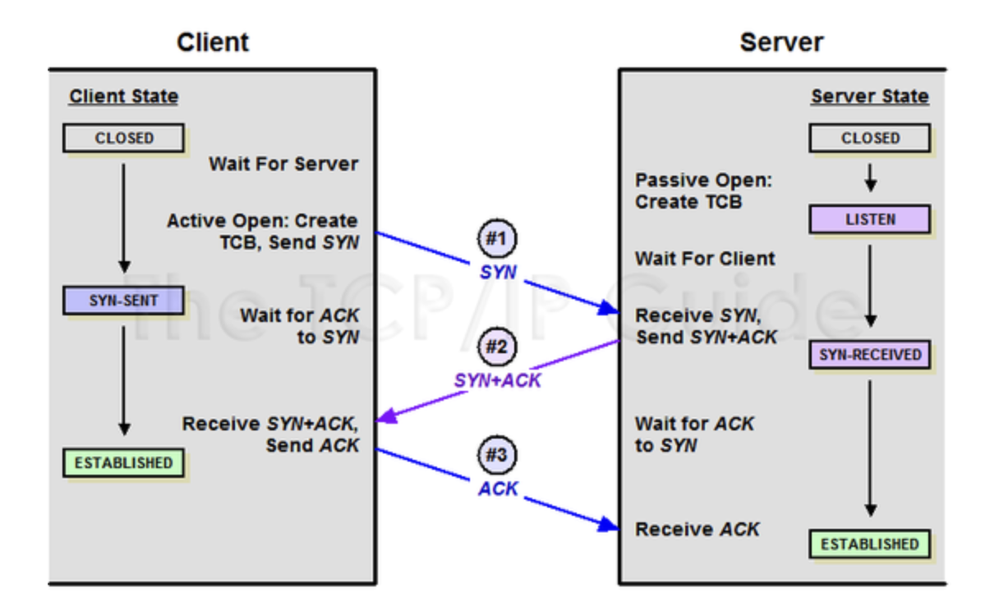

- 3-Way Handshake란 클라이언트와 서버간의 가상회선을 수립하는 과정이다. 즉, 클라이언트는 서버에 요청을 전송할 수 있는지, 서버는 클라이언트에게 응답을 전송할 수 있는지 확인하는 과정이다.
  - 이 과정을 통해 클라이언트-서버 간 신뢰성 있는 연결을 맺게 되면서, 전송 순서가 보장되고 순서 제어가 가능하게 된다.
  - SYN(SYnchronize sequence Number) 플래그 : 접속 요청 (패킷 송신)
  - ACK(ACKnowledgement) 플래그 : 요청 수락 (패킷 받았다고 응답)

1. (세그먼트 1)클라이언트가 서버에 접속을 요청하는 `SYN` 패킷 보내고 `SYN/ACK` 응답을 기다리는 `SYN_SENT 상태`가 됨

2. (세그먼트 2)서버가 `SYN` 패킷 받으면 클라이언트에게 요청을 수락한다는 `ACK`와 `SYN`이 설정된 패킷을 전송하고 클라이언트가 다시 `ACK`로 응답하기를 기다리는 `SYN_RECEIVED` 상태가 됨

3. (세그먼트 3)클라이언트는 서버에게 `ACK` 보내고 난 이후에는 연결이 설정된 상태. 이때의 서버 상태가 `ESTABLISHED`이다.

 

11-2. ACK, SYN 같은 정보는 어떻게 전달하는 것 일까요? (출처 : vsfe)

 

- TCP 패킷의 헤더에 ACK, SYN 정보가 포함되어 전달된다.

 

11-3. 2-Way Handshaking을 하지않는 이유에 대해 설명해 주세요. (출처 : vsfe)

 

- <ins>신뢰성이 떨어진다.</ins> 클라이언트의 입장에서는 서버의 `SYN/ACK` 신호를 통해 응답을 받을 수 있으나, 서버의 입장에서는 `ACK`를 받을 수 없어서 제대로 보냈는지 송신을 확인할 수 없다.

- 2-way handshake는 서버와 클라이언트 간 상호인증을 위해 주로 사용되는데, 이 과정에서는 보통 <ins>ISN(초기 순서번호)의 동기화를 수행하지 않는다.</ins>
  - TCP는 양방향 통신이므로, 각 방향마다 다른 ISN(초기 순서번호)이 설정되는데, 2-way handshaking을 한 경우에는 ISN을 동기화 할 수 없다.
  - 세그먼트 1에서 클라이언트 측의 ISN 보냄 → 세그먼트 2에서 서버 측의 ISN 보냄 → 세그먼트 3에서 클라이언트가 ACK를 서버로 보내면서 서로의 ISN을 확인하고 동기화해야 하는데 이 과정이 빠져있으니까

 

11-4. 두 호스트가 동시에 연결을 시도하면, 연결이 가능한가요? 가능하다면 어떻게 통신 연결을 수행하나요? (출처 : vsfe)

- TCP는 두 개의 파이프를 사용하여 전송이 양방향으로 일어날 수 있는 전이중(Full-Duplex) 통신이라서 두 호스트가 동시에 연결을 시도해도 연결이 가능하다.

- simultaneous open을 이용하여 동시에 활성 상태로 열 수 있다.

    
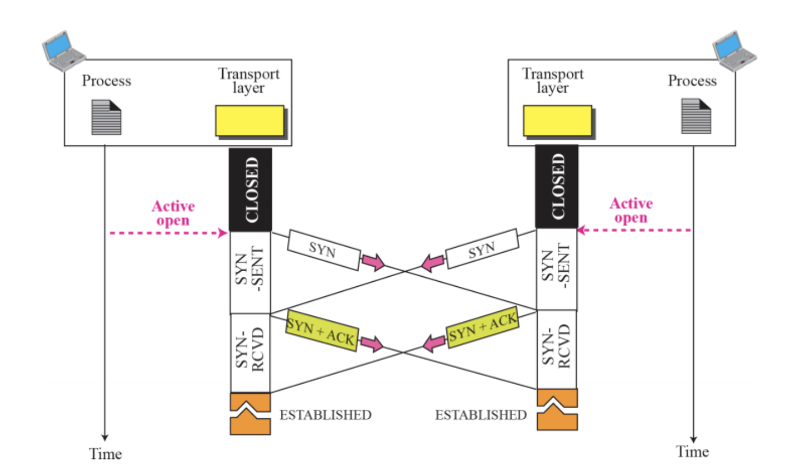

    1. 클라이언트와 서버가 동시에 서로에게 `SYN` 패킷을 보냄
    2. 서버와 클라이언트는 받은 `SYN` 패킷에 대한 응답으로 `SYN-ACK` 패킷 보냄
    3. 클라이언트과 서버는 `SYN-ACK` 패킷에 대한 응답으로 `ACK` 패킷 보냄

    - 두 TCP 모두 `ESTABLISHED` 상태로 가기 전에 `SYN_SENT`, `SYN_RECEIVED` 상태를 거친다.
    - 두 프로세스가 모두 클라이언트와 서버 역할을 한다.
    - 3-way Handshake 보다 빠르다.
    - TCP에 허용은 되지만, 사실 이런 시나리오가 발생할 가능성은 낮다.

 

11-5. SYN Flooding에 대해 설명해 주세요. (출처 : vsfe)

 

- 공격자가 대상 서버에 대량의 TCP SYN 요청 패킷을 보내서, 서버의 리소스를 고갈시키는 공격

- <ins>시나리오 (1) 공격자 -- (SYN) --> 서버</ins>

    - 대량 연결 요청 자체에서 서버는 부담을 느낌
    - 서버의 리소스가 고갈되면 응답하지 못하는 상태가 됨
    - **서비스 거부(DoS, Denial Of Service) 상태**
    - 서버는 SYN 패킷을 받으면 SYN 패킷 관련 정보를 백 로그 큐에 저장해 관리함

- <ins>시나리오 (2) 공격자 <-- (SYN+ACK) -- 서버</ins>

    - 서버는 SYN+ACK 패킷을 전송하고 ACK를 받을 때까지 대기
    - 서버는 half-open 상태가 됨
    - 공격자가 ACK를 전송하지 않고 서버를 계속 기다리게 함
    - half-open 연결이 쌓이고, 서버의 연결 테이블이 고갈되면서 서비스 거부 상태가 됨

- <ins>SYN Flooding 해결방법</ins>

    - 서버는 클라이언트의 IP 주소, 포트 번호, 시간 정보 등을 이용하여 쿠키를 생성
    - 쿠키는 일시적으로 서버 메모리에 저장되고, 연결 수립 이후에는 즉시 제거됨
    - SYN+ACK 패킷의 ISN에 Cookie 값을 넣어서 전송
    - 서버 입장에서는 클라한테 받은 SYN 패킷과 연결 정보를 저장할 필요가 없음
    - 클라이언트가 ACK 응답을 보내면, 서버는 Sequence Number (Cookie 값 + SYN 패킷의 크기)가 올바른지 확인한다. 일치하면 연결되고 일치하지 않으면 무시함
    - 그러나, DoS 공격은 막을 수 있지만, DDoS 공격은 막을 수 없고, 완벽한 해결방법이 아니라서 여러 방식과 결합하여 사용한다.

 

11-6. 위 질문과 모순될 수 있지만, 3-Way Handshake의 속도 문제 때문에 이동 수를 줄이는 0-RTT 기법을 많이 적용하고 있습니다. 어떤 방식으로 가능한 걸까요? (출처 : vsfe)

- 0-RTT (Zero Round-Trip Time) 기법은 TLS 연결 설정 과정에서 사용되는 기술 중 하나로, 3-way Handshake에서 발생하는 지연을 줄이고 속도를 향상시키는 방법 중 하나로, <ins>이전 연결의 정보를 재사용하여</ins> 서버에 대한 새로운 연결을 설정하는 것이다.

    1. 클라이언트는 서버에게 연결을 요청하는 ClientHello 메시지를 보냄
    2. 서버는 클라이언트에게 연결을 수락하는 ServerHello 메시지를 보냄
    3. 클라이언트와 서버는 서로에게 인증서를 교환하고, 암호화 키를 합의하는 과정을 거침

- 0-RTT는 TLS 1.3에서 도입된 기술인데, 클라이언트는 서버에게 최초 요청을 보내면서 동시에 이전에 사용한 세션 정보를 함께 보낸다. 여기에는 클라이언트와 서버 간에 공유된 비밀키, 암호화된 세션 상태가 포함된다.
    - 서버는 이 정보를 통해 유효한 클라이언트라고 판단하고 이전에 성공적으로 연결했던 것을 확인한다.
    - 이전 세션에서 사용한 키 및 상태를 다시 활성화하여 통신을 즉시 시작할 수 있다.

 

11-7. 초기 Sequence Number인 ISN은 0부터 시작하지 않고 난수를 생성해서 설정합니다. 그 이유가 무엇일까요? (출처 : WeareSoft)

 

- 연결을 맺을 때 사용하는 포트는 유한 범위 내에서 사용하고 시간이 지남에 따라 재사용됨
  - 그러다보니, 과거에 사용된 포트 번호 쌍을 사용하는 가능성이 존재
  - 서버 측에서는 패킷의 SYN을 보고 패킷을 구분하는데, 난수가 아닌 순차적인 숫자가 전송된다면 이전의 연결로부터 오는 패킷으로 인식할 수 있음

 

11-8. 만약 Server에서 FIN 플래그를 전송하기 전에 전송한 패킷이 Routing 지연이나 패킷 유실로 인한 재전송 등으로 인해 FIN 패킷보다 늦게 도착하는 상황이 발생하면 어떻게 되나요? (출처 : WeareSoft)

 

- 이러한 현상에 대비하여 클라이언트는 서버로부터 FIN 플래그를 수신하더라도 일정시간(Default: 240sec)동안 세션을 남겨 놓고 잉여 패킷을 기다리는 과정을 거친다. (TIME_WAIT 과정)

- 12-6번 문제와 관련

 

11-9. TCP의 연결 설정 과정(3단계)과 연결 종료 과정(4단계)이 단계가 차이나는 이유가 무엇이라고 생각하시나요? (출처 : WeareSoft)

 

- 클라이언트가 데이터 전송을 마쳤다고 하더라도 서버는 아직 보낼 데이터가 남아있을 수 있기 때문에 일단 FIN에 대한 ACK만 보내고, 데이터를 모두 전송한 후에 자신도 FIN 메시지를 보내기 때문이다.

 

## 12번 질의

12-1. 4-Way Handshake에 대해 설명해 주세요. (출처 : vsfe)

 

- 4-Way Handshake란 TCP 연결을 해제하는 과정이다.

    
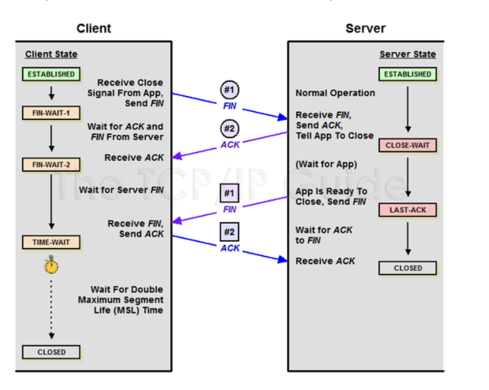

    - FIN 플래그 : 접속이 연결되었을 때, 끊어야 할 때 사용하는 FLAG BIT
    - ACK(ACKnowledgement) 플래그 : 요청 수락 (패킷 받았다고 응답)

1. 클라이언트가 연결을 종료하겠다는 `FIN` 플래그 전송
2. 서버는 `FIN` 플래그 받은 후 응답으로 `ACK`를 클라이언트한테 보내고, 일정시간 대기하면서 서버 자신의 통신이 끝날 때까지 대기
3. 서버가 통신이 끝났으면 `FIN` 플래그를 클라이언트한테 전송
4. 클라이언트는 확인했다는 `ACK` 플래그를 다시 서버로 전송

 

12-2. 패킷이 4-way handshake 목적인지 어떻게 파악할 수 있을까요? (출처 : vsfe)

 

- FIN 플래그가 있냐 없냐로 확인할 수 있다.

 

12-3. 재빨리 끊어야 할 경우엔, (즉, 4-way Handshake를 할 여유가 없다면) 어떻게 종료할 수 있을까요? (출처 : vsfe)

 

- <ins><strong>Abrupt connection release (갑작스러운 연결 해제)</strong></ins>

  - <ins>RST(TCP reset)</ins> 세그먼트를 전송시켜서 갑작스러운 연결 해제를 수행할 수 있다.
  - ACK를 보내거나 기다리는 작업이 필요하지 않고, 바로 연결이 종료된다.
  - RST 비트를 1로 설정한 세그먼트를 전송한다.
    - 송신자는 패킷을 보내고 바로 연결을 종료한다.
    - 수신자는 패킷을 받으면 바로 연결을 종료한다.

 

12-4. RST 세그먼트를 전송시키는 경우는 어떤 경우가 있을까요? 재빨리 끊어야 하는 경우는 어떤게 있을까요? (창작 문제)

 

- 악상코드가 존재하는 경우처럼 보안이 위반된 경우

- 자원이 부족하여 자원 할당을 해제해야 하는 경우

- TCP 연결에 장애가 발생한 경우

 

12-5. 4-Way Handshake 과정에서 중간에 한쪽 네트워크가 강제로 종료된다면, 반대쪽은 이를 어떻게 인식할 수 있을까요? (출처 : vsfe)

 

- timeout을 통해 일정 시간이 지나면 스스로 close한다.

 

12-6. 왜 종료 후에 바로 끝나지 않고, TIME_WAIT 상태로 대기하는 것 일까요? (출처 : vsfe)

 

- 클라이언트에서 서버로 보낸 ACK가 소실되었을 수도 있다.

- 서버에서 아직 받지 못한 잉여 패킷이 있을 수도 있다.

- 11-8번 문제와 관련

 

## 참고 자료

- vsfe 님의 **[VSFE / Tech-Interview Github](https://github.com/VSFe/Tech-Interview/tree/main)**
- 테코톡 포이님의 **[[10분 테코톡] 포이의 HTTP 1.1, HTTP2, 그리고 QUIC](https://www.youtube.com/watch?v=Zyv1Sj43ykw)**
- minu님의 **[HTTP/1.0, HTTP/1.1, HTTP/2.0, HTTP/3.0, and QUIC](https://velog.io/@minu/HTTP1.0-HTTP1.1-HTTP2-and-QUIC)**
- scalalang2님의 미디엄 게시글 **[QUIC 프로토콜 | 구글 또 너야?](https://medium.com/rate-labs/quic-%ED%94%84%EB%A1%9C%ED%86%A0%EC%BD%9C-%EA%B5%AC%EA%B8%80-%EB%98%90-%EB%84%88%EC%95%BC-932befde91a1)**
- 데브인파님의 **[HTTP 3.0 통신 기술](https://inpa.tistory.com/entry/WEB-%F0%9F%8C%90-HTTP-30-%ED%86%B5%EC%8B%A0-%EA%B8%B0%EC%88%A0-%EC%9D%B4%EC%A0%9C%EB%8A%94-%ED%99%95%EC%8B%A4%ED%9E%88-%EC%9D%B4%ED%95%B4%ED%95%98%EC%9E%90#quic_%ED%94%84%EB%A1%9C%ED%86%A0%EC%BD%9C)**
- ElaYJ님의 **[[정보처리][IC개론]데이터 오류 검출 방식](https://m.blog.naver.com/syunjae21/222281190462)**
- JI-DUM님의 **[오류정정기법 FEC, BEC](http://www.jidum.com/jidums/view.do?jidumId=426)**
- Evans Library님의 **[TCP 흐름제어](https://evan-moon.github.io/2019/11/22/tcp-flow-control-error-control/)**
- nayoungs님의 **[TCP 혼잡제어](https://nayoungs.tistory.com/entry/%EB%84%A4%ED%8A%B8%EC%9B%8C%ED%81%AC-TCPIP-%ED%9D%90%EB%A6%84%EC%A0%9C%EC%96%B4-%ED%98%BC%EC%9E%A1%EC%A0%9C%EC%96%B4)**
- stackExchange **[How does browser know which version of HTTP it should use when sending a request?](https://superuser.com/questions/1659248/how-does-browser-know-which-version-of-http-it-should-use-when-sending-a-request)**
- 정보통신기술용어해설 **[TCP 3-way Handshaking](http://www.ktword.co.kr/test/view/view.php?no=1901)**
- zh025700님의 **[simultaneous open](https://velog.io/@zh025700/%E3%85%81%ED%93%A8%ED%84%B0%EB%A7%9D)**
- weareSoft **[tech-interview](https://github.com/WeareSoft/tech-interview/blob/master/contents/network.md#questiontcp-%EA%B4%80%EB%A0%A8-%EC%A7%88%EB%AC%B8-1)**