# GSLY 면접스터디

**1주차 질문 목록**

- **GSLY 면접스터디**
  - [1번 질의](#1번-질의)
  - [2번 질의](#2번-질의)
  - [3번 질의](#3번-질의)
  - [4번 질의](#4번-질의)
  - [참고 자료](#참고-자료)

## 1번 질의

1-1. 시스템 콜이 무엇인지 설명해주세요. (출처 : vsfe)

 

- <ins><strong>시스템 콜은 운영체제의 커널이 제공하는 서비스에 대해, 응용 프로그램의 요청에 따라 커널에 접근하기 위한 인터페이스</strong></ins>
    - 예를 들어, 프로세스가 시스템의 자원이나, 서비스를 필요로 할 경우 운영체제에게 시스템 콜을 통하여 요청 할 수 있음

- 사용자 프로그램이 운영체제의 서비스를 받기 위해 커널 함수를 호출하는 것

- 시스템 콜은 <ins>소프트웨어 인터럽트</ins>인 Trap의 한 종류이다.

 

> Interrupt (넓은 의미)
> - Interrupt (하드웨어 인터럽트, 비동기적 인터럽트) : 좁은 의미의 인터럽트로써, 하드웨어가 발생시킨 인터럽트
> - Trap (소프트웨어 인터럽트)
>   - Exception (동기적 인터럽트, 비자발적) : 다른 메모리에 접근, 오버플로, 언더플로, 입출력 장치에 의한 인터럽트, 0으로 나눗셈 한 경우 등등
>   - System call (자발적) : 프로그램이 커널 함수를 호출하는 경우

 

1-2. 커널이라고 하셨는데, 커널이 어떤건가요? (창작 문제)

 

- 커널은 운영체제의 핵심적인 부분으로, 항상 실행되고 있는 중요한 프로그램

- 하드웨어와 응용 프로그램 사이에서 직접적인 상호작용을 담당

 

1-3. 그렇다면, 운영체제와 커널의 차이가 어떤건가요? (창작 문제)

 

- 운영체제는 시스템 전체를 관리하고 사용자와 응용 프로그램에 다양한 서비스를 제공

- 커널은 운영체제의 핵심 부분으로 하드웨어와 직접적으로 상호 작용하여 시스템 기능을 제공하고 관리

- 운영체제 전체가 컴퓨터 부팅 시 반드시 실행되어야 하는 것은 아님. 그러나, 커널은 반드시 실행되어야함.

 

1-4. 운영체제의 커널의 종류 중 대표적인 것 2가지를 말씀해주세요. (창작 문제)

 

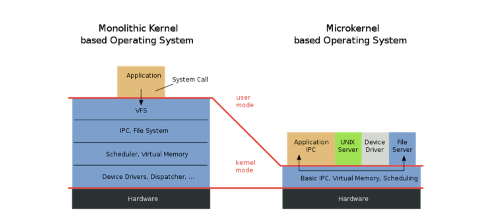

- 모놀리식 커널 : Application을 제외한 모든 system 관련 기능들 (예를 들어, I/O, 네트워크, 디바이스 지원, IPC, Filesystem 등등) 운영체제에서 일어나는 모든 일을 한 개의 커널이 전부 처리하는 방식이다. 대표적인 예시로 Unix, Linux 등등
    - 장점 : 각 Component간의 커뮤니케이션이 효율적
    - 단점 : 디바이스 드라이버를 추가/삭제 하려면 커널을 재빌드 해야 한다. 또한 하나가 죽으면 전체 시스템이 죽음

- 마이크로 커널 : 핵심적인 기능인 스케쥴링, 메모리 관리 등등만 커널에 담고 나머지는 제외하여 가볍게 만든 커널이다. 기존에 모놀리식 커널이 갖고 있던 시스템 기능들(VFS, IPC, Device driver)은 커널위의 서버의 형태로 존재한다. 이러한 이유로 하나의 서비스가 죽더라도 커널 전체가 죽는 일은 없다. 대표적인 예시로 임베디드 시스템에서 주로 사용된다.
    - 장점 : 서버를 추가하는 방식이기 때문에 기능을 추가하기 쉽고, 시스템이 견고하며 리얼타임성(실시간성)이 높음
    - 단점 : 시스템 기능들이 서버의 형태로 존재하기 때문에 커뮤니케이션 오버헤드가 있다.

- 위 두가지를 섞은 구조가 하이브리드 커널이다. 모듈의 형태로 쉽게 시스템 기능을 추가 할 수 있는 방식인데 윈도우가 가장 대표적

 

1-5. 우리가 사용하는 시스템 콜의 예시를 들어주세요. (출처 : vsfe)

 

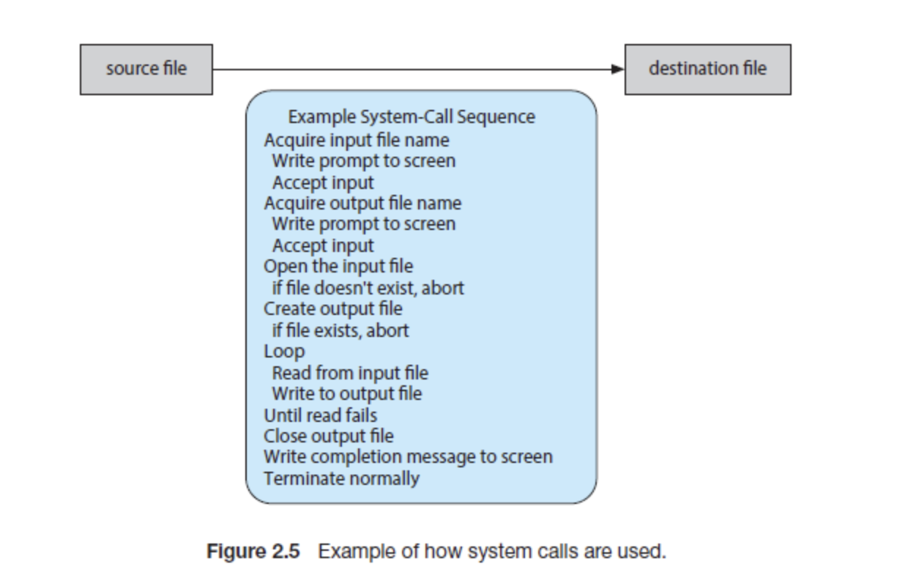

- 예시 1) 터미널에 `cp in.txt out.txt` 명령어 입력 시 발생하는 시스템 콜
    - `in.txt` 파일이 접근할 수 있는 파일인지 검사하기 위해 시스템 콜 호출
    - 복사한 파일을 저장하기 위해 `out.txt` 도 검사하기 위해 시스템 콜 호출
    - 이 간단한 작업에서 아래와 같이 어마어마한 시스템 콜 발생

- 예시 2) `fork()`
  - 현재 프로세스와 동일한 새로운 프로세스를 생성할 때 사용
  - child process를 생성하기 위한 시스템 콜
  - 특징
    - 부모 프로세스 : 리턴 값이 자식 프로세스의 PID
    - 자식 프로세스 : 리턴 값이 0
    - 자식 프로세스는 열린 파일과 같은 자원, 권한, 스케줄링 속성을 부모 프로세스로부터 상속
  - 쓰기 시 복사(copy-on-write) 사용
    - 자식 프로세스가 시작할 때 부모의 페이지를 당분간 함께 사용
    - 둘중 한 프로세스가 공유중인 페이지에 쓸 때(변경점이 생겼을 때) 복사본을 생성
    - 수정을 하는 페이지에 대해서만 복사본이 생김 → 코드와 같은 곳은 자식과 부모 간 그대로 공유
    - 별도의 수정이 없을 시 vfork를 사용할 수도 있음(쓰기 시 복사 미사용, 데이터 영역 공유)
  - 데몬 프로세스의 경우 PID가 1인 systemd에서 fork되어 생성됨, 모든 데몬 프로세스의 루트 프로세스는 systemd

- 예시 3) `exec()`
  - 특정 바이너리 파일을 메모리로 적재하고, 기존 프로그램을 파괴하는 명령
  - 기존 프로세스에 새로운 프로세스를 덮어쓰기 하는 작업
  - 특징
    - 포크 이후 사용하면 부모 프로세스와 커널 자원을 공유하는 통신 가능한 다른 프로세스가 생성되는 것으로 볼 수 있음
    - 메모리가 새로운 프로세스로 대체되는 과정

- 그 외) `exit`, `open`, `getpid` 등등 다양함

 

1-6. 우리가 사용하는 Java에서 시스템 콜을 어떻게 사용하는지 자유롭게 설명해주세요. (창작 문제)

 

- C와 같은 언어는 직접 메모리에 접근하여 할당하거나 해제하지만, 이와 다르게 Java는 개발자가 직접 메모리를 관리하지 않는다. Java는 JVM 위에서 돌아가기에 이와 연관있다.

- Java는 시스템 콜을 사용하기 위해 JNI를 통하여 네이티브 메서드를 활용한다.
  - JNI(Java Navtive Interface) : C 혹은 C++로 작성된 모듈에 접근하게 해주는 인터페이스

- JVM → JNI → 시스템 콜 → 커널 → 디스크 컨트롤러 → 커널 버퍼 복사 → JVM 버퍼 복사

- 추가로, I/O 작업을 하는 상황이라 가정하면 읽기 요청을 한 쓰레드가 디스크에서 프로세스 내부 버퍼로 복사를 할 때 Blocking이 발생하기도 한다.

 

1-7. Java는 JVM 위에서 동작하고, JVM은 하나의 프로세스이기 때문에 I/O가 비효율적이며, 블록킹되며 운영체제가 제공해주는 효율적인 기능들도 사용하지 못할 것 같은데 이는 어떻게 개선했을까요? (창작 문제)

 

- JDK 1.4부터 기존에 입출력이 스트림 기반이며 논-버퍼 방식인 I/O의 느린 속도를 개선하고자 NIO (New I/O)가 추가 되었음

- NIO는 입출력이 채널 방식이라 양방향 통신이 가능해졌고, Buffer 방식을 지원하고 비동기를 지원한다.

- 이때문에, 1-6에서 언급한 순서가 가능하게 되었음

 

1-8. 운영체제의 Dual Mode 에 대해 설명해 주세요. (출처 : vsfe)

 

- Dual Mode(이중 모드)란, CPU가 유저 모드(User Mode)와 커널 모드(Kernel Mode) 두 가지 모드 중 하나로 동작할 수 있는 기능을 의미

- 시스템의 안정성과 보안을 강화하기 위해 도입된 개념으로, 응용 프로그램과 운영 체제 간의 상호작용을 효과적으로 제어

 

1-9. 유저 모드와 커널 모드가 무엇인가요? (창작 문제)

 

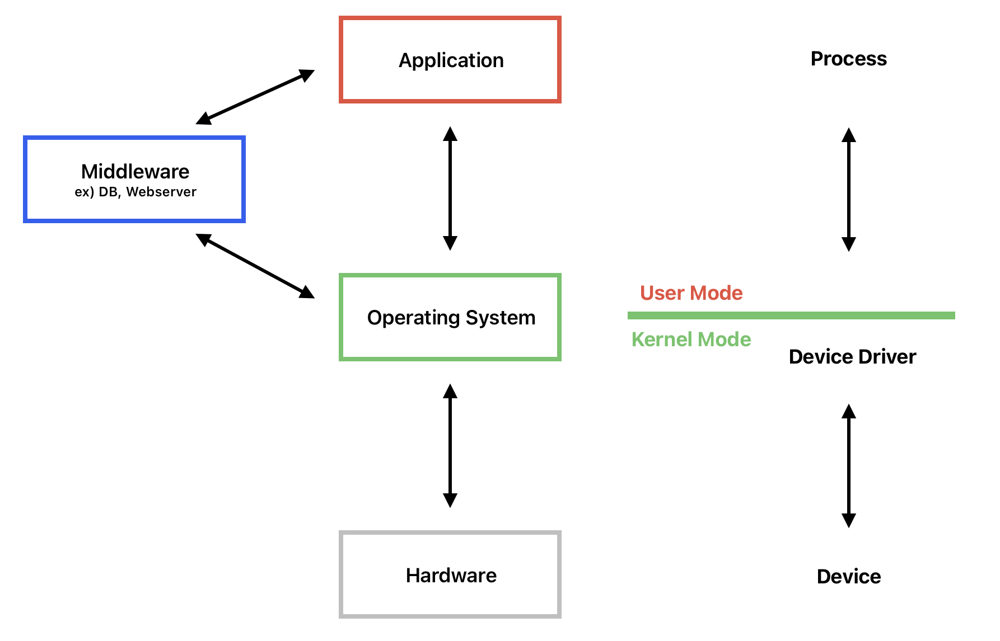

- 운영체제는 <ins><strong>사용자 애플리케이션이 시스템을 손상시키는 것을 방지하기 위해</strong></ins> 2가지 모드 제공
  - CPU에 있는 Mode bit로 모드를 구분하여 0은 커널모드, 1은 사용자모드로 나뉨

- 유저 모드: 사용자 애플리케이션 코드 실행, 사용자가 접근할 수 있는 영역에 제한 있음, 하드웨어 접근 안됨 (시스템 콜 필요, 사용자 애플리케이션이 유저 모드로 동작)

- 커널 모드: 파일 읽기/쓰기/출력 (디스크 드라이버가 커널 모드로 동작)

 

1-10. 왜 유저모드와 커널모드를 구분해야 하나요?  (출처 : vsfe)

 

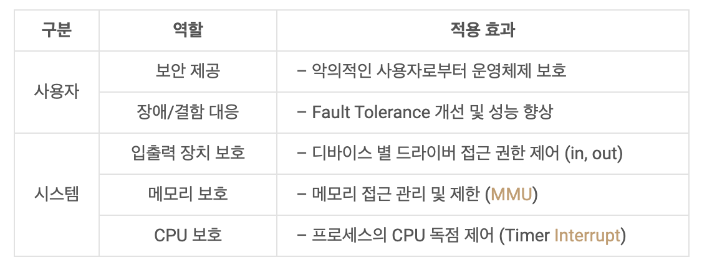

- 간단하게 말하면, <ins><strong>사용자 모드와 커널 모드의 구분이 없다면, 응용 프로그램이 시스템에 접근할 수 있는 길이 열리기 때문</strong></ins>이다. 운영체제의 경우, 시스템에 영향을 끼칠 수 있는 몇몇 명령어를 <ins><strong>특권 명령 (Privileged Instruction)</strong></ins> 으로 지정함으로써 운영체제 자신을 보호한다. 응용 소프트웨어가 해당 명령을 시행하려고 접근하게 된다면, OS 측에서 잘못된 접근으로 인식하여 트랩을 걸어 프로그램을 중단 시켜버릴 수 있다.

- 입출력 장치 보호 : 사용자 애플리케이션에서 입출력을 사용하려면 운영체제를 통해서 수행하도록 하여 프로그램이 동시에 입출력을 사용하려고 하면 운영체제 내부에서 순서를 정하여 혼선을 막아줄 수 있음

- 메모리 보호 : 애플리케이션이 자신의 메모리 영역이 아닌 운영체제나 다른 애플리케이션의 메모리 영역에 침범하려하면 매우 위험하다. 따라서, address bus 중간에 설치된 하드웨어 칩인 MMU(Memory Management Unit)를 도입하여 두 개의 레지스터를 통해 해당 프로그램의 주소 범위를 저장하고 주소 범위에 해당하는 주소 값일 때만 bus를 통과하게 하여 메모리 보호

- CPU 보호 : 하나의 프로그램이 CPU를 독점하게 되면 다른 프로그램은 수행되지 못하니까 독점 방지해야한다. 대표적인 예시로 무한 반복이 있는데, 이를 해결하기 위해 Timer를 두어 일정 시간이 지나면 타이머 인터럽트를 발생시키고, 인터럽트가 발생하면 반드시 운영체제 내의 ISR로 이동하므로, 해당 ISR에서 각 프로그램의 CPU 점유 시간을 측정하여 적절히 분배되도록 조정하도록 함

 

1-11. 시스템 콜이, 운영체제에서 어떤 과정으로 실행되는지 설명해 주세요. (출처 : vsfe)

 

1. 응용 프로그램이 시스템 콜을 통하여 원하는 서비스 요청
2. trap mode bit = 0 이용하여 CPU 모드가 유저 모드(1)에서 커널 모드(0)로 변경
3. 시스템 콜 수행
4. 끝나면 return mode bit = 1 이용하여 커널 모드(0)에서 유저 모드(1)로 변경되면서 응용 프로그램으로 결과 반환

 

조금 더 쉬운 버전으로 설명하면 아래와 같다.

1. 유저모드에서 프로세스 실행
2. 프로세스가 시스템 콜 호출
3. 커널모드로 전환
4. 작업 수행
5. 작업 완료 이후 유저모드로 다시 전환

 

1-12. 시스템 콜의 세부적인 동작 과정에 대하여 설명해주세요. 예를 들어, `fork()` 를 사용했다고 가정 (출처 : vsfe 블로그 + 창작 문제)

 

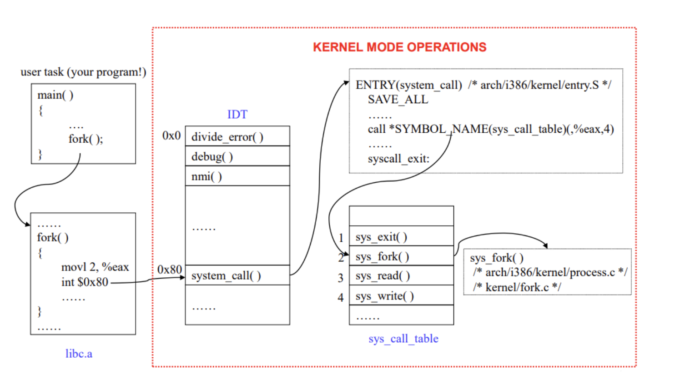

1. 응용 프로그램에서 `fork()` 시스템 콜 호출

2. C 라이브러리인 libc.a 같은 곳에서 `fork()` 시스템 콜 고유 번호인 2 저장하고 `0x80` 인터럽트 발생시킴

3. 커널은 IDT (Interrupt Descripter Table, 인터럽트의 종류를 판단하기 위해 사용함) 에서 `0x80` 주소에 있는 `system_call()` 찾음

4. `system_call()` 함수에서는 호출된 시스템 콜 번호와 모든 레지스터를 스택에 저장하고 올바른 시스템콜 번호인지 검사후 `sys_calll_table[시스템_콜_테이블]`에서 시스템 콜 번호에 해당하는 함수를 호출

5. 함수가 종료 되면 entry.S에 정의되어 있는 ret_from_sys_call()함수에 의해 사용자 프로세서로 돌아감

 

1-13. 시스템 콜의 유형에 대해 설명해 주세요. (출처 : vsfe)

 

- 대표적으로 `파일 관리` (open, read, write, close), `프로세스 제어` (fork, wait, exit), `장치 관리` (read, write), `정보 유지` (getpid, alarm, sleep), `통신` (pipe), `보호` (chmod, umask)가 있음

 

1-14. 서로 다른 시스템 콜을 어떻게 구분할 수 있을까요? (출처 : vsfe)

 

- 커널은 내부적으로 각각의 시스템 콜을 구분하기 위해 각각 시스템 콜은 고유한 이름, 매개변수, 시스템 콜 번호, 번호에 해당하는 서비스 루틴 등을 가지고 있음
    - 시스템 콜 이름 : open, read, write와 같이 다른 이름
    - 매개변수 : 매개변수의 종류와 값에 따라 시스템 콜이 어떤 동작 수행하는지 구분 가능
        - 예를 들어, open 이면 파일 경로와 옵션을 매개변수로 전달
        - 예를 들어, fork 이면 새로운 프로세스를 생성하는데 필요한 정보를 매개변수로 전달

- 커널은 요청받은 시스템 콜에 대응하는 기능번호를 확인 -> 그에 맞는 서비스 루틴 호출

 

1-15. 그렇다면, 이때 매개변수를 어떤 방식으로 전달할 수 있을까요? (창작 문제)

- 매개변수를 레지스터에 담기
    - 매개변수가 레지스터의 수보다 많은 경우가 있으므로 적절한 방법 X

- **매개변수를 연속적 (블록) 또는 불연속적 (테이블 사용)으로 메모리에 담은 뒤, 주소를 레지스터에 담기**
    - 크기에 제한이 없으므로, 보통 이 방법을 많이 사용

- 스택에 매개변수를 담기
    - 스택에 담긴 모든 데이터를 레지스터에 옮기고 스택에 원소를 담아야 하기 때문에, 결과적으로 첫 번째 방법과 큰 차이가 없음

 

## 2번 질의

2-1. 인터럽트가 무엇인지 설명해주세요. (출처 : vsfe)

 

- 인터런트는 <ins><strong>현재 실행 중인 작업을 즉시 중단하고 발생한 상황에 대한 우선 처리가 필요함을 CPU에 알리는 것</strong></ins>이다. 

- 필요 이유 : 대부분의 컴퓨터는 한 개의 CPU를 사용하므로 한 순간에는 하나의 일 밖에 처리할 수 없기 때문에 어떤 일을 처리하는 도중에 우선 순위가 급한 일을 처리할 필요가 있을 때 대처할 수 있는 방안이 필요

- 인터럽트에는 하드웨어 인터럽트와 소프트웨어 인터럽트가 있고, 소프트웨어 인터럽트는 다시 비자발적인 exception과 자발적인 system call로 나뉜다.

- Interrupt (하드웨어 인터럽트, 비동기적 인터럽트) : 좁은 의미의 인터럽트로써, 하드웨어가 발생시킨 인터럽트
 - Trap (소프트웨어 인터럽트)
   - Exception (동기적 인터럽트, 비자발적) : 다른 메모리에 접근, 오버플로, 언더플로, 입출력 장치에 의한 인터럽트, 0으로 나눗셈 한 경우 등등
   - System call (자발적) : 프로그램이 커널 함수를 호출하는 경우

 

> - 외부 인터럽트와 로 보는 시선도 있음 (출처 : [vsfe](https://velog.io/@klm03025/%EC%9A%B4%EC%98%81%EC%B2%B4%EC%A0%9C-%EC%9D%B8%ED%84%B0%EB%9F%BD%ED%8A%B8%EC%8B%9C%EC%8A%A4%ED%85%9C-%EC%BD%9C))
>   - 내부 인터럽터를 트랩이라고 한다고 함 
>     
> - <ins><strong>외부 인터럽트</strong></ins>
>   - 전원 이상 인터럽트(Power fail interrupt) : 정전이 발생하거나, 파워에 이상이 발생했을 때 동작
>   - 기계 착오 인터럽트(Machine check interrupt) : CPU에 문제가 발생할 때 동작
>   - 외부 신호 인터럽트(External interrupt)
>       - 타이머에 의한 인터럽트 : 여러 프로세스가 하나의 CPU를 공유하기 때문에, 다양한 방법으로 CPU는 어떤 프로세스를 다룰지 선택할 수 있다. (우리는 이것을 CPU 스케쥴링이라고 부름) 여기서, Time Sharing 방식의 Preemptive 스케쥴링을 선택할 수 있는데, 여기서 자원이 할당된 시간이 다 끝난 경우 해당 프로세스를 중단해야 한다. (Context Switching)
>       - 키보드로 인터럽트 키를 누른 경우 : ex. Control + Alt + Delete
>       - 외부장치로부터 인터럽트 요청이 있는 경우
>   - 입출력 인터럽트(I/O Interrupt)
>       - 입출력장치가 데이터 전송을 요구하거나 전송이 끝나 다음 동작이 수행되어야 할 경우
>       - 입출력 데이터에 이상이 있는 경우
>   
> - <ins><strong>내부 인터럽트</strong></ins>
>   - 잘못된 명령이나 잘못된 데이터를 사용할때 발생한다. 다른 말로 프로그램 검사 인터럽트 (Program check interrupt) 라고 부르는데, 크게 다음과 같은 것들이 있다.
>   - Division by zero
>   - Overflow/Underflow
>   - 기타 프로그램 Exception

 

2-2. 인터럽트는 어떻게 처리하나요? (출처 : vsfe)

 

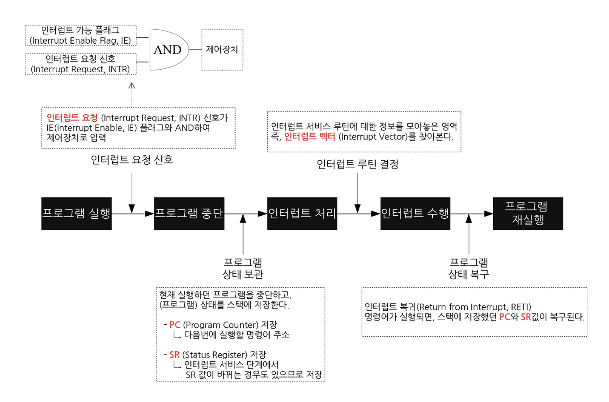

1. <ins><strong>하드웨어에서 트리거 이벤트 발생 시, 인터럽트 요청 신호를 CPU의 인터럽트 요청 라인이라는 선으로 보냄</strong></ins>

2. <ins><strong>CPU가 인터럽트 요청 라인을 통해 인터럽트를 감지하면 인터럽트 핸들링 시작</strong></ins>
   - 인터럽트 핸들링 (interrupt handling) : 인터럽트가 발생한 경우 처리해야 할 일의 절차
   - 인터럽트 핸들러는 디바이스에 맞게 다양하게 존재. ex) 키보드 인터럽트 핸들러, 터치 인터럽트 핸들러 등등

3. <ins><strong>현재 실행 중이던 프로그램은 중단하고, 상태를 프로세스 메모리 구조에서의 스택에 저장</strong></ins>
   - PCB(Process Control Block)에는 수행 중이던 PC, 메모리 주소, 레지스터 값, 하드웨어 상태 등이 저장됨
   - PC(Program Counter) : 다음에 실행할 명령어의 주소
   - Context : 프로세스와 관련된 정보의 집합
     - CPU register context => in CPU(Processor)
     - Code & data, Stack, PCB => in Memory

4. <ins><strong>인터럽트 벡터에서 인터럽트 서비스 루틴의 주소 찾음</strong></ins>
   - 인터럽트 벡터 (interrupt vector) : 인터럽트를 유발한 장치를 위한 인터럽트 서비스 루틴의 주소 배열

5. <ins><strong>인터럽트 서비스 루틴의 주소로 이동해서 인터럽트 서비스 루틴 수행</strong></ins>

6. <ins><strong>인터럽트 서비스 완료 이후, 원래 실행 중이던 프로그램으로 복구</strong></ins>
   - 이때, 이전에 실행 중이던 프로그램이 실행될 수도 있지만, 준비 큐의 가장 앞에 있던 프로그램이 다시 올라올 수도 있음
   - PCB에 저장된 context를 복구하면서 올라옴

 

2-3. Polling 방식에 대해 설명해 주세요. (출처 : vsfe)

 

- 인터럽트 방식과 비교되는 방식으로, CPU가 직접 입출력장치에 데이터를 가져오거나 내보내는 방식

- <ins><strong>Polling</strong></ins>
  - CPU가 직접 입출력장치에 데이터를 가져오거나 내보내는 방식
  - CPU가 입출력장치의 상태를 주기적으로 계속 검사하여 어떠한 조건을 만족하면 데이터 처리
  - 반복적인 모니터링 작업으로 인해 작업의 효율이 떨어지기 때문에 오늘날의 다양한 프로세스를 처리하기에는 적합하지 않음

- <ins><strong>Interrupt</strong></ins>
  - CPU가 아닌 주변의 입출력장치(입출력 관리자)가 대신 입출력 해주는 방식
    - 때문에 데이터의 입출력이 이루어지는 동안 CPU는 다른 작업을 할 수 있음
  - CPU의 작업과 저장장치의 데이터 이동을 독립적으로 운영할 수 있어 시스템의 효율을 높임
  - 현대 운영체제는 인터럽트 기반의 시스템을 사용

 

2-4. 동시에 두 개 이상의 인터럽트가 발생하면, 어떻게 처리해야 하나요? (출처 : vsfe)

 

- 최신 운영체제에서는 인터럽트가 비동기 이벤트를 처리하기 위해 자주 사용되기에, 두 개 이상의 인터럽트 발생에 대한 처리가 필요했음
- 인터럽트 마스킹, 인터럽트 우선순위 부여와 같은 방식으로 처리 가능

- 

자세한 설명
<ul><li>원칙적으로는 데이터의 일관성을 유지하기 위하여 인터럽트 처리 중에 다른 인터럽트가 발생하는 것을 허용하지 않음 → 그러나 현대 운영체제에서는 더욱 정교한 기능이 필요해졌음</li><ul><li><ins><strong>인터럽트 처리 연기</strong></ins> 가능해야함</li><li>적절한 인터럽트 핸들러로 <ins><strong></strong></ins> 할 방법 필요</li><li>우선순위가 높은 인터럽트와 낮은 인터럽트를 구분하고 적절한 긴급도로 대응할 수 있도록 <ins><strong>다단계 인트럽트</strong></ins>가 필요</li></ul> <li><ins><strong>인터럽트 마스킹</strong></ins></li> 
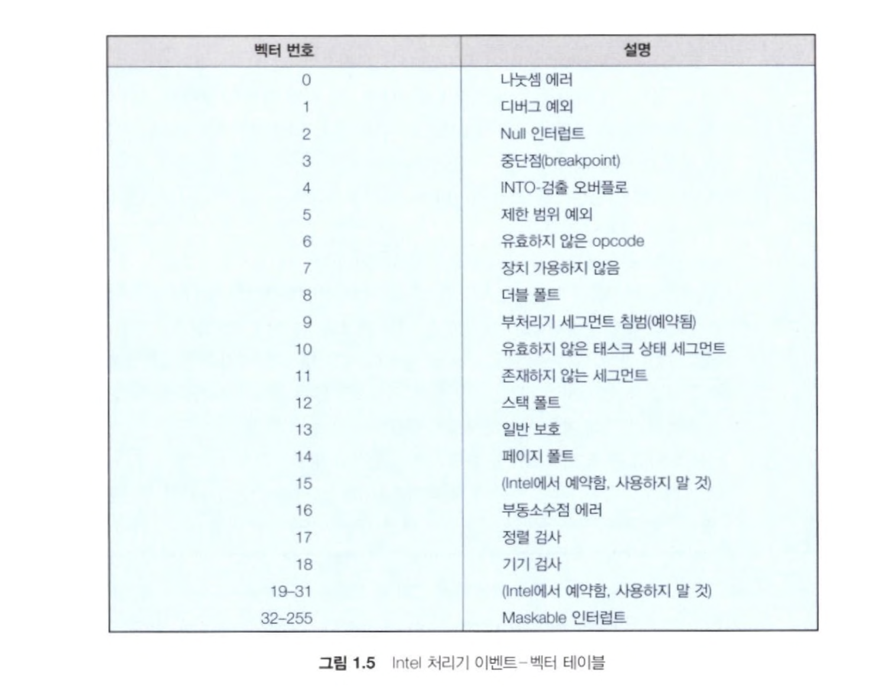
<ul><li>대부분 CPU에는 인터럽트 요청 라인(interrupt request line)이 2개 있음</li><li>마스크 불가능 인터럽트(nonmaskable interrupt) : 복구할 수 없는 메모리 오류와 같은 이벤트를 위한 것으로, 미리 예약된 것</li><li>마스킹 가능(maskable) : 인터럽트 되어서는 안되는 중요한 명령 시퀀스를 실행하기 이전에 CPU에 의해 꺼질 수 있음. 보통 장치 컨트롤러가 서비스를 요청하기 위해 사용</li><li>위 그림의 경우 0~31까지 마스킹 불가능, 32~255까지 마스킹 가능</li></ul> <li><ins><strong>인터럽트 체인</strong></ins></li><ul><li>벡터 방식 인터럽트의 목적은 서비스가 필요한 장치를 결정하기 위해 하나의 인터럽트 핸들러가 가능한 모든 인터럽트 소스를 검색할 필요를 줄이는 것</li><li>그러나, 실제 컴퓨터에는 인터럽트 벡터의 주소 개수보다 많은 장치가 있음</li><li>인터럽트 체인을 통해 인터럽트 벡터의 각 원소는 인터럽트 핸들러 리스트의 헤드를 가리킴</li><li>인터럽트 발생 시, 요청을 처리할 수 있는 핸들러가 발견될 때까지 해당하는 리스트의 핸들러가 호출됨</li><li>이러한 방법을 통해, 큰 크기의 인터럽트 테이블의 오버헤드와 하나의 인터럽트 핸들러로 디스패치 하는 것의 비효율성을 줄였음 → 인터럽트 체인으로 효율적인 디스패치!</li> </ul><li><ins><strong>인터럽트 우선순위 레벨</strong></ins></li><ul><li>CPU는 모든 인터럽트를 마스킹하지 않고도 우선순위가 낮은 인터럽트 처리를 연기할 수 있고, 우선순위가 높은 인터럽트가 우선순위가 낮은 인터럽트의 실행을 선점할 수 있음</li></ul></ul>

 

## 3번 질의

3-1. 프로세스가 무엇인가요? (출처 : vsfe)

 

- <ins><strong>프로그램이 메모리에 올라가서 실행 중인 상태가 된 것</strong></ins>

- 각 프로세스는 고유한 메모리 공간, 리소스 및 시스템 관련 정보를 갖고 있으며, 독립적인 실행 단위
  - 메모리 구조 : Code 영역, Data 영역, Heap 영역, Stack 영역으로 구성 (4-1 문제 참조, 프로세스 주소공간)
  - 스케줄링의 대상이 되는 작업/task와 같은 의미
  - 운영체제가 자원을 할당하는 최소 단위
  - 최소 하나의 스레드를 가지며, 스레드 단위로 스케줄링

- Java의 경우 JVM을 보통의 프로세스처럼 실행시킴
  - JVM은 Java 프로그램을 virtual machine 안에서 실행시킴

 

3-2. 프로세스의 상태 다이어그램에 관하여 설명해주세요. (창작 문제)

 

- 프로세스는 실행되면서 상태가 변하는데, 이를 다이어그램으로 나타낸 것

    
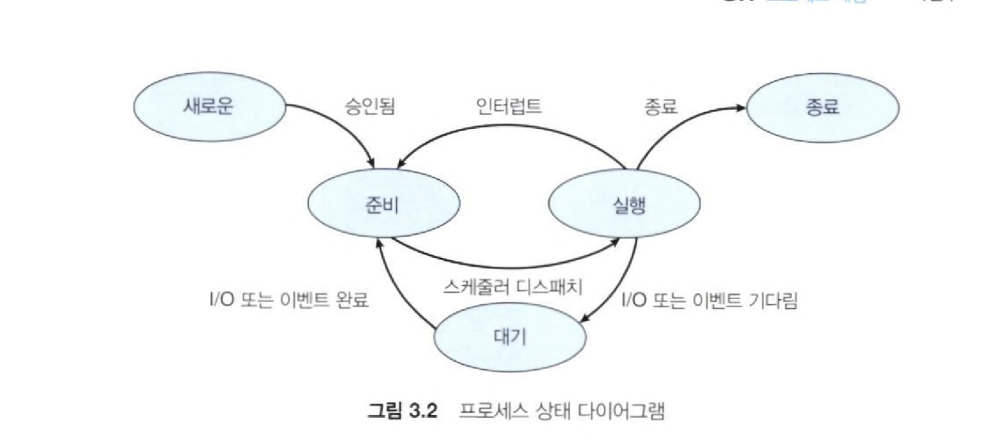

    - `new(새로운)` : 프로세스 생성 중
    - `ready(준비)` : 프로세스가 처리기에 할당되기를 대기
    - `running(실행)` : 명령어들이 실행되고 있음
    - `waiting(대기)` : 프로세스가 어떤 이벤트가 발생하기를 대기
      - 이때의 이벤트는 입출력 완료 또는 신호의 수신 같은 것
    - `terminated(종료)` : 프로세스의 실행 종료됨

 

- 상세한 과정
  - `새로운(new) -> 준비(ready)` : 생성 완료되면 OS 커널에 존재하는 ready queue에 올라감
  - `준비(ready) -> 실행(running)` : ready queue에 있는 프로세스들을 OS가 프로세스 스케쥴링 알고리즘에 의해 running 상태로 가야할 프로세스를 CPU로 할당하면 프로세스가 running 상태가 됨
  - `실행(running) -> 준비(ready)` : 현재 running 상태에 있는 프로세스 A보다 ready queue에서 대기하고 있는 프로세스 B가 우선순위가 높을 때, preemptive schedule(선점형)인 경우 프로세스 A는 ready상태로 오게되고, 프로세스 B는 running 상태로 가서 CPU 할당 받음
  - `실행(running) -> 대기(waiting)` : 현재 running 상태에 있는 프로세스 A에서 입출력 이벤트가 발생했을 때 프로세스 A가 waiting 상태가 됨
  - `대기(waiting) -> 준비(ready)` : 입출력 이벤트가 종료된 프로세스는 다시 ready 상태가 됨
  - `실행(running) -> 종료(terminated)` : 프로세스 종료 시
  - `준비(ready), 대기(waiting)` 상태에는 여러 프로세스 존재 가능
  - 만약, 싱글코어 CPU라면 `실행(running)` 상태에는 프로세스가 단 1개
    - 하나의 작업을 매우 짧은 시간동안 처리 한 후 다른 작업으로 넘어가는 것을 반복하기 때문에 우리가 겉으로 보기엔 여러 작업들이 동시에 실행되는 것 처럼 보인다. (동시성: Concurrency)

 

3-3. 프로그램과 프로세스, 스레드의 차이에 대해 설명해 주세요. (출처 : vsfe)

 

- <ins><strong>프로그램 (program)</strong></ins>
    - 사용자가 원하는 일을 처리할 수 있도록 프로그래밍 언어를 사용해 올바른 수행절차를 표현해 놓은 명령어들의 집합
    - 컴퓨터에서 어떤 작업을 위해 실행할 수 있는 정적인 상태의 파일
    - 메모리에 적재되기 전 상태인 파일

- <ins><strong>프로세스 (process)</strong></ins>
    - 운영체제가 메모리 등의 필요한 자원을 할당해준 실행 중인 프로그램
    - <ins>OS로부터 자원을 할당받는 단위</ins>
    - 프로그램이 메모리에 올라가서 실행 중인 상태가 된 것

- <ins><strong>스레드 (thread)</strong></ins>
    - 프로세스 내에서의 작은 실행 단위
    - <ins>작업을 수행하는 단위</ins>
    - 하나의 프로세스 내에 여러 스레드 존재
    - 독립적으로 스레드가 가지는 것
      - 스레드 실행 환경 정보, 지역 변수(스택에 있는거), stack
    - 스레드가 공유하는 것 (프로세스의 정보)
      - code 영역, data 영역 (전역 변수), heap 영역

 

3-4. 멀티 프로세스와 멀티 스레드가 무엇인지와 장단점에 대해 설명해 주세요. (출처 : vsfe 블로그)

 

- <ins><strong>멀티 프로세스 (Multi Process)</strong></ins>
    - 하나의 프로그램을 여러 개의 프로세스로 나눠서 사용하는 것
    - 장점
      - 각각의 프로세스는 OS에게 자원을 할당 받으므로, 서로의 메모리를 침범하지 않음
      - 각각의 프로세스에 문제가 생겨도 다른 프로세스에는 영향을 미치지 않는다. (즉, 안정적이다.)
    - 단점
      - 각각의 프로세스는 서로 독립된 메모리 공간을 할당 받았기 때문에, 서로 메모리를 공유하기 위해선 IPC (Inter Process Communication) 기법을 사용해 공유해야 하는데, 이 과정에서 추가적인 설비가 필요하기도 하고 다소 비효율적
      - Context Switching이 발생하면 시간이 오래 걸리게 됨

- <ins><strong>멀티 스레드 (Multi Thread)</strong></ins>
  - 하나의 프로세스가 여러 개의 스레드를 갖고, 각각의 스레드가 서로 다른 작업들을 수행하는 것
  - 장점
    - 프로세스를 추가적으로 생성하지 않기 때문에, 비용 측면에서 매우 효율적
    - 스레드는 동일한 프로세스 내 자원을 공유하기 때문에, 데이터를 공유하는 데 있어 프로세스에 비해 효율적
  - 단점
    - 공통된 자원을 공유하기 때문에, 설계가 다소 어려움
    - 하나의 스레드에 문제가 생기면 프로세스 전체에 문제가 발생

 

3-5. 그렇다면, 대부분의 프로그램은 멀티 프로세스과 멀티 스레딩 중 어떤 것을 선택하나요? 이유와 함께 말해주세요. (출처 : vsfe 블로그)

 

- <ins><strong>대부분의 프로그램에서 멀티 스레딩 선택</strong></ins>
  - 멀티 프로세스의 경우, 멀티 프로세스를 시작하기 위해 여러개의 프로세스를 실행해야 하는데, 이 과정에서 많은 비용이 소모
  - 각각의 프로세스가 Context Switching 되는 과정에서도 많은 비용이 소모됨
    - Process Context Switching은 무겁지만, Thread Context Switching은 이에 비해 비교적 빠르니까
  - IPC보다 스레드의 자원 공유 방식이 더 빠름

 

3-6. 크롬의 경우에는 멀티 프로세스 구조를 택하는데 왜 그렇다고 생각하시나요? (출처 : vsfe 블로그)

 

- <ins><strong>각각의 탭이나 확장 중 하나에 문제가 생겨도 전체 브라우저에 문제가 가지 않도록 각각을 서로 다른 프로세스로 분리시켜 관리하는 것</strong></ins>

 

3-7. PCB가 무엇인가요? (출처 : vsfe)

 

- <ins><strong>PCB(Process Control Block, 프로세스 제어 블록) : 운영체제에서 프로세스를 제어하기 위해 프로세스와 관련된 정보를 저장해놓은 데이터 구조</strong></ins>
    - 프로세스의 상태 정보를 저장하는 구조체
    - 프로세스 상태 관리와 문맥 교환(Context switching)을 위해 필요
    - PCB는 프로세스 생성 시에 만들어지며, 주기억장치(ROM, RAM)에 유지됨

- <ins><strong>PCB에 저장되는 정보</strong></ins>
  - Process ID (PID): 프로세스의 고유 번호
  - Process state (상태): 준비/대기/실행/종료 등의 상태
  - Program counter (PC): 프로세스 내에서 실행될 다음 명령의 주소
  - CPU 레지스터 및 일반 레지스터: 프로세스를 실행하기 위해 저장해야 할 레지스터에 대한 정보
  - CPU 스케줄링 정보: 우선순위, 최종 실행시간, CPU 점유시간 등
  - 메모리 관리 정보 : 프로세스의 주소 공간
  - 입출력 상태 정보 : 프로세스에 할당된 입출력 장치 목록, 열린 파일 목록 등
  - 프로세스 계정 정보 : 페이지 테이블, 스케줄링 큐 포인터, 소유자, 부모 등
  - Stack Pointer : 부모 프로세스에 대한 포인터, 자식 프로세스에 대한 포인터, 프로세스가 위치한 메모리 주소에 대한 포인터, 할당된 자원에 대한 포인터 정보. 함수 호출할 때 스택의 가장 위쪽 데이터의 위치를 가리킴

 

3-8. 그렇다면, 스레드는 PCB를 갖고 있을까요? (출처 : vsfe)

 

- <ins><strong>PCB와 유사한 데이터 구조를 가진 TCB(Thread Control Block)이 있음</strong></ins>
    - thread와 관련된 data만 있으면 되기 때문에 PCB보다 적은 데이터를 가짐
    - thread가 생성될 때마다 생성되고, thread가 종료되면 해제. 보통 Linked list로 구현

    
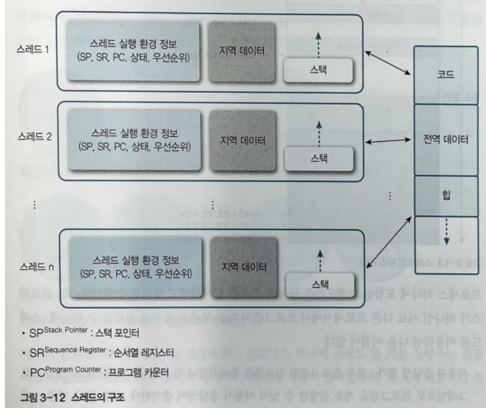
 

    
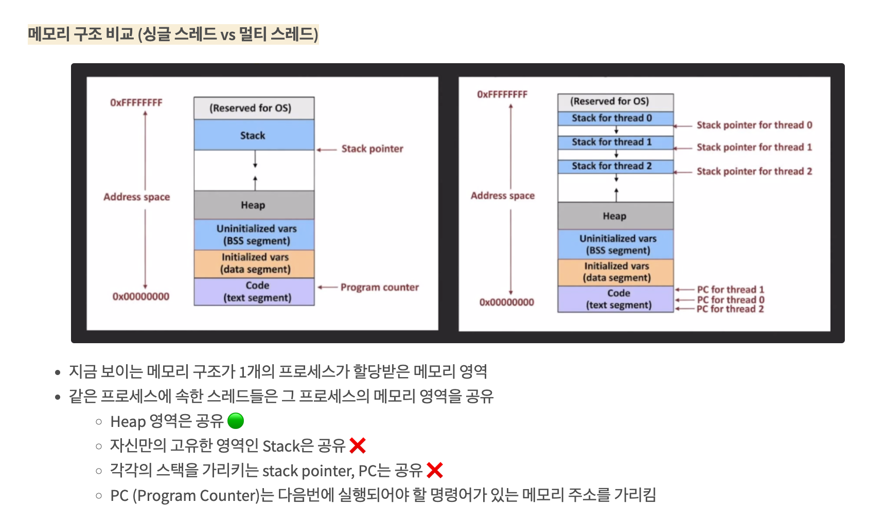
 

    
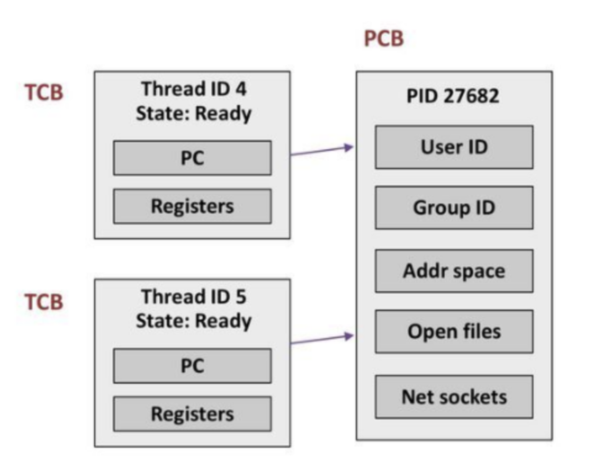
 

    - Thread ID (TID) : 스레드의 고유 번호
    - Thread state (상태)
      - 순서열 레지스터 : 명령의 진행 상태 저장
      - 스택 포인터 : 스레드가 함수 호출할 때 저장하는 곳이 스택이라서 실행흐름을 저장하는데 필요
      - Program counter : 스레드 내에서 실행될 다음 명령의 주소
    - 스케쥴링 정보
    - PCB에 대한 포인터 : 해당 스레드를 포함하는 프로세스

 

3-9. 리눅스에서, 프로세스와 스레드는 각각 어떻게 생성될까요? (출처 : vsfe)

 

- <ins><strong>프로세스 생성</strong></ins>
  - 리눅스는 부팅될 때 부트로더에서 커널을 작동
    - 부트로더 : OS가 시동되기 이전에 미리 실행되면서 커널이 올바르게 시동되기 위해 필요한 모든 관련 작업을 마무리하고. 최종적으로 운영 체제를 시동시키기 위한 목적을 가진 프로그램
  - 커널은 <ins><strong>init 프로세스</strong></ins>를 실행
    - init 프로세스 : 모든 프로세스의 부모 프로세스
      - 데몬 프로세스: 서비스의 요청에 대해 응답하기 위해 오랫동안 실행중인 백그라운드 프로세스
      - 시스템이 종료될때까지 계속 running 상태
      - 부모가 죽은 모든 프로세스를 입양
      - 이 프로세스로부터 모든 시스템/사용자 프로세스가 파생
  - <ins><strong>부모 프로세스에서 자식 프로세스를 만들때: `fork()`와 `exec()` 실행</strong></ins>
    - `fork()` : 부모 프로세스와 동일한 정보 (PCB)를 갖는 자식 프로세스를 만드는 시스템 콜
    - `exec()` : 새로운 정보로 `exec()`를 호출한 부모 프로세스를 덮어버리는 시스템 콜
    - 대부분 `fork()` 후 `exec()` 사용

 

- <ins><strong>스레드 생성</strong></ins>
  - <ins><strong>`pthread_create()` 시스템 호출 함수 사용</strong></ins>
    - 같은 프로그램 내에서 작은 작업을 처리하는데 `fork()`를 통해 부모와 동일한 자식 프로세스를 만드는 것은 오버헤드가 큼 (1-12 문제 참조) → 스레드 필요
    - 스레드는 부모 프로세스의 PCB 정보를 모두 가짐 (대부분이 포인터로 이루어짐)
    - 부모 프로세스와 같은 정보에 접근할 수 있지만 굉장히 가볍고 해당 정보로 필요한 작업만 처리 가능

 

3-10. 자식 프로세스가 상태를 알리지 않고 죽거나, 부모 프로세스가 먼저 죽게 되면 어떻게 처리하나요? (출처 : vsfe)

 

- <ins><strong>좀비 프로세스 (Zombie Process)</strong></ins>
  - 자식 프로세스가 부모 프로세스보다 먼저 죽은 경우
  - 자식 프로세스가 부모 프로세스보다 먼저 죽어서 부모 프로세스가 종료 상태를 회수할 경우를 위해 <ins>커널이 자식 프로세스의 최소한의 정보 (PID, 종료 상태)를 남겨둠</ins>
  - <ins>부모 프로세스가 wait 함수를 호출하여 이 상태를 회수 → 모든 정보 제거 → 자식 프로세스 완전히 소멸</ins>
  - 부모 프로세스가 wait 함수를 호출하지 않아 정보가 메모리에 남아있는 경우
  - 좀비 프로세스가 쌓이면 리소스의 유출을 야기할 수도 있음 → 처리 필요

- <ins><strong>고아 프로세스 (Orphan Process)</strong></ins>
  - 부모 프로세스가 자식 프로세스보다 먼저 죽은 경우
  - 운영체제는 고아 프로세스를 허용하지 않음 → 부모 프로세스가 먼저 종료되면 <ins>자식 프로세스의 새로운 부모 프로세스로 init이 설정됨</ins>
  - <ins>init 프로세스는 자식 프로세스가 종료될 때까지 기다린 후 wait 함수 호출 → 고아 프로세스의 종료 상태를 회수하여 좀비 프로세스가 되는 것을 방지</ins>
  - 성능 저하의 원인
    - 고아 프로세스는 프로세스 자신이 시스템의 자원을 낭비할 수 있음
    - 시스템이 프로세스가 종료될 때까지 추적해야 함

 

3-11. 리눅스에서, 데몬프로세스에 대해 설명해 주세요. (출처 : vsfe)

 

- <ins><strong>데몬 프로세스 (Daemon Process)</strong></ins>
  - 서비스의 요청에 대해 응답하기 위해 오랫동안 실행중인 <ins>백그라운드 프로세스</ins>
    - 부팅시 자동으로 켜짐
    - 백그라운드 프로세스 중 부모프로세스(PPID)가 1이거나 다른 데몬프로세스인 프로세스
    - 대표적인 데몬 프로세스: 웹서버
      - 웹서버 데몬 프로세스는 서버에서 터미널을 통해 실행될 수 있지만 tty/pts 등 터미널을 통해 사용자와 대화할 필요 없음 → 백그라운드 프로세스로 만들어짐   

    > 포그라운드 프로세스: 표준입출력장치 (터미널/키보드)를 통해 대화   
    > 백그라운드 프로세스: 입력장치에 대해 터미널과의 관계를 끊은 모드 프로세스 (사용자에게 키보드를 통해 입력받지 않고 스스로 동작하는 프로세스)

 

3-12. 리눅스는 프로세스가 일종의 트리를 형성하고 있습니다. 이 트리의 루트 노드에 위치하는 프로세스에 대해 설명해 주세요. (출처 : vsfe)

 

- <ins><strong>init 프로세스</strong></ins>
  - 모든 프로세스의 부모 프로세스 (트리의 루트 노드에 위치)
  - 리눅스가 부팅될 때 부트로더에서 커널을 작동시키는데, 이때 커널이 init 프로세스 실행시킴
  - 시스템이 종료될때까지 계속 running 상태
  - 시스템의 기본적인 초기화 및 관리를 담당
    - ex) 시스템 서비스의 시작 및 중지, 사용자 로그인 및 로그아웃 등의 작업을 처리
  - 부모가 죽은 모든 프로세스를 입양
  - 이 프로세스로부터 모든 시스템/사용자 프로세스가 파생

    > 부트로더 : OS가 시동되기 이전에 미리 실행되면서 커널이 올바르게 시동되기 위해 필요한 모든 관련 작업을 마무리하고. 최종적으로 운영 체제를 시동시키기 위한 목적을 가진 프로그램

 

## 4번 질의

4-1. 프로세스 주소공간에 대해 설명해 주세요. (출처 : vsfe)

 

- <ins><strong>프로세스 주소공간 : 프로세스가 메모리를 할당 받으면, 자신만의 방법으로 메모리를 관리하기 위해 이 공간들을 어떤 구조로 표현한 것</strong></ins>
  - 메모리는 한정되어 있기 때문에, 프로세스는 다양한 방법으로 메모리를 절약하려고 시도

    
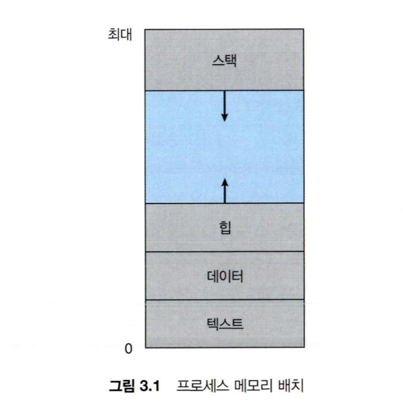

  - Stack 영역
    - 함수의 호출과 관계되는 지역 변수와 매개변수가 저장되는 영역
    - Stack 영역의 값은 함수의 호출과 함께 할당되며, 함수의 호출이 완료되면 소멸
    - 메모리의 높은 주소에서 낮은 주소의 방향으로 할당된다.
    - 재귀 함수가 너무 깊게 호출되거나 함수가 지역변수를 너무 많이 가지고 있어 stack 영역을 초과하면 stack overflow 에러가 발생

  - Heap 영역
    - 런타임에 크기가 결정되는 영역
    - 사용자에 의해 공간이 동적으로 할당 및 해제
    - 주로 참조형 데이터 (ex. 클래스) 등의 데이터가 할당
    - 메모리의 낮은 주소에서 높은 주소의 방향으로 할당된다.

  - Data 영역
    - 전역 변수나 Static 변수 등 프로그램이 사용할 수 있는 데이터를 저장하는 영역
    - 어떤 프로그램에 전역/static 변수를 참조하는 코드가 존재한다면, 이 프로그램은 컴파일 된 후에 data 영역을 참조하게 됨
    - 프로그램의 시작과 함께 할당되며, 프로그램이 종료되면 소멸
    - 단, 초기화 되지 않은 변수가 존재한다면, 이는 BSS 영역에 저장 (그림에는 없음)

  - Text (Code) 영역
    - 프로그램이 실행될 수 있도록 CPU가 해석 가능한 기계어 코드가 저장되어 있는 공간으로, 프로그램이 수정되면 안 되므로 ReadOnly 상태로 저장 되어있음    

 

4-2. 초기화 하지 않은 변수들은 어디에 저장될까요? (출처 : vsfe)

 

- <ins><strong>BSS (Block Started by Symbel) 영역</strong></ins>
  - 전역으로 선언된 초기화 되지 않은 데이터 영역
  - 컴파일타임에 메모리 할당
  - 크기 고정
  - 초기화되지 않은 변수에 대해 메모리는 할당되지만, 특정 값으로 초기화되지는 않지만 대신, 운영체제에 따라서 기본 값 (보통 0)으로 변수를 초기화해주는 경우도 있음

 

4-3. 일반적인 주소공간 그림처럼, Stack과 Heap의 크기는 매우 크다고 할 수 있을까요? 그렇지 않다면, 그 크기는 언제 결정될까요? (출처 : vsfe)

 

- 실제 객체는 Heap 영역에서 관리되기 때문에 Stack 영역의 크기는 클 필요 X

    
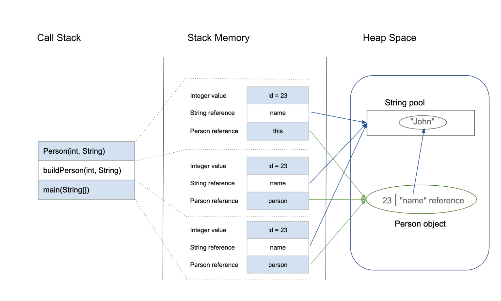

    - Stack 영역에 등장하는 각각의 변수들은 Heap 영역에 위치한 실제 Object의 참조를 갖고 있음
    - 실제 객체는 Heap 영역에서 관리되기 때문에 Stack 영역의 크기는 생각보다 클 필요가 없음

- Stack 영역
  - 생성과 동시에 크기가 결정되고 바뀌지 않음
  - Heap 영역과 상관없이 크기의 제한을 가짐

- Heap 영역
  - 런타임에 크기가 결정되고 동적으로 바뀜
  - 가변적 크기

 

4-4. Stack과 Heap 공간에 대해, 접근 속도가 더 빠른 공간은 어디일까요? (출처 : vsfe)

 

- Stack 공간
  - 할당: 이미 생성되어 있는 스택에 대해 포인터의 위치만 바꿔주는 단순한 CPU instruction

- Heap 공간
  - 할당: 요청된 chunk의 크기, 현재 메모리의 fragmentation 등 다양한 요소를 고려하기 때문에 더 많은 CPU instruction 필요

- Stack 공간이 더 빠름

 

4-5. 다음과 같이 공간을 분할하는 이유가 있을까요? (출처 : vsfe)

 

- <strong><ins>최대한 데이터를 공유하여 메모리 사용량을 줄임</ins></strong>
  - 스택과 힙 공간을 분리하는 건 컴퓨터 메모리 관리 측면에서 이점이 많음
  - 스택은 후입선출 (LIFO) 구조를 이용하여 함수 호출과 지역 변수 관리가 쉽도록 특별히 설계되었기 때문에, 빠른 호출과 반환 작업이 가능
  - 스택의 구조화된 형태와 고정된 할당 패턴은 "메모리 조각화"와 "할당 관련 문제"를 예방하는 데 도움됨
  - 스택은 종종 작고 메모리 액세스 패턴이 예측 가능하기 때문에 캐시에 저장해두고 쓰기 좋음
    - 따라서 스택에 저장된 데이터는 프로세서의 캐시에 더 자주 존재하므로 메모리 액세스 시간이 더 빠름
  - 힙은 한 번의 함수 호출 범위를 넘어서 지속되어야 되는 동적 수명을 갖는 데이터를 관리하기 위해 필요
    - 힙을 사용하면 데이터를 구조화되지 않은 방식으로 할당, 해제할 수 있으므로 다양한 크기의 데이터 구조를 관리하는 데 유연성을 제공

- Code 영역 구분 : 같은 프로그램에서는 모두 같은 내용 → 따로 관리하여 공유
  - 그리고 애초에 기계어만 들어있어서 다른 영역과 너무 다르니 분리하는게 당연

- Stack/Data 영역 구분 : 스택 구조의 특성과 전역변수의 활용성을 위해 나눔

- Data/BSS 영역 구분
  - 초기화되지 않은 변수: 프로그램이 실행될때 영역만 잡아주면 됨
    - 값을 프로그램에 저장하고 있을 필요 없음
  - 초기화된 변수: 영역 & 값 모두 프로그램에 저장하고 있어야 함
  - BSS 영역 변수들이 많아져도 프로그램의 실행코드 사이즈를 늘리지는 않음

 

4-6. 스레드의 주소공간은 어떻게 구성되어 있을까요? (출처 : vsfe)

 

- 스레드는 프로세스 내에서 각각의 스택만 할당받고 나머지 영역은 공유

- Data 영역에 있는 자원(공유 데이터)은 동시에 여러 스레드가 접근할 수 있기에 여기서 발생하는 문제를 해결하기 위해 뒤에서 동기화가 필요함
  - 한 스레드가 공유데이터에 대한 접근을 마칠 때까지
  - 다른 스레드가 공유 데이터를 접근하지 못하도록 제어
  - 자세한 내용은 **[스레드 동기화 링크 참조](https://velog.io/@passion_man/%EC%9A%B4%EC%98%81%EC%B2%B4%EC%A0%9C-6.-%EC%8A%A4%EB%A0%88%EB%93%9C-%EB%8F%99%EA%B8%B0%ED%99%94)**

 

4-7. "스택"영역과 "힙"영역은 정말 자료구조의 스택/힙과 연관이 있는 걸까요? 만약 그렇다면, 각 주소공간의 동작과정과 연계해서 설명해 주세요. (출처 : vsfe)

 

- 자료구조의 스택과 힙 데이터 구조와 관련성이 있는 것 맞음. 추가로, 운영체제에서 뜻하는 stack 과 heap은 특정한 개념을 가리킴

- 자료구조의 스택 : 후입선출 (LIFO) 원칙을 따르는 선형 데이터 구조
  - 스택에서의 주요 작업은 push 와 pop
  - 운영체제에서 스택 메모리 영역은 이 데이터 구조를 기반으로 이름이 지어짐

- 운영체제의 스택 : 함수 호출과 지역 변수에 사용되는 메모리 영역
  - 이 영역은 함수 호출 컨텍스트와 지역 변수를 관리하는 데 사용되는데, 함수가 호출되면 새로운 스택 프레임 (또는 활성화 레코드라고도 함)이 스택에 푸시됨
    - 이 프레임에는 함수의 매개변수, 지역 변수 및 반환 주소에 관한 정보가 포함됨
    - 함수가 반환되면 스택 프레임이 pop되고 제어가 호출한 함수로 돌아갑니다.

- 자료구조의 힙 : 컴퓨터 과학에서 힙은 동적으로 할당된 메모리를 관리하기 위해 사용되는 동적 데이터 구조 
  - 각 노드가 자식 노드를 가리키는 트리와 유사한 구조로 구현됨
  - 힙은 "삽입" 및 "삭제"와 같은 작업을 지원하여 메모리 할당과 해제를 효율적으로 관리합

- 운영체제의 힙 : 동적 메모리 할당에 사용되는 메모리 영역을 의미
  - 메모리 관리에서 힙 메모리 영역은 동적 메모리 할당을 관리하는 유사한 목적으로 사용됨
  - 프로그램은 `malloc()` 또는 `new`와 같은 함수를 사용하여 런타임에 메모리를 요청할 수 있음
  - 그러나 힙 내의 메모리 관리는 스택과 비교했을 때 더 복잡함. 할당된 메모리 블록의 자유 리스트를 유지하고 조각화를 처리하는 것이 포함되기 때문

 

4-8. IPC의 Shared Memory 기법은 프로세스 주소공간의 어디에 들어가나요? 그런 이유가 있을까요? (출처 : vsfe)

 

- 아래 링크 참조하고 내용 수정필요
- 일단, 기본적인 느낌은 실제 물리적인 공간에 공유 메모리 영역이 구축되고, 프로세스 주소공간에서 그 공유 메모리랑 매핑 해주는듯. 그러니까, 프로세스 주소공간은 가상의 영역인데 물리적인 공유 메모리는 전체적인 메모리의 여러군데에 퍼져있고 그를 매핑해주는 것 같음
- 흠 근데 [링크](https://jhtop93.tistory.com/2)를 참조해보면, data 영역이 read/write로 되어 있으며 컴파일 이후에 data 영역의 주소값을 가리킨다고 하는데.. 가리킨다는 점에서 여기에 공유 메모리를 가리키는 것이 있나 싶음
-  Stack Overflow 같은 문제는, 힙 영역을 침범해서가 아니라 정해진 Stack 영역의 크기를 초과해서 발생한 문제
- https://jhtop93.tistory.com/2
- https://leechamin.tistory.com/527
- https://stackoverflow.com/questions/34545631/shared-memory-segment-in-operating-system
- https://hyuuny.tistory.com/153
- https://dokhakdubini.tistory.com/490
- https://blog.naver.com/akj61300/80126200460
- http://www.cs.unibo.it/~sacerdot/doc/C/corso2/node27.html
- https://stackoverflow.com/questions/24713565/shared-memory-in-process-address-space

 

4-9. 스택과 힙영역의 크기는 언제 결정되나요? 프로그램 개발자가 아닌, 사용자가 이 공간의 크기를 수정할 수 있나요? (출처 : vsfe)

 

- Stack 영역
  - 컴파일 타임에 크기가 결정되며, 실행 도중 크기 조절 불가능
  - 생성과 동시에 크기가 결정되고 바뀌지 않음
  - Heap 영역과 상관없이 크기의 제한을 가짐

- Heap 영역
  - 런타임에 크기가 결정되고 동적으로 바뀜
  - 가변적 크기

- "프로그램 개발자가 아닌, 사용자"를 어떻게 해석하느냐에 따라 차이가 있을듯
  - ex) 내가 만든 스프링 웹 애플리케이션의 사용자
    - 당연히 수정 불가능
  - ex) 개발자를 운영체제 개발자 혹은 JVM 개발자로 보고 나를 사용자로 본다면 가능
    - heap
      - `java -Xmx4096m uni` uni 라는 프로그램을 jvm 상에서 실행하되, 최대 힙 크기를 4096(=4G)로 할당하라는 의미. 이렇게 공간 크기 수정 가능
    - stack
      - UNIX 계열 OS의 경우 `ulimit -s` 같이 최대 스택 크기 수정 가능
      - 여러 명령어는 [링크](https://sysops.tistory.com/99) 참조

 

## 참고 자료

- vsfe 님의 **[VSFE / Tech-Interview Github](https://github.com/VSFe/Tech-Interview/tree/main)**
- vsfe 님의 블로그 **[운영체제 프로세스 주소 공간](https://velog.io/@klm03025/%EC%9A%B4%EC%98%81%EC%B2%B4%EC%A0%9C-%ED%94%84%EB%A1%9C%EC%84%B8%EC%8A%A4-%EC%A3%BC%EC%86%8C-%EA%B3%B5%EA%B0%84)**
- 개발한입 님의 **[시스템 콜과 자바에서의 시스템 콜 사용례](https://brewagebear.github.io/java-syscall-and-io/)**
- 혼잣말하는 개발자 님의 **[자바 NIO](https://dev-cool.tistory.com/11)**
- 푸글로그 님의 **[운영체제 면접 질문 모음](https://suhyunsim.github.io/2023-03-14/%EC%9A%B4%EC%98%81%EC%B2%B4%EC%A0%9C-%EB%A9%B4%EC%A0%91%EC%A7%88%EB%AC%B8)**
- 덕쑤 님의 **[[Linux] System call 동작 구조 & System call 등록 순서](https://duksoo.tistory.com/entry/System-call-%EB%93%B1%EB%A1%9D-%EC%88%9C%EC%84%9C)**
- becooq81 님의 **[운영체제 면접 정리](https://velog.io/@becooq81/%EC%9A%B4%EC%98%81%EC%B2%B4%EC%A0%9C-%EC%9D%B8%ED%84%B0%EB%9F%BD%ED%8A%B8)**
- oizys 님의 **[인터럽트 처리 과정](https://oizys.tistory.com/4)**
- grighth12 님의 **[인터럽트 컨택스트 스위칭](https://velog.io/@grighth12/Study-%EC%9D%B8%ED%84%B0%EB%9F%BD%ED%8A%B8-%EC%BB%A8%ED%85%8D%EC%8A%A4%ED%8A%B8-%EC%8A%A4%EC%9C%84%EC%B9%AD)**
- lucaschoi 님의 **[프로세스 주소 공간에 대해 설명해 주세요.](https://velog.io/@lucaschoi/%EC%9A%B4%EC%98%81%EC%B2%B4%EC%A0%9C-%EC%8A%A4%ED%84%B0%EB%94%94#4-%ED%94%84%EB%A1%9C%EC%84%B8%EC%8A%A4-%EC%A3%BC%EC%86%8C%EA%B3%B5%EA%B0%84%EC%97%90-%EB%8C%80%ED%95%B4-%EC%84%A4%EB%AA%85%ED%95%B4-%EC%A3%BC%EC%84%B8%EC%9A%94)**
